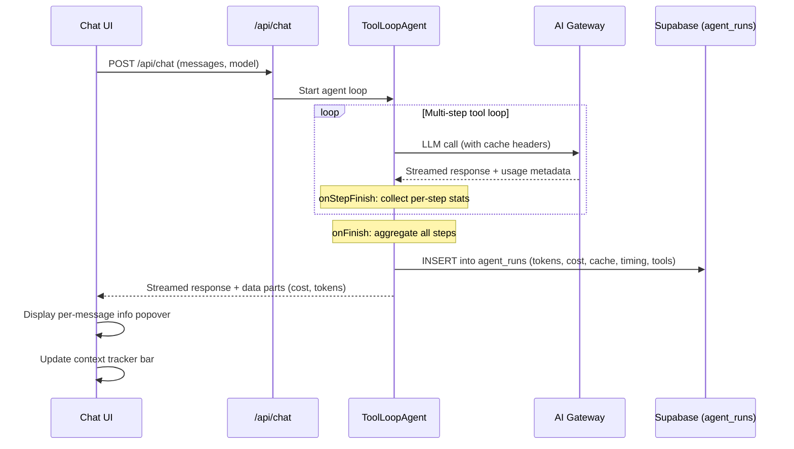

# Cost & Token Observability

> Architecture document for the cost, token, caching, and timing observability system in Layers chat.

---

## Overview

Every LLM interaction in Layers is instrumented. The system tracks tokens, cost, cache performance, and timing at the per-step, per-message, and per-conversation level. This data flows from the AI SDK's `onStepFinish` and `onFinish` callbacks into the `agent_runs` table, and surfaces in the UI through per-message info popovers and a conversation-level context tracker bar.

---

## What We Track

### Per Message (Per Agent Run)

| Metric | Source | Description |
|--------|--------|-------------|
| Model used | `response.modelId` | Can change mid-conversation via model selector |
| Input tokens (total) | `usage.inputTokens` | Total input tokens sent to the model |
| Cached read tokens | `usage.inputTokenDetails.cacheReadTokens` | Tokens served from prompt cache |
| Cached write tokens | `usage.inputTokenDetails.cacheWriteTokens` | Tokens written to prompt cache |
| Output tokens | `usage.outputTokens` | Tokens generated by the model |
| Time to first token (TTFT) | Custom timing | Time from request start to first streamed chunk |
| Total response time | Custom timing | Wall-clock duration of the full agent run |
| Cost in USD | Calculated | Derived from model pricing and token counts |
| Tool calls made | `steps[].toolCalls` | Names and count of tools invoked |
| Step count | `steps.length` | Number of LLM calls in a multi-step agent loop |
| Cache hit rate | Calculated | `cacheReadTokens / inputTokens * 100` |
| Gateway generation ID | `response.headers` | For cross-referencing with AI Gateway dashboard |

### Per Conversation

| Metric | Derivation |
|--------|------------|
| Total input tokens | Sum across all agent runs in conversation |
| Total output tokens | Sum across all agent runs in conversation |
| Total cost | Sum of all message costs |
| Model breakdown | Tokens + cost grouped by model (if user switched mid-conversation) |
| Average TTFT | Mean of per-message TTFT values |
| Total tool calls | Count of all tool invocations across all messages |
| Credit usage | Cost mapped to user's credit balance |

---

## Where It Is Stored

### `agent_runs` table

Per-request aggregate. One row per assistant message (per agent run).

| Column | Type | Description |
|--------|------|-------------|
| `id` | UUID | Primary key |
| `chat_id` | UUID | FK to `chats` |
| `org_id` | UUID | FK to `organizations` |
| `user_id` | UUID | FK to `auth.users` |
| `model` | TEXT | Model ID used (e.g., `anthropic/claude-sonnet-4.6`) |
| `input_tokens` | INT | Total input tokens |
| `output_tokens` | INT | Total output tokens |
| `cache_read_tokens` | INT | Tokens served from prompt cache |
| `cache_write_tokens` | INT | Tokens written to prompt cache |
| `cost_usd` | DECIMAL | Calculated cost in USD |
| `duration_ms` | INT | Total response time in milliseconds |
| `ttft_ms` | INT | Time to first token in milliseconds |
| `tool_calls` | JSONB | Array of tool names invoked |
| `step_count` | INT | Number of LLM steps in the agent loop |
| `generation_id` | TEXT | AI Gateway generation ID |
| `created_at` | TIMESTAMPTZ | When the run started |

### `chat_messages` table

Per-message model used, stored alongside the message content.

### `sandbox_usage` table

Per-sandbox compute costs (E2B sandbox runtime, separate from LLM costs).

### AI Gateway Dashboard

Per-request cost, generation IDs, latency, and provider-level metrics. Accessible via the Vercel dashboard. The `generation_id` in `agent_runs` links back to the Gateway for debugging.

---

## Data Flow



```mermaid
flowchart LR
    A[Chat Request] --> B[ToolLoopAgent]
    B --> C{onStepFinish}
    C -->|Per step| D[Collect: model, tokens, cache, tools, timing]
    D --> C
    C -->|All steps done| E[onFinish]
    E --> F[Aggregate stats across all steps]
    F --> G[Save to agent_runs]
    F --> H[Stream cost data part to client]
    H --> I[Per-message info popover]
    G --> J[/api/chat/context-stats]
    J --> K[Context tracker bar]
```

---

## Prompt Caching

Prompt caching reduces cost by reusing previously processed input tokens. The system prompt, tool definitions, rules, and conversation history are all cacheable.

### Provider Comparison

| Provider | Mechanism | Savings | AI SDK Configuration |
|----------|-----------|---------|---------------------|
| Anthropic | Explicit via `cacheControl: { type: 'ephemeral' }` or Gateway `caching: 'auto'` | 90% on cached input tokens | `providerOptions.anthropic.cacheControl` on system/tool messages |
| OpenAI | Fully automatic (no configuration needed) | 50% on cached input tokens | None needed |
| Google Gemini | Automatic on Gemini 2.5+ models | 90% on cached input tokens | None needed |

### Key Behaviors

- **Cache is per-model, per-provider.** Switching models mid-conversation invalidates the cache. A conversation that starts on Claude Sonnet and switches to Claude Opus will pay full input cost on the first Opus message.
- **Gateway `caching: 'auto'` handles per-provider differences automatically.** When enabled, the AI Gateway adds the appropriate cache headers for each provider without code changes.
- **Cache stats are available in the usage object.** The AI SDK surfaces `usage.inputTokenDetails.cacheReadTokens` and `usage.inputTokenDetails.cacheWriteTokens` in `onStepFinish` and `onFinish` callbacks.
- **Cache TTL varies by provider.** Anthropic caches expire after 5 minutes of inactivity. OpenAI and Google manage TTL internally.
- **First message in a conversation always pays full cost.** Cache is populated on the first call, then subsequent calls benefit. The savings compound as conversations grow longer (more system prompt + history to cache).

### What Gets Cached

| Content | Typical Size | Cacheable? | Notes |
|---------|-------------|------------|-------|
| System prompt | ~1.1K tokens | Yes | Stable across messages in a conversation |
| Rules | ~38 tokens | Yes | Org-level rules appended to system prompt |
| Tool definitions | ~6.0K tokens | Yes | All registered tools (search, write_code, etc.) |
| Conversation history | Varies | Yes | Growing with each turn; most cache benefit here |
| User's current message | Varies | No | Always new input |

---

## Model Pricing Reference

| Model | Input $/M tokens | Output $/M tokens | Cached Input $/M tokens |
|-------|-------------------|--------------------|-----------------------|
| Claude Opus 4.6 | $15.00 | $75.00 | $1.50 |
| Claude Sonnet 4.6 | $3.00 | $15.00 | $0.30 |
| Claude Haiku 4.5 | $0.80 | $4.00 | $0.08 |
| GPT-5.4 | $5.00 | $15.00 | $2.50 |
| GPT-5.4 Mini | $0.40 | $1.60 | $0.20 |
| Gemini 3.1 Pro | $1.25 | $10.00 | $0.125 |
| Gemini 3 Flash | $0.075 | $0.30 | $0.0075 |
| Gemini Flash Lite | $0.02 | $0.10 | $0.002 |
| Ollama (local) | $0 | $0 | N/A |

> Prices are approximate. Check provider pricing pages for current rates.

### Cost Calculation Formula

```
cost = (inputTokens - cacheReadTokens) * inputPrice / 1_000_000
     + cacheReadTokens * cachedInputPrice / 1_000_000
     + cacheWriteTokens * inputPrice / 1_000_000
     + outputTokens * outputPrice / 1_000_000
```

---

## UI Components

### Per-Message Info Button

A small info icon on each assistant message. Clicking it opens a popover showing:

- Model used for that specific message
- Input tokens (total, cached read, cached write)
- Output tokens
- Cache hit rate as a percentage
- Cost in USD
- TTFT and total response time
- Tool calls made (names and count)
- Step count (if multi-step)

### Context Tracker Bar

Persistent bar (collapsible) showing the current context window composition:

- **System**: System prompt tokens (~1.1K)
- **Rules**: Organization rules tokens (~38)
- **Tools**: Tool definition tokens (~6.0K)
- **History**: Conversation history tokens (grows per turn)
- **Available**: Remaining context window capacity
- **Total cost**: Running cost for the conversation
- **Message counts**: User messages, assistant messages, rules, MCP servers

Each section has a colored progress bar segment. The bar updates after every message.

### Cost Breakdown (Expandable)

A collapsible card listing every LLM call in the conversation:

| Step | Model | Input | Output | Cost | Cache |
|------|-------|-------|--------|------|-------|
| 1 | Claude Sonnet 4.6 | 1,234 | 456 | $0.0052 | 890 tokens (72%) |
| 2 | Claude Sonnet 4.6 | 456 | 1,023 | $0.0168 | 1,100 tokens (89%) |
| 3 | Claude Sonnet 4.6 | 678 | 234 | $0.0038 | 1,100 tokens (95%) |
| **Total** | | **2,368** | **1,713** | **$0.0258** | |

### Cache Indicator

A badge on each message showing cache hit rate:
- Green badge (>80%): "95% cached"
- Yellow badge (40-80%): "62% cached"
- No badge (<40%): Cache not materially helping

---

## Database Schema

### Existing: `agent_runs` with cache columns

```sql
-- Add cache tracking columns to agent_runs
ALTER TABLE agent_runs ADD COLUMN cache_read_tokens INT DEFAULT 0;
ALTER TABLE agent_runs ADD COLUMN cache_write_tokens INT DEFAULT 0;
ALTER TABLE agent_runs ADD COLUMN ttft_ms INT;
ALTER TABLE agent_runs ADD COLUMN generation_id TEXT;
ALTER TABLE agent_runs ADD COLUMN step_count INT DEFAULT 1;
```

### Future: Per-Step Tracking

For detailed per-step observability within multi-step agent loops:

```sql
CREATE TABLE agent_run_steps (
    id UUID PRIMARY KEY DEFAULT gen_random_uuid(),
    agent_run_id UUID NOT NULL REFERENCES agent_runs(id) ON DELETE CASCADE,
    step_number INT NOT NULL,
    model TEXT NOT NULL,
    input_tokens INT DEFAULT 0,
    output_tokens INT DEFAULT 0,
    cache_read_tokens INT DEFAULT 0,
    cache_write_tokens INT DEFAULT 0,
    cost_usd DECIMAL(10, 6) DEFAULT 0,
    duration_ms INT,
    tool_calls JSONB DEFAULT '[]',
    created_at TIMESTAMPTZ DEFAULT now()
);

CREATE INDEX idx_agent_run_steps_run ON agent_run_steps(agent_run_id);
```

### Aggregation Query (Per-Conversation)

```sql
SELECT
    chat_id,
    COUNT(*) AS total_runs,
    SUM(input_tokens) AS total_input_tokens,
    SUM(output_tokens) AS total_output_tokens,
    SUM(cache_read_tokens) AS total_cache_read_tokens,
    SUM(cost_usd) AS total_cost_usd,
    AVG(ttft_ms) AS avg_ttft_ms,
    jsonb_agg(DISTINCT model) AS models_used
FROM agent_runs
WHERE chat_id = $1
GROUP BY chat_id;
```

---

## API Endpoints

### GET `/api/chat/context-stats`

Returns token counts for the current context window composition. Used by the context tracker bar.

**Response:**

```json
{
  "system": 1100,
  "rules": 38,
  "tools": 6000,
  "history": 228,
  "total": 7366,
  "available": 120734,
  "cost_usd": 0.0258,
  "messages": {
    "total": 6,
    "user": 3,
    "assistant": 3
  },
  "rules_count": 2,
  "mcp_servers": 2
}
```

### GET `/api/analytics/costs`

Returns cost data aggregated by model, user, and date range. Used by the analytics dashboard.

**Query params:** `startDate`, `endDate`, `userId`, `groupBy` (model | user | date)

---

## What Else Could Be Tracked (Future)

| Metric | Description | Priority |
|--------|-------------|----------|
| Token cost per user per day/week/month | Billing dashboard with per-user breakdown | P1 |
| Cost per tool | Which tools are most expensive to run (tokens consumed by tool calls + results) | P2 |
| Cost per conversation topic | Group conversations by tag/collection and aggregate costs | P2 |
| Embedding costs | Search queries trigger embedding generation via AI Gateway | P2 |
| Sandbox compute costs | Already tracked in `sandbox_usage`, needs integration into unified view | P1 |
| MCP server call costs | External API usage from MCP tool invocations | P3 |
| Cost anomaly detection | Alert if a conversation exceeds a configurable threshold | P2 |
| Token budget per org | Hard/soft limits on monthly token usage per organization | P1 |
| Cost forecasting | Project monthly costs based on usage trends | P3 |
| Model efficiency comparison | Compare cost-per-quality across models for similar tasks | P3 |

---

## Implementation Notes

### Collecting Stats in the Agent Loop

The AI SDK provides two key callbacks:

- **`onStepFinish(step)`**: Fires after each LLM call within a multi-step agent loop. Use this to collect per-step stats (tokens, cache, tools, timing).
- **`onFinish(result)`**: Fires when the entire agent run completes. Use this to aggregate across all steps and write to `agent_runs`.

```
onStepFinish -> push step stats to array
onFinish -> reduce array to aggregates -> INSERT agent_runs
```

### Streaming Cost Data to the Client

Cost data is sent as a custom data part in the UI message stream:

```typescript
writer.write({
  type: "data-cost",
  id: generateId(),
  data: {
    model,
    inputTokens,
    outputTokens,
    cacheReadTokens,
    cacheWriteTokens,
    costUsd,
    ttftMs,
    durationMs,
    toolCalls,
    stepCount,
  },
});
```

The client reads this data part and renders the per-message info popover.

### Cache Strategy Across Providers

The AI Gateway `caching: 'auto'` setting is the recommended approach. It abstracts away per-provider differences:

1. For Anthropic: adds `cacheControl` headers to system and tool messages
2. For OpenAI: no-op (caching is automatic)
3. For Google: no-op (caching is automatic on supported models)

This means switching providers in the model selector does not require any cache configuration changes.

---

## Analytics API

### GET `/api/analytics/usage`

Aggregated usage analytics from the `agent_runs` table. Requires authentication and `owner` or `admin` role on the organization.

**Query params:**

| Param | Values | Default | Description |
|-------|--------|---------|-------------|
| `period` | `day`, `week`, `month` | `week` | Time window for the query (1 day, 7 days, or 30 days) |
| `group_by` | `model`, `provider`, `user`, `day` | `model` | Primary grouping dimension |

**Response shape:**

```json
{
  "summary": {
    "totalRequests": 1247,
    "totalInputTokens": 4200000,
    "totalOutputTokens": 1800000,
    "totalCost": 12.45,
    "totalCacheReadTokens": 3024000,
    "cacheHitRate": 72,
    "avgDurationMs": 2400,
    "avgTtft": 380,
    "modelsUsed": 4,
    "uniqueConversations": 89
  },
  "byModel": [
    { "model": "anthropic/claude-sonnet-4.6", "requests": 420, "inputTokens": 2100000, "outputTokens": 900000, "cost": 8.20, "avgDuration": 2800 }
  ],
  "byProvider": [
    { "provider": "anthropic", "requests": 420, "cost": 8.20 }
  ],
  "byDay": [
    { "date": "2026-04-06", "requests": 180, "cost": 1.80, "inputTokens": 600000, "outputTokens": 250000 }
  ],
  "topTools": [
    { "tool": "search_context", "count": 456 }
  ],
  "period": "week",
  "groupBy": "model",
  "interval": "7 days"
}
```

**SQL / aggregation patterns used:**

- **Data fetch**: Single query on `agent_runs` filtered by `org_id` and `created_at >= cutoff`, ordered descending, limited to 10,000 rows. The cutoff date is computed from the `period` param (1, 7, or 30 days ago).
- **Summary**: Single pass over all rows accumulating totals for requests, tokens, cost, duration, and TTFT. Cache hit rate = `cacheReadTokens / (inputTokens + cacheReadTokens) * 100`. Unique models and conversations tracked via `Set`.
- **By Model**: `Map<model, accumulator>` grouping rows by `run.model`. Each entry tracks requests, input/output tokens, cost, and duration. Sorted by request count descending.
- **By Provider**: Provider extracted by splitting model ID on `/` (e.g., `"anthropic/claude-sonnet-4.6".split("/")[0]` yields `"anthropic"`). Grouped into `Map<provider, { requests, cost }>`. Sorted by cost descending.
- **By Day**: Date extracted by splitting `created_at` on `T` (ISO date prefix). Grouped into `Map<date, { requests, cost, tokens }>`. Sorted by date descending.
- **Top Tools**: Flattens `tool_calls` JSONB arrays across all rows, counts by tool name, returns top 10 sorted by count descending.

---

## How agent_runs Works (End-to-End Flow)

```
User sends message
  -> Chat route receives request (POST /api/chat)
  -> ToolLoopAgent runs (may call tools, multi-step)
  -> onStepFinish: accumulates per-step stats (tokens, cache, duration, tools)
  -> Stream completes
  -> createAgentUIStreamResponse onFinish fires
  -> ONE insert into agent_runs with all accumulated data
  -> Client fetches via /api/chat/stats for per-conversation view
  -> Client fetches via /api/analytics/usage for aggregate view
```

The key design decision is **one row per assistant message**, not one row per LLM step. A single agent run may involve multiple LLM calls (tool loop), but the `onStepFinish` callback collects per-step stats into an array, and the `onFinish` callback reduces that array into a single aggregate row. This keeps the table manageable (row count = message count, not step count) while retaining per-step detail in the `tool_calls` JSONB column.

---

## What's Tracked Per Request (Complete Column Reference)

| Column | Type | How It's Populated | Purpose |
|--------|------|--------------------|---------|
| `id` | UUID | Auto-generated (`gen_random_uuid()`) | Primary key |
| `chat_id` | UUID | From the request body's `conversationId` | Links run to its conversation |
| `org_id` | UUID | From the authenticated user's org membership | Scopes analytics to organization |
| `user_id` | UUID | From `supabase.auth.getUser()` | Attributes cost to the individual |
| `model` | TEXT | From `response.modelId` in `onFinish` | The model that generated this response |
| `input_tokens` | INT | `usage.inputTokens` summed across all steps | Total tokens sent to the model |
| `output_tokens` | INT | `usage.outputTokens` summed across all steps | Total tokens generated |
| `cache_read_tokens` | INT | `usage.inputTokenDetails.cacheReadTokens` | Tokens served from prompt cache (cost savings) |
| `cache_write_tokens` | INT | `usage.inputTokenDetails.cacheWriteTokens` | Tokens written to prompt cache |
| `cost_usd` | DECIMAL(10,6) | Calculated from model pricing table and token counts | Dollar cost for this single request |
| `duration_ms` | INT | Wall-clock time from request start to stream end | Total response time |
| `ttft_ms` | INT | Time from request start to first streamed chunk | Time to first token (perceived latency) |
| `tool_calls` | JSONB | Array of `{ name }` objects from `steps[].toolCalls` | Which tools were invoked and how many |
| `step_count` | INT | `steps.length` from the agent loop | Number of LLM calls in this agent run |
| `generation_id` | TEXT | From `response.headers` (AI Gateway header) | Cross-reference with Vercel AI Gateway dashboard |
| `created_at` | TIMESTAMPTZ | Auto-generated (`now()`) | When the run occurred |

---

## Analytics Dimensions

What you can slice by, and what questions each dimension answers:

**Per message**: model, tokens, cache, cost, TTFT, tools used. Answers: "What did this specific response cost? Was the cache helping? Which tools fired?"

**Per conversation**: total cost, model mix, cache efficiency, tool frequency. Answers: "How much did this entire conversation cost? Did the user switch models? How did cache savings accumulate over turns?"

**Per user**: total spend, most-used model, request count, avg response time. Answers: "Who is using the most credits? Which users prefer which models? Who generates the most tool calls?"

**Per organization**: aggregate cost, provider breakdown, credit usage, member usage. Answers: "What's our total AI spend? Which provider is cheapest for our workload? Are we within budget?"

**Per provider**: cost comparison, latency comparison, cache hit rates. Answers: "Is Anthropic cheaper than OpenAI for our use case? Which provider has the best cache performance?"

**Per model**: cost efficiency ($/1K tokens), avg TTFT, avg throughput, popularity. Answers: "Is Sonnet good enough or do we need Opus? Which model delivers the best cost/quality tradeoff?"

**Per day/week/month**: trends, cost forecasting, usage growth. Answers: "Are costs trending up? How does Monday compare to Friday? What will next month cost at this rate?"

**Per tool**: most called, avg cost per call, failure rate. Answers: "Is search_context dominating tool usage? How much does a typical write_code call cost in tokens?"

---

## Individual vs Organization Visibility

### For individual users

- See the cost of each message in real-time via the info popover on every assistant response
- Track which model is cheapest for their use case by switching mid-conversation and comparing
- Monitor cache hit rate per message (higher = cheaper; consecutive messages on the same model get up to 90% cheaper)
- Set personal cost awareness without requiring admin intervention — the data is always visible
- View full conversation cost breakdown showing every LLM call, its tokens, and its cache performance

### For organization admins

- Dashboard showing total spend, per-user breakdown, and per-provider costs over configurable time periods
- Set credit budgets and receive alerts before they run out
- Identify expensive conversations or users through the analytics API's grouping dimensions
- Compare model cost-effectiveness across the team (e.g., Sonnet vs. Opus cost per 1K tokens)
- Track cache efficiency org-wide — low cache hit rates indicate model-switching patterns that inflate costs
- Export usage data for billing, accounting, and forecasting via the `/api/analytics/usage` endpoint

---

## Future: What We Can Build on This Data

| Capability | Description | Complexity |
|------------|-------------|------------|
| Cost anomaly alerts | Notify when a conversation exceeds a configurable dollar threshold | Low |
| Model recommendation engine | "Sonnet is 3x cheaper for your use case with similar quality" | Medium |
| Auto-downgrade | Route simple queries to cheaper models automatically | Medium |
| Daily/weekly cost reports | Email digest with spend trends and cache performance | Low |
| Per-team cost allocation | Attribute costs to teams/departments within an organization | Medium |
| Invoice generation | Generate itemized invoices for billing downstream customers | High |
| Token budget guardrails | Hard-stop or soft-warn when a user/org approaches a token limit | Low |
| Cost forecasting | Project next month's spend based on trailing usage trends | Medium |
