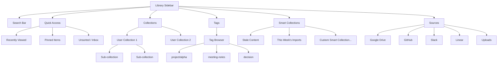
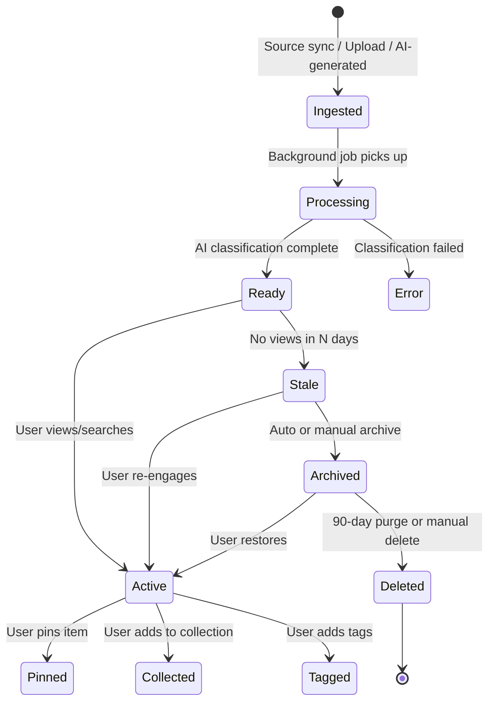
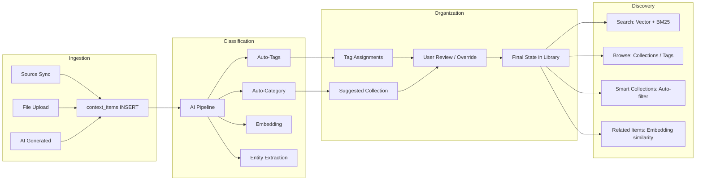
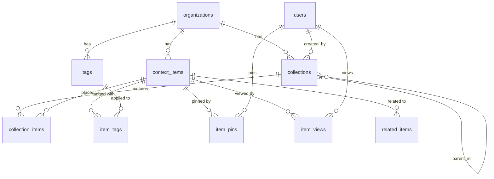

# Content Organization Architecture for Layers

> Status: Research & Design
> Owner: Mirror Factory
> Last updated: 2026-04-05
> Priority: HIGH — Foundation for scaling beyond 1,000 items per org

---

## Executive Summary

Layers currently stores knowledge items in a flat `context_items` table with source-type groupings and basic filtering. This works at small scale (< 500 items) but breaks down as teams accumulate thousands of documents, messages, issues, and meetings from 8+ sources. Users cannot create their own organizational structure, and the only navigation path is search or scroll.

This document proposes a **hybrid organization system** combining:
1. **User-created collections** (folders with nesting up to 3 levels)
2. **Tags** (user-assigned + AI-generated, multi-assign)
3. **Smart collections** (saved filter queries that auto-populate)
4. **AI auto-classification** (auto-tag, auto-categorize, staleness detection)
5. **Pinning and recency** (quick access to frequently used items)

The design draws from research on Notion, Confluence, Google Drive, Apple Notes, Obsidian, Raindrop.io, and knowledge management theory (PARA, Zettelkasten, LATCH). It is optimized for 10,000+ items per organization while keeping navigation fast and discoverable.

---

## Table of Contents

1. [Research Findings](#1-research-findings)
2. [Comparison Matrix](#2-comparison-matrix)
3. [Recommended Approach](#3-recommended-approach)
4. [Information Architecture](#4-information-architecture)
5. [UI Wireframe Descriptions](#5-ui-wireframe-descriptions)
6. [Database Schema](#6-database-schema)
7. [Auto-Classification Pipeline](#7-auto-classification-pipeline)
8. [Staleness Detection Algorithm](#8-staleness-detection-algorithm)
9. [Search Relevance Tuning](#9-search-relevance-tuning)
10. [Migration Plan](#10-migration-plan)
11. [Implementation Phases](#11-implementation-phases)

---

## 1. Research Findings

### 1.1 Notion — Pages, Databases, and Relations

Notion uses a **block-based hierarchy** where everything is a page, and pages nest inside pages. Databases are special pages that contain structured items with properties (dates, selects, relations, rollups). Key patterns:

- **Linked Database Views**: A single database can appear in multiple places with different filters/sorts, without duplicating data. This is analogous to our "smart collections" concept.
- **Relations and Rollups**: Pages in one database can reference pages in another, creating cross-database links. Rollups aggregate data from related items.
- **Data Sources (2025)**: Notion now allows multiple databases to be organized under one unified block while maintaining individuality — essentially "views over multiple tables."
- **Views**: Table, List, Board (Kanban), Calendar, Gallery, Chart. Each view is a filtered/sorted lens on the same data.
- **Templates**: Pre-configured page structures that standardize how new items are created.

**Lesson for Layers**: The "one item, many views" pattern is powerful. Items should live in a canonical location but appear in multiple collections via references, not copies.

*Sources: [Notion Data Sources 2025](https://www.notionapps.com/blog/notion-data-sources-update-2025), [Notion Databases Help](https://www.notion.com/help/intro-to-databases), [Linked Databases](https://www.whalesync.com/blog/link-databases-in-notion)*

### 1.2 Confluence — Spaces and Labels

Confluence organizes content into **spaces** (top-level containers) with nested page trees. Key patterns:

- **Flat Space Model**: Spaces cannot nest inside spaces. This simplicity prevents over-hierarchization but can lead to space sprawl.
- **Page Tree Depth**: Best practice is 3-4 levels max. Deeper nesting indicates a space should be split.
- **Labels**: Cross-cutting tags that group content across spaces. Spaces with the same label appear together in the directory.
- **2025 Navigation Update**: Recently-worked-on spaces moved to the sidebar for faster switching — validating the "recency-first" navigation pattern.
- **Content Templates**: Standardized page structures per space type.
- **Archive/Trash**: Two-stage deletion with recoverable archive.

**Lesson for Layers**: Keep hierarchy shallow (max 3 levels). Use labels/tags as the cross-cutting organization mechanism that folders cannot provide.

*Sources: [Confluence Space Organization](https://www.atlassian.com/software/confluence/resources/guides/get-started/organize-customize), [Labels for Spaces](https://confluence.atlassian.com/doc/use-labels-to-categorize-spaces-136647.html), [Content Structure Best Practices](https://www.k15t.com/rock-the-docs/confluence-cloud-best-practices/how-to-structure-confluence-content-for-long-term-success)*

### 1.3 Google Drive — Folders, Labels, and AI Classification

Google Drive uses a traditional folder hierarchy with several modern additions:

- **Shared Drives**: Team-owned containers where files belong to the team, not individuals. Access is scoped at the drive level with folder-level overrides.
- **Labels (Metadata)**: Admin-defined metadata fields (like Notion properties) that can be applied to files. AI classification can auto-apply labels.
- **AI Classification (2025)**: Google now auto-labels files in shared drives using AI, classifying content type, sensitivity, and category without manual effort.
- **Priority/Workspaces**: Google experimented with smart groupings based on usage patterns but has focused more on labels and recency.
- **Starred and Recent**: Two universal "smart folders" — starred items (user-pinned) and recently accessed.

**Lesson for Layers**: AI auto-labeling at ingestion is now table-stakes. "Starred" (pinned) and "Recent" should be first-class navigation entries.

*Sources: [Google Drive AI Classification](https://knowledge.workspace.google.com/admin/security/label-google-drive-files-automatically-using-ai-classification), [Drive Labels API](https://developers.google.com/workspace/drive/api/guides/about-labels), [Shared Drives 2026](https://refractiv.co.uk/news/shared-drives-introduction-benefits/)*

### 1.4 Apple Notes — Tags and Smart Folders

Apple Notes uses a deceptively simple system that scales well:

- **Folders with Nesting**: Traditional folder hierarchy, drag-and-drop.
- **Tags**: Inline hashtags (`#work`, `#project-alpha`) that create cross-cutting groupings. A note in the "Meetings" folder can also be tagged `#project-alpha` and appear in both contexts.
- **Smart Folders**: Saved filter queries that auto-populate based on tags, dates, mentions, attachments, checklists, etc. The filters compose — you can combine tag + date + has-attachment.
- **Pinning**: Pin notes to the top of any folder for quick access.

**Lesson for Layers**: Smart folders (saved filters) are the killer feature for power users. They eliminate manual sorting while giving users control over what they see. Pinning is a low-effort, high-value interaction.

*Sources: [Apple Notes Tags and Smart Folders](https://support.apple.com/en-us/102288), [Smart Folders on Mac](https://support.apple.com/guide/notes/use-smart-folders-apd58edc7964/mac), [Organizing Apple Notes](https://www.geeky-gadgets.com/organizing-apple-notes-iphone-guide/)*

### 1.5 Obsidian — Vaults, Links, MOCs, and Graph View

Obsidian represents the opposite end of the spectrum — link-first, folder-optional:

- **Vaults**: Top-level container (analogous to an org in Layers).
- **Folders**: Optional, used primarily for broad categorization. Power users often use only 3-5 top-level folders.
- **Tags**: Inline and YAML frontmatter tags. Flexible but require institutional knowledge of the taxonomy.
- **Bi-directional Links**: The core primitive. Any note can link to any other note, creating a graph of relationships.
- **Maps of Content (MOCs)**: Curated index notes that link to related notes on a topic. Superior to folders because they allow a note to appear in multiple MOCs and encourage organic growth.
- **Graph View**: Visual representation of all notes and their connections. Useful for discovery but noisy at scale.
- **Dataview Queries**: SQL-like queries over note metadata — essentially programmable smart folders.

**Lesson for Layers**: MOCs map well to our "curated collections" concept. Bi-directional links between context items would enable discovery. Graph view is aspirational but not MVP.

*Sources: [How I Use Folders in Obsidian](https://obsidian.rocks/how-i-use-folders-in-obsidian/), [Maps of Content](https://obsidian.rocks/maps-of-content-effortless-organization-for-notes/), [Steph Ango's Vault](https://stephango.com/vault)*

### 1.6 Raindrop.io — Collections, Tags, and AI Suggestions

Raindrop.io is a bookmark manager that handles 10,000+ items well:

- **Nested Collections**: Folders with nesting, each with its own view mode (list, grid, moodboard).
- **Tags**: Multi-assign, any characters allowed, filterable within or across collections.
- **AI Suggestions**: On save, AI suggests collections and tags based on page content. Users confirm or override.
- **Full-Text Search**: Searches inside PDFs and cached pages, not just titles/URLs.
- **Highlights**: Users can highlight passages within saved pages — similar to our "source_quote" concept.
- **Unsorted**: Default inbox where items land before being organized. Encourages a triage workflow.

**Lesson for Layers**: The "unsorted inbox" pattern is essential for multi-source ingestion. Items arrive from Drive, Slack, GitHub, etc. — they need a triage zone before being organized. AI suggestions at ingestion reduce friction.

*Sources: [Raindrop Collections](https://help.raindrop.io/collections), [Raindrop AI Suggestions](https://help.raindrop.io/ai-suggestions), [Raindrop Tags](https://help.raindrop.io/tags)*

### 1.7 Knowledge Management Theory

**PARA Method** (Tiago Forte): Organizes everything into four categories:
- **Projects**: Active, with a deadline (time-bound)
- **Areas**: Ongoing responsibilities (persistent)
- **Resources**: Reference material (topic-based)
- **Archive**: Inactive items from the above three

**Zettelkasten** (Niklas Luhmann): Note-level linking system where each note has a unique ID and links to related notes. Focuses on building a network of ideas rather than hierarchical filing.

**Johnny Decimal**: Strict numbering system — max 10 areas, each with max 10 categories. Forces discipline but breaks down for organic, multi-source content.

**LATCH** (Richard Saul Wurman): Five fundamental ways to organize any information:
- **L**ocation — where something is (source, geography)
- **A**lphabet — alphabetical ordering
- **T**ime — chronological ordering (ingested_at, source_created_at)
- **C**ategory — type groupings (content_type, source_type)
- **H**ierarchy — ranked ordering (priority, relevance, freshness)

**Lesson for Layers**: PARA maps naturally to our system — sessions are Projects, org-level context is Areas/Resources, and we need an Archive state. LATCH tells us to support all five organizational dimensions in our filter system. Zettelkasten's linking model validates the "related items" feature.

*Sources: [PARA + Zettelkasten](https://forum.obsidian.md/t/how-can-para-and-zettelkasten-workflow-live-together/3570), [Johnny Decimal + PARA](https://help.noteplan.co/article/155-how-to-organize-your-notes-and-folders-using-johnny-decimal-and-para), [LATCH Framework](https://www.nngroup.com/videos/latch-framework/)*

---

## 2. Comparison Matrix

### Approaches x Dimensions

| Dimension | Notion | Confluence | Google Drive | Apple Notes | Obsidian | Raindrop.io | **Layers (Proposed)** |
|-----------|--------|------------|-------------|-------------|----------|-------------|----------------------|
| **Hierarchy** | Pages nest in pages + databases | Spaces → page trees (3-4 levels) | Folders (unlimited nesting) | Folders + nesting | Optional folders | Nested collections | **Collections (3 levels max)** |
| **Tags** | Database properties (select/multi-select) | Labels (flat) | Labels (admin-defined) | Inline hashtags | Tags + YAML frontmatter | Multi-assign tags | **User + AI tags (multi-assign)** |
| **Smart Grouping** | Linked views with filters | Label-based grouping | AI classification | Smart folders (saved filters) | Dataview queries / MOCs | AI-suggested collections | **Smart collections (saved filters)** |
| **Navigation** | Sidebar tree + search | Space sidebar + search | Folder tree + search + recent | Sidebar tree + search | Sidebar + graph + search | Sidebar + search | **Sidebar tree + search + recent + pinned** |
| **Auto-Org** | None (manual) | None (manual) | AI labels (2025) | None | None | AI tag/collection suggestions | **AI auto-tag + auto-categorize at ingestion** |
| **Scalability** | Good to ~5K pages per workspace | Good to ~2K pages per space | Good to 100K+ files | Good to ~5K notes | Good to ~10K notes | Good to 30K+ bookmarks | **Target: 50K+ items per org** |
| **Discovery** | Backlinks, related | Label search | Recent, starred, suggested | Smart folders | Graph view, backlinks | Full-text + highlights | **Related items, "more like this", smart collections** |
| **Staleness** | Manual archive | Manual archive/delete | Activity-based suggestions | None | None | None | **AI staleness scoring + auto-archive suggestions** |
| **Multi-Source** | Native (one source) | Native (one source) | Native (one source) | Native (one source) | Plugins | Web captures only | **8+ sources unified with source-aware display** |

### Key Takeaways

1. **No platform does all seven dimensions well.** This is Layers' opportunity.
2. **Tags + folders hybrid** is the most scalable pattern (Apple Notes, Raindrop.io).
3. **Smart folders / saved filters** are the power-user feature that none of the enterprise tools (Notion, Confluence) do well.
4. **AI auto-organization** is nascent — Google Drive and Raindrop.io lead, but neither does staleness detection.
5. **Multi-source unification** is Layers' unique challenge. No competitor handles 8+ sources in a single library.

---

## 3. Recommended Approach

### 3.1 Core Primitives

```
┌─────────────────────────────────────────────────┐
│                  CONTEXT ITEM                    │
│  (document, message, issue, meeting, file, ...)  │
│                                                  │
│  ┌──────────┐  ┌──────────┐  ┌───────────────┐  │
│  │  Tags    │  │Collection│  │ Smart         │  │
│  │ (many)   │  │ (one+)   │  │ Collection    │  │
│  │          │  │          │  │ (auto-matched)│  │
│  └──────────┘  └──────────┘  └───────────────┘  │
│                                                  │
│  ┌──────────┐  ┌──────────┐  ┌───────────────┐  │
│  │  Pinned  │  │ Archived │  │  Related      │  │
│  │  (bool)  │  │ (bool)   │  │  Items (link) │  │
│  └──────────┘  └──────────┘  └───────────────┘  │
└─────────────────────────────────────────────────┘
```

**1. Collections (Folders)**
- User-created containers, nestable up to 3 levels
- An item can belong to multiple collections (unlike traditional folders)
- Each collection can have an icon, color, and description
- Special system collections: "All Items", "Unsorted", "Recently Viewed", "Archived"

**2. Tags**
- Two types: **user tags** (manually created) and **AI tags** (auto-generated at ingestion)
- Multi-assign: an item can have unlimited tags
- Tags are org-scoped (shared across the team)
- Tag management: rename, merge, delete, set color
- Nested tags via delimiter: `project/alpha`, `project/beta`

**3. Smart Collections**
- Saved filter queries that auto-populate
- Filters: tags, source_type, content_type, date range, status, created_by, has_attachment, text match
- Composable with AND/OR logic
- Count badge shows matching items
- Examples: "Unread Slack messages this week", "All Linear issues tagged #sprint-42", "Stale documents (not viewed in 90 days)"

**4. Pins**
- Any item can be pinned to the top of the library or within a collection
- Pinned items persist across sessions
- Quick access without navigating hierarchy

**5. Archive**
- Soft-delete: items move to Archive, remain searchable but hidden from default views
- AI can suggest archiving stale items
- Bulk archive operations
- 90-day auto-purge from archive (configurable)

### 3.2 Design Principles

1. **Search-first, browse-second**: The search bar is always visible and fast. Collections/tags are for browsing when you do not know what to search for.
2. **Zero-effort organization**: Items land in "Unsorted" with AI-generated tags. Users organize only when they want to, not because they have to.
3. **One item, many places**: Items live in the `context_items` table; collections and tags are references. No data duplication.
4. **Shallow hierarchy**: Max 3 levels of nesting. If you need more, use tags or smart collections.
5. **Source-aware display**: A Google Drive document and a Slack message look different in the UI but live in the same organizational structure.

---

## 4. Information Architecture

### 4.1 Navigation Hierarchy



### 4.2 Item Lifecycle



### 4.3 Organization Flow



---

## 5. UI Wireframe Descriptions

### 5.1 Library Sidebar (Left Panel)

```
┌─────────────────────────────┐
│ 🔍 Search...                │  ← Always visible, Cmd+K shortcut
├─────────────────────────────┤
│ ▸ Quick Access              │
│   ├ Recently Viewed    (12) │  ← Last 50 viewed items
│   ├ Pinned              (4) │  ← User-pinned items
│   └ Unsorted           (23) │  ← Items with no collection
├─────────────────────────────┤
│ ▸ Collections               │
│   ├ Product Research    (45) │  ← User-created, icon + color
│   │  ├ Competitor Intel (12) │  ← Nested sub-collection
│   │  └ User Interviews  (8) │
│   ├ Engineering Docs   (89) │
│   └ + New Collection        │
├─────────────────────────────┤
│ ▸ Tags                      │
│   ├ #sprint-42         (18) │  ← Click to filter by tag
│   ├ #decision          (31) │
│   ├ #action-item       (47) │
│   └ Manage Tags...          │
├─────────────────────────────┤
│ ▸ Smart Collections         │
│   ├ Stale Content      (15) │  ← Auto-populated
│   ├ This Week          (34) │
│   ├ My Uploads          (7) │
│   └ + New Smart Collection  │
├─────────────────────────────┤
│ ▸ Sources                   │
│   ├ Google Drive       (201)│  ← Filter by source
│   ├ GitHub             (156)│
│   ├ Slack               (89)│
│   ├ Linear              (67)│
│   └ Uploads             (34)│
├─────────────────────────────┤
│ 🗄 Archive              (8) │
└─────────────────────────────┘
```

### 5.2 Main Content Area

**List View** (default for large item counts):
```
┌──────────────────────────────────────────────────────────────┐
│  ☐  📄  Quarterly Product Roadmap           google-drive     │
│      "Strategic priorities for Q2 2026..."  #roadmap #q2     │
│      Modified 2d ago · Ready                                 │
├──────────────────────────────────────────────────────────────┤
│  ☐  💬  Sprint 42 Retro Notes               slack            │
│      "Key takeaways from the retro..."      #sprint-42       │
│      Modified 5h ago · Ready                                 │
├──────────────────────────────────────────────────────────────┤
│  ☐  🔧  AUTH-1234: Fix OAuth token refresh   linear          │
│      "Token refresh failing on mobile..."   #bug #auth       │
│      Modified 1w ago · Ready                                 │
└──────────────────────────────────────────────────────────────┘
```

**Grid View** (for visual browsing):
```
┌─────────────┐ ┌─────────────┐ ┌─────────────┐ ┌─────────────┐
│ 📄           │ │ 💬           │ │ 🔧           │ │ 🎙           │
│ Quarterly   │ │ Sprint 42   │ │ AUTH-1234   │ │ Team Sync   │
│ Roadmap     │ │ Retro       │ │ Fix OAuth   │ │ Mar 28      │
│             │ │             │ │             │ │             │
│ google-drive│ │ slack       │ │ linear      │ │ granola     │
│ 2d ago      │ │ 5h ago      │ │ 1w ago      │ │ 1w ago      │
└─────────────┘ └─────────────┘ └─────────────┘ └─────────────┘
```

**Finder/Column View** (Mac-like, per Alfonso's requirement):
```
┌──────────────┬──────────────┬──────────────────────────────┐
│ Sources      │ Categories   │ Items                        │
├──────────────┼──────────────┼──────────────────────────────┤
│ > All        │ > Documents  │ ☐ Quarterly Roadmap    2d   │
│   Google Dr..│ > Issues     │ ☐ API Design Doc       1w   │
│   GitHub     │ > Messages   │ ☐ Brand Guidelines     2w   │
│   Slack      │ > Meetings   │ ☐ Product Brief        3w   │
│   Linear     │ > Code       │                              │
│   Uploads    │              │                              │
│              │              │                              │
│              │              │ 4 items                      │
└──────────────┴──────────────┴──────────────────────────────┘
```

### 5.3 Smart Collection Editor

```
┌─────────────────────────────────────────────────────┐
│ Create Smart Collection                              │
├─────────────────────────────────────────────────────┤
│ Name: [Stale Engineering Docs                     ] │
│ Icon: 📋  Color: [blue ▼]                           │
├─────────────────────────────────────────────────────┤
│ Filters (all must match):                            │
│                                                      │
│ [Source Type ▼] [is    ▼] [GitHub, Google Drive  ▼] │
│ [Content Type▼] [is    ▼] [Document              ▼] │
│ [Last Viewed ▼] [older ▼] [90 days               ] │
│ [Tags        ▼] [has   ▼] [#engineering          ] │
│                                                      │
│ [+ Add Filter]                                       │
│                                                      │
│ Preview: 15 items match                              │
├─────────────────────────────────────────────────────┤
│                    [Cancel]  [Create Smart Collection]│
└─────────────────────────────────────────────────────┘
```

### 5.4 Tag Manager

```
┌─────────────────────────────────────────────────────┐
│ Manage Tags                        [🔍 Search tags] │
├─────────────────────────────────────────────────────┤
│ Tag              │ Items │ Type     │ Actions        │
├──────────────────┼───────┼──────────┼────────────────┤
│ #sprint-42       │   18  │ user     │ ✏️ 🔀 🗑      │
│ #decision        │   31  │ ai+user  │ ✏️ 🔀 🗑      │
│ #action-item     │   47  │ ai       │ ✏️ 🔀 🗑      │
│ #roadmap         │   12  │ user     │ ✏️ 🔀 🗑      │
│ #bug             │   23  │ ai       │ ✏️ 🔀 🗑      │
│ #auth            │    8  │ ai       │ ✏️ 🔀 🗑      │
├──────────────────┴───────┴──────────┴────────────────┤
│ ✏️ = Rename  🔀 = Merge with another tag  🗑 = Delete │
│                                                      │
│ [+ Create Tag]                                       │
└─────────────────────────────────────────────────────┘
```

---

## 6. Database Schema

### 6.1 New Tables

```sql
-- ============================================================
-- COLLECTIONS (user-created folders)
-- ============================================================
CREATE TABLE collections (
  id          UUID PRIMARY KEY DEFAULT gen_random_uuid(),
  org_id      UUID NOT NULL REFERENCES organizations(id) ON DELETE CASCADE,
  parent_id   UUID REFERENCES collections(id) ON DELETE CASCADE,
  name        TEXT NOT NULL,
  description TEXT,
  icon        TEXT,          -- emoji or lucide icon name
  color       TEXT,          -- tailwind color class
  sort_order  INT NOT NULL DEFAULT 0,
  is_smart    BOOLEAN NOT NULL DEFAULT FALSE,
  smart_filter JSONB,       -- filter definition for smart collections
  created_by  UUID NOT NULL REFERENCES auth.users(id),
  created_at  TIMESTAMPTZ NOT NULL DEFAULT now(),
  updated_at  TIMESTAMPTZ NOT NULL DEFAULT now()
);

-- Enforce max 3 levels of nesting via application logic
-- Index for fast tree queries
CREATE INDEX idx_collections_org_parent ON collections(org_id, parent_id);
CREATE INDEX idx_collections_org_smart ON collections(org_id, is_smart) WHERE is_smart = TRUE;

-- ============================================================
-- COLLECTION ITEMS (many-to-many: items in collections)
-- ============================================================
CREATE TABLE collection_items (
  id              UUID PRIMARY KEY DEFAULT gen_random_uuid(),
  collection_id   UUID NOT NULL REFERENCES collections(id) ON DELETE CASCADE,
  context_item_id UUID NOT NULL REFERENCES context_items(id) ON DELETE CASCADE,
  sort_order      INT NOT NULL DEFAULT 0,
  added_by        UUID REFERENCES auth.users(id),
  added_at        TIMESTAMPTZ NOT NULL DEFAULT now(),
  UNIQUE(collection_id, context_item_id)
);

CREATE INDEX idx_collection_items_item ON collection_items(context_item_id);
CREATE INDEX idx_collection_items_collection ON collection_items(collection_id);

-- ============================================================
-- TAGS (org-scoped tag definitions)
-- ============================================================
CREATE TABLE tags (
  id         UUID PRIMARY KEY DEFAULT gen_random_uuid(),
  org_id     UUID NOT NULL REFERENCES organizations(id) ON DELETE CASCADE,
  name       TEXT NOT NULL,
  color      TEXT,          -- optional color for UI
  tag_type   TEXT NOT NULL DEFAULT 'user' CHECK (tag_type IN ('user', 'ai', 'system')),
  usage_count INT NOT NULL DEFAULT 0,  -- denormalized for fast sorting
  created_by UUID REFERENCES auth.users(id),
  created_at TIMESTAMPTZ NOT NULL DEFAULT now(),
  UNIQUE(org_id, name)
);

CREATE INDEX idx_tags_org_name ON tags(org_id, name);
CREATE INDEX idx_tags_org_usage ON tags(org_id, usage_count DESC);

-- ============================================================
-- ITEM TAGS (many-to-many: tags on items)
-- ============================================================
CREATE TABLE item_tags (
  id              UUID PRIMARY KEY DEFAULT gen_random_uuid(),
  context_item_id UUID NOT NULL REFERENCES context_items(id) ON DELETE CASCADE,
  tag_id          UUID NOT NULL REFERENCES tags(id) ON DELETE CASCADE,
  source          TEXT NOT NULL DEFAULT 'user' CHECK (source IN ('user', 'ai')),
  confidence      FLOAT DEFAULT 1.0,  -- AI confidence (0-1), always 1.0 for user
  added_at        TIMESTAMPTZ NOT NULL DEFAULT now(),
  UNIQUE(context_item_id, tag_id)
);

CREATE INDEX idx_item_tags_item ON item_tags(context_item_id);
CREATE INDEX idx_item_tags_tag ON item_tags(tag_id);

-- ============================================================
-- ITEM PINS (user-scoped pins)
-- ============================================================
CREATE TABLE item_pins (
  id              UUID PRIMARY KEY DEFAULT gen_random_uuid(),
  user_id         UUID NOT NULL REFERENCES auth.users(id) ON DELETE CASCADE,
  context_item_id UUID NOT NULL REFERENCES context_items(id) ON DELETE CASCADE,
  pinned_at       TIMESTAMPTZ NOT NULL DEFAULT now(),
  UNIQUE(user_id, context_item_id)
);

CREATE INDEX idx_item_pins_user ON item_pins(user_id, pinned_at DESC);

-- ============================================================
-- ITEM VIEWS (track last-viewed for recency + staleness)
-- ============================================================
CREATE TABLE item_views (
  id              UUID PRIMARY KEY DEFAULT gen_random_uuid(),
  user_id         UUID NOT NULL REFERENCES auth.users(id) ON DELETE CASCADE,
  context_item_id UUID NOT NULL REFERENCES context_items(id) ON DELETE CASCADE,
  viewed_at       TIMESTAMPTZ NOT NULL DEFAULT now()
);

-- Keep only the latest view per user+item for "recently viewed"
-- Partition or TTL in application logic
CREATE INDEX idx_item_views_user_recent ON item_views(user_id, viewed_at DESC);
CREATE INDEX idx_item_views_item ON item_views(context_item_id, viewed_at DESC);

-- ============================================================
-- RELATED ITEMS (precomputed similarity links)
-- ============================================================
CREATE TABLE related_items (
  id          UUID PRIMARY KEY DEFAULT gen_random_uuid(),
  item_a_id   UUID NOT NULL REFERENCES context_items(id) ON DELETE CASCADE,
  item_b_id   UUID NOT NULL REFERENCES context_items(id) ON DELETE CASCADE,
  similarity  FLOAT NOT NULL,  -- cosine similarity score
  computed_at TIMESTAMPTZ NOT NULL DEFAULT now(),
  UNIQUE(item_a_id, item_b_id),
  CHECK (item_a_id < item_b_id)  -- prevent duplicate pairs
);

CREATE INDEX idx_related_items_a ON related_items(item_a_id, similarity DESC);
CREATE INDEX idx_related_items_b ON related_items(item_b_id, similarity DESC);
```

### 6.2 Additions to Existing Tables

```sql
-- Add archive and last-viewed tracking to context_items
ALTER TABLE context_items ADD COLUMN IF NOT EXISTS archived_at TIMESTAMPTZ;
ALTER TABLE context_items ADD COLUMN IF NOT EXISTS last_viewed_at TIMESTAMPTZ;
ALTER TABLE context_items ADD COLUMN IF NOT EXISTS view_count INT NOT NULL DEFAULT 0;
ALTER TABLE context_items ADD COLUMN IF NOT EXISTS ai_category TEXT;  -- top-level AI classification
ALTER TABLE context_items ADD COLUMN IF NOT EXISTS staleness_score FLOAT DEFAULT 0;  -- 0 = fresh, 1 = stale

-- Index for archive queries
CREATE INDEX idx_context_items_archived ON context_items(org_id, archived_at)
  WHERE archived_at IS NOT NULL;

-- Index for staleness queries
CREATE INDEX idx_context_items_staleness ON context_items(org_id, staleness_score DESC)
  WHERE staleness_score > 0.5;
```

### 6.3 Smart Collection Filter Schema (JSONB)

Smart collections store their filter definition as JSONB in `collections.smart_filter`:

```jsonc
{
  "match": "all",  // "all" (AND) or "any" (OR)
  "filters": [
    {
      "field": "source_type",
      "operator": "in",
      "value": ["github", "google-drive"]
    },
    {
      "field": "content_type",
      "operator": "eq",
      "value": "document"
    },
    {
      "field": "tags",
      "operator": "has_any",
      "value": ["engineering", "api"]
    },
    {
      "field": "last_viewed_at",
      "operator": "older_than_days",
      "value": 90
    },
    {
      "field": "staleness_score",
      "operator": "gte",
      "value": 0.7
    },
    {
      "field": "created_by",
      "operator": "eq",
      "value": "current_user"  // resolved at query time
    }
  ]
}
```

### 6.4 RLS Policies

```sql
-- Collections: org-scoped
ALTER TABLE collections ENABLE ROW LEVEL SECURITY;
CREATE POLICY "Users can view org collections"
  ON collections FOR SELECT
  USING (org_id IN (SELECT get_user_org_ids()));
CREATE POLICY "Users can manage org collections"
  ON collections FOR ALL
  USING (org_id IN (SELECT get_user_org_ids()));

-- Collection items: via collection org
ALTER TABLE collection_items ENABLE ROW LEVEL SECURITY;
CREATE POLICY "Users can view collection items"
  ON collection_items FOR SELECT
  USING (collection_id IN (
    SELECT id FROM collections WHERE org_id IN (SELECT get_user_org_ids())
  ));
CREATE POLICY "Users can manage collection items"
  ON collection_items FOR ALL
  USING (collection_id IN (
    SELECT id FROM collections WHERE org_id IN (SELECT get_user_org_ids())
  ));

-- Tags: org-scoped
ALTER TABLE tags ENABLE ROW LEVEL SECURITY;
CREATE POLICY "Users can view org tags"
  ON tags FOR SELECT
  USING (org_id IN (SELECT get_user_org_ids()));
CREATE POLICY "Users can manage org tags"
  ON tags FOR ALL
  USING (org_id IN (SELECT get_user_org_ids()));

-- Item tags: via tag org
ALTER TABLE item_tags ENABLE ROW LEVEL SECURITY;
CREATE POLICY "Users can view item tags"
  ON item_tags FOR SELECT
  USING (tag_id IN (
    SELECT id FROM tags WHERE org_id IN (SELECT get_user_org_ids())
  ));
CREATE POLICY "Users can manage item tags"
  ON item_tags FOR ALL
  USING (tag_id IN (
    SELECT id FROM tags WHERE org_id IN (SELECT get_user_org_ids())
  ));

-- Pins: user-scoped
ALTER TABLE item_pins ENABLE ROW LEVEL SECURITY;
CREATE POLICY "Users can manage their pins"
  ON item_pins FOR ALL
  USING (user_id = auth.uid());

-- Views: user-scoped
ALTER TABLE item_views ENABLE ROW LEVEL SECURITY;
CREATE POLICY "Users can manage their views"
  ON item_views FOR ALL
  USING (user_id = auth.uid());

-- Related items: accessible if user can see both items
ALTER TABLE related_items ENABLE ROW LEVEL SECURITY;
CREATE POLICY "Users can view related items"
  ON related_items FOR SELECT
  USING (
    item_a_id IN (SELECT id FROM context_items WHERE org_id IN (SELECT get_user_org_ids()))
  );
```

### 6.5 Entity Relationship Diagram



---

## 7. Auto-Classification Pipeline

### 7.1 Pipeline Overview

Every item that enters the system (from any source) goes through the same classification pipeline:

```mermaid
flowchart TD
    A[New context_item inserted] --> B{Has raw_content?}
    B -- Yes --> C[Step 1: Generate Embedding]
    B -- No --> Z[Mark as error: no content]

    C --> D[Step 2: AI Classification]
    D --> E[Extract tags, category, entities]

    E --> F[Step 3: Find Related Items]
    F --> G[Top-5 nearest by cosine similarity]

    G --> H[Step 4: Suggest Collection]
    H --> I{Confidence > 0.8?}
    I -- Yes --> J[Auto-assign to collection]
    I -- No --> K[Suggest to user in "Unsorted"]

    J --> L[Mark status = ready]
    K --> L
    L --> M[Notify user if configured]
```

### 7.2 Classification Prompt

```typescript
const CLASSIFICATION_PROMPT = `
Analyze this content and return a JSON object with:
{
  "tags": string[],           // 3-8 relevant tags, lowercase, hyphenated
  "category": string,         // one of: engineering, product, design, marketing,
                              // sales, operations, hr, finance, legal, general
  "entities": {
    "people": string[],       // mentioned people
    "projects": string[],     // mentioned projects/products
    "decisions": string[],    // key decisions made
    "action_items": string[], // action items identified
    "dates": string[],        // important dates mentioned
    "topics": string[]        // main topics/themes
  },
  "summary_short": string,    // ~50 words
  "summary_oneliner": string  // ~10 words for search results
}

Content type: {{content_type}}
Source: {{source_type}}
Title: {{title}}
Content:
{{raw_content | truncate(8000)}}
`;
```

### 7.3 Tag Normalization

AI-generated tags go through normalization before insertion:

1. **Lowercase**: `Sprint-42` → `sprint-42`
2. **Dedup against existing**: If org already has `sprint42`, use it instead of creating `sprint-42`
3. **Fuzzy match**: Levenshtein distance < 2 → suggest merge (e.g., `api-design` and `api-designs`)
4. **Blocklist**: Skip generic tags like `document`, `text`, `content`, `file`
5. **Frequency cap**: If a tag matches >50% of items, it is too generic — skip it

### 7.4 Collection Suggestion Logic

```typescript
async function suggestCollection(
  item: ContextItem,
  orgCollections: Collection[],
  itemTags: string[]
): Promise<{ collectionId: string; confidence: number } | null> {
  // Strategy 1: Tag overlap with existing collection items
  for (const collection of orgCollections) {
    const collectionTags = await getTopTagsForCollection(collection.id);
    const overlap = intersect(itemTags, collectionTags);
    const score = overlap.length / Math.max(itemTags.length, 1);
    if (score > 0.6) {
      return { collectionId: collection.id, confidence: score };
    }
  }

  // Strategy 2: Embedding similarity with collection centroid
  for (const collection of orgCollections) {
    const centroid = await getCollectionCentroid(collection.id);
    if (!centroid) continue;
    const similarity = cosineSimilarity(item.embedding, centroid);
    if (similarity > 0.8) {
      return { collectionId: collection.id, confidence: similarity };
    }
  }

  return null; // No confident match → stays in Unsorted
}
```

### 7.5 Cost Estimate

Per item classification (using `anthropic/claude-haiku-4-5-20251001` via AI Gateway):
- Input: ~2,000 tokens (prompt + content snippet)
- Output: ~200 tokens (JSON response)
- Cost: ~$0.0002 per item
- At 10,000 items: ~$2.00 total classification cost
- Embedding (text-embedding-3-small): ~$0.00002 per item → negligible

---

## 8. Staleness Detection Algorithm

### 8.1 Staleness Score Formula

Each item gets a `staleness_score` between 0 (fresh) and 1 (stale), computed daily via cron:

```
staleness_score = w_age * age_factor
                + w_views * view_decay_factor
                + w_source * source_activity_factor
                + w_refs * reference_factor
```

Where:

| Factor | Weight | Description |
|--------|--------|-------------|
| `age_factor` | 0.30 | Time since `source_created_at`, normalized by content type half-life |
| `view_decay_factor` | 0.35 | Time since `last_viewed_at`, exponential decay |
| `source_activity_factor` | 0.20 | Whether the source document was updated externally |
| `reference_factor` | 0.15 | How often the item is referenced in chats/sessions |

### 8.2 Content-Type Half-Lives

Different content types go stale at different rates:

| Content Type | Half-Life (days) | Rationale |
|-------------|-----------------|-----------|
| `message` | 14 | Slack/Discord messages are ephemeral |
| `issue` | 45 | Issues get closed/resolved |
| `meeting_transcript` | 60 | Meeting notes lose relevance quickly |
| `document` | 180 | Docs remain relevant longer |
| `code` | 120 | Code changes frequently |
| `file` (generic) | 365 | Static files (PDFs, images) are relatively timeless |

### 8.3 Implementation

```typescript
function computeStalenessScore(item: {
  content_type: string;
  source_created_at: string | null;
  last_viewed_at: string | null;
  view_count: number;
  source_metadata: { updated_at?: string } | null;
  reference_count: number;
}): number {
  const now = Date.now();

  // Age factor: exponential decay based on content type
  const halfLife = CONTENT_HALF_LIVES[item.content_type] ?? 120;
  const ageMs = now - new Date(item.source_created_at ?? now).getTime();
  const ageDays = ageMs / (1000 * 60 * 60 * 24);
  const ageFactor = 1 - Math.exp(-LN2 * ageDays / halfLife);

  // View decay: how long since last viewed
  const lastViewMs = item.last_viewed_at
    ? now - new Date(item.last_viewed_at).getTime()
    : now - new Date(item.source_created_at ?? now).getTime();
  const viewDays = lastViewMs / (1000 * 60 * 60 * 24);
  const viewDecay = 1 - Math.exp(-LN2 * viewDays / 30); // 30-day half-life for view freshness

  // Source activity: was the source updated recently?
  const sourceUpdated = item.source_metadata?.updated_at;
  const sourceActivityFactor = sourceUpdated
    ? 1 - Math.exp(-LN2 * (now - new Date(sourceUpdated).getTime()) / (1000 * 60 * 60 * 24 * 90))
    : 0.5; // Unknown → neutral

  // Reference factor: items referenced in chats stay fresh
  const referenceFactor = item.reference_count > 0
    ? Math.max(0, 1 - (item.reference_count * 0.1)) // Each reference reduces staleness by 10%
    : 1.0; // Never referenced → fully stale on this dimension

  return (
    0.30 * ageFactor +
    0.35 * viewDecay +
    0.20 * sourceActivityFactor +
    0.15 * referenceFactor
  );
}
```

### 8.4 Cron Job (Daily)

```sql
-- Recompute staleness scores for all ready items in the org
-- Run via /api/cron/staleness-update
UPDATE context_items
SET staleness_score = compute_staleness(
  content_type,
  source_created_at,
  last_viewed_at,
  view_count,
  source_metadata,
  (SELECT COUNT(*) FROM session_context_links WHERE context_item_id = context_items.id)
)
WHERE status = 'ready'
  AND archived_at IS NULL;
```

### 8.5 Staleness Actions

| Staleness Score | Action |
|----------------|--------|
| 0.0 - 0.3 | Fresh — no action |
| 0.3 - 0.5 | Aging — show subtle indicator in UI |
| 0.5 - 0.7 | Stale — show in "Stale Content" smart collection |
| 0.7 - 0.9 | Very stale — suggest archiving in weekly digest |
| 0.9 - 1.0 | Critical — auto-archive after 30 days at this level |

---

## 9. Search Relevance Tuning

### 9.1 Current Search Architecture

Layers uses hybrid search combining BM25 (full-text) and vector similarity (embeddings) with Reciprocal Rank Fusion (RRF). The current implementation in `src/lib/db/search.ts` already has freshness decay per content type.

### 9.2 Proposed Enhancements

#### A. Collection-Scoped Search

When searching within a collection, add a filter join:

```sql
-- Add to search_context_items RPC
AND (
  p_collection_id IS NULL
  OR ci.id IN (
    SELECT context_item_id FROM collection_items
    WHERE collection_id = p_collection_id
  )
)
```

#### B. Tag Boosting

Items matching the user's active tag filters get a relevance boost:

```typescript
// In search result scoring
const tagBoost = activeTagFilters.length > 0
  ? (matchingTags / activeTagFilters.length) * 0.2  // up to 20% boost
  : 0;

finalScore = rrf_score * (1 + tagBoost) * freshnessFactor * trustWeight;
```

#### C. Personalized Ranking

Track per-user interaction patterns and boost items matching their profile:

```typescript
// User profile built from item_views and item_pins
const userProfile = {
  preferred_sources: { "github": 1.3, "slack": 0.8 },  // based on view frequency
  preferred_tags: ["engineering", "api"],                // based on pin frequency
  preferred_content_types: ["document", "code"],         // based on search clicks
};

// Apply personalized boost (max 30%)
const personalBoost = computePersonalRelevance(item, userProfile) * 0.3;
```

#### D. "More Like This" Search

Given an item, find similar items using its embedding:

```sql
-- Find items similar to a given item
SELECT ci.id, ci.title, ci.description_short,
       1 - (ci.embedding <=> target.embedding) AS similarity
FROM context_items ci,
     (SELECT embedding FROM context_items WHERE id = $1) target
WHERE ci.org_id = $2
  AND ci.id != $1
  AND ci.status = 'ready'
  AND ci.archived_at IS NULL
ORDER BY ci.embedding <=> target.embedding
LIMIT 10;
```

#### E. Search Relevance Tuning Parameters

| Parameter | Current Value | Proposed Value | Rationale |
|-----------|--------------|----------------|-----------|
| RRF k constant | 60 | 60 | Standard, no change needed |
| BM25 k1 | 1.2 (Postgres default) | 1.5 | Slightly favor longer documents that match more terms |
| BM25 b | 0.75 (Postgres default) | 0.75 | Keep default length normalization |
| Vector weight in RRF | 0.5 | 0.6 | Semantic matches slightly more important than keyword |
| Freshness decay | Per content type | Per content type | Already well-tuned |
| Staleness penalty | None | -20% for score > 0.7 | Deprioritize stale items |
| Pin boost | None | +15% | Pinned items are important to the user |

---

## 10. Migration Plan

### 10.1 Phase 0: Schema Migration (Zero Downtime)

1. Run `ALTER TABLE` to add new columns to `context_items` (non-blocking)
2. Create new tables (`collections`, `tags`, `item_tags`, etc.)
3. Create indexes
4. Add RLS policies
5. **No data migration needed** — all new tables start empty

### 10.2 Phase 1: Migrate Existing `user_tags` to Tags Table

The current system stores tags as a `user_tags` text array directly on `context_items`. Migrate to the normalized schema:

```sql
-- Step 1: Create tag records from existing user_tags
INSERT INTO tags (org_id, name, tag_type, created_at)
SELECT DISTINCT ci.org_id, unnest(ci.user_tags), 'user', now()
FROM context_items ci
WHERE ci.user_tags IS NOT NULL AND array_length(ci.user_tags, 1) > 0
ON CONFLICT (org_id, name) DO NOTHING;

-- Step 2: Create item_tag links
INSERT INTO item_tags (context_item_id, tag_id, source)
SELECT ci.id, t.id, 'user'
FROM context_items ci,
     unnest(ci.user_tags) AS tag_name
     JOIN tags t ON t.org_id = ci.org_id AND t.name = tag_name
WHERE ci.user_tags IS NOT NULL
ON CONFLICT (context_item_id, tag_id) DO NOTHING;

-- Step 3: Update tag usage counts
UPDATE tags SET usage_count = (
  SELECT COUNT(*) FROM item_tags WHERE tag_id = tags.id
);
```

### 10.3 Phase 2: Create Default System Collections

For each org, create system collections:

```typescript
const SYSTEM_COLLECTIONS = [
  // Smart collections (auto-populated via filter)
  {
    name: "Recently Viewed",
    icon: "clock",
    is_smart: true,
    smart_filter: {
      match: "all",
      filters: [
        { field: "last_viewed_at", operator: "newer_than_days", value: 7 }
      ]
    }
  },
  {
    name: "Stale Content",
    icon: "archive",
    is_smart: true,
    smart_filter: {
      match: "all",
      filters: [
        { field: "staleness_score", operator: "gte", value: 0.7 },
        { field: "status", operator: "eq", value: "ready" }
      ]
    }
  },
  {
    name: "This Week",
    icon: "calendar",
    is_smart: true,
    smart_filter: {
      match: "all",
      filters: [
        { field: "ingested_at", operator: "newer_than_days", value: 7 }
      ]
    }
  }
];
```

### 10.4 Phase 3: Backfill AI Classification

Run the classification pipeline on existing items that lack AI tags:

```typescript
// Backfill script — run as background job
const BATCH_SIZE = 50;
const items = await supabase
  .from('context_items')
  .select('id')
  .eq('status', 'ready')
  .is('ai_category', null)
  .limit(BATCH_SIZE);

for (const item of items) {
  await classifyItem(item.id);
  await sleep(200); // Rate limit: 5 items/second
}
```

Estimated time for 10,000 items at 5/sec: ~33 minutes.
Estimated cost at $0.0002/item: ~$2.00.

### 10.5 Phase 4: Precompute Related Items

Build the `related_items` table by computing pairwise cosine similarity:

```sql
-- For each item, find top-5 most similar items in the same org
INSERT INTO related_items (item_a_id, item_b_id, similarity)
SELECT
  LEAST(a.id, b.id),
  GREATEST(a.id, b.id),
  1 - (a.embedding <=> b.embedding)
FROM context_items a
CROSS JOIN LATERAL (
  SELECT id, embedding
  FROM context_items
  WHERE org_id = a.org_id
    AND id != a.id
    AND status = 'ready'
    AND embedding IS NOT NULL
  ORDER BY embedding <=> a.embedding
  LIMIT 5
) b
WHERE a.status = 'ready'
  AND a.embedding IS NOT NULL
ON CONFLICT (item_a_id, item_b_id) DO UPDATE
  SET similarity = EXCLUDED.similarity, computed_at = now();
```

### 10.6 Migration Timeline

| Phase | Work | Duration | Risk |
|-------|------|----------|------|
| Phase 0 | Schema migration | 1 day | Low — additive only |
| Phase 1 | user_tags migration | 1 day | Low — data copy, old column kept |
| Phase 2 | System collections | 1 day | Low — INSERT only |
| Phase 3 | AI backfill | 2-3 days | Medium — cost + rate limits |
| Phase 4 | Related items | 1-2 days | Medium — compute intensive |

---

## 11. Implementation Phases

### Phase 1: Foundation (Week 1-2)
- [ ] Database migration: new tables + columns
- [ ] API routes: CRUD for collections, tags, pins
- [ ] Migrate `user_tags` to `tags` + `item_tags` tables
- [ ] Update context-library component to read from new schema
- [ ] Sidebar: add Collections and Tags sections

### Phase 2: Collections & Tags UI (Week 3-4)
- [ ] Collection create/edit/delete UI
- [ ] Drag-and-drop items into collections
- [ ] Tag management page (rename, merge, delete)
- [ ] Tag filtering in library view
- [ ] Bulk operations: add to collection, add tags, archive

### Phase 3: Smart Collections (Week 5-6)
- [ ] Smart collection editor UI (filter builder)
- [ ] Smart collection query engine (JSONB filter → SQL)
- [ ] System smart collections (Recently Viewed, This Week, Stale)
- [ ] Badge counts on smart collections

### Phase 4: AI Classification (Week 6-8)
- [ ] Classification pipeline integration at ingestion
- [ ] AI tag generation + normalization
- [ ] AI category assignment
- [ ] Backfill existing items
- [ ] Collection suggestion logic

### Phase 5: Staleness & Discovery (Week 8-10)
- [ ] Staleness score computation (daily cron)
- [ ] Staleness UI indicators
- [ ] Auto-archive suggestions in weekly digest
- [ ] "More like this" search
- [ ] Related items precomputation
- [ ] Related items panel in item detail view

### Phase 6: Advanced (Week 10-12)
- [ ] Finder/column view (Mac-like navigation)
- [ ] Personalized search ranking
- [ ] Search within collection
- [ ] Pin/unpin interactions
- [ ] View tracking for recency
- [ ] Archive management UI

---

## Appendix A: Smart Filter Query Engine

The smart filter JSONB must be translated to SQL at query time. Here is the resolver:

```typescript
type FilterDef = {
  match: "all" | "any";
  filters: Array<{
    field: string;
    operator: string;
    value: unknown;
  }>;
};

function buildSmartCollectionQuery(
  filter: FilterDef,
  orgId: string
): { sql: string; params: unknown[] } {
  const clauses: string[] = [];
  const params: unknown[] = [orgId];
  let paramIdx = 2;

  for (const f of filter.filters) {
    switch (f.field) {
      case "source_type":
      case "content_type":
      case "status":
      case "ai_category":
        if (f.operator === "eq") {
          clauses.push(`ci.${f.field} = $${paramIdx++}`);
          params.push(f.value);
        } else if (f.operator === "in") {
          clauses.push(`ci.${f.field} = ANY($${paramIdx++})`);
          params.push(f.value);
        }
        break;

      case "tags":
        if (f.operator === "has_any") {
          clauses.push(`EXISTS (
            SELECT 1 FROM item_tags it
            JOIN tags t ON t.id = it.tag_id
            WHERE it.context_item_id = ci.id
              AND t.name = ANY($${paramIdx++})
          )`);
          params.push(f.value);
        } else if (f.operator === "has_all") {
          const tagValues = f.value as string[];
          for (const tag of tagValues) {
            clauses.push(`EXISTS (
              SELECT 1 FROM item_tags it
              JOIN tags t ON t.id = it.tag_id
              WHERE it.context_item_id = ci.id
                AND t.name = $${paramIdx++}
            )`);
            params.push(tag);
          }
        }
        break;

      case "last_viewed_at":
      case "ingested_at":
      case "source_created_at":
        if (f.operator === "newer_than_days") {
          clauses.push(`ci.${f.field} > now() - interval '${Number(f.value)} days'`);
        } else if (f.operator === "older_than_days") {
          clauses.push(`(ci.${f.field} IS NULL OR ci.${f.field} < now() - interval '${Number(f.value)} days')`);
        }
        break;

      case "staleness_score":
        if (f.operator === "gte") {
          clauses.push(`ci.staleness_score >= $${paramIdx++}`);
          params.push(f.value);
        }
        break;

      case "created_by":
        if (f.operator === "eq" && f.value === "current_user") {
          clauses.push(`ci.created_by = auth.uid()`);
        }
        break;
    }
  }

  const joiner = filter.match === "all" ? " AND " : " OR ";
  const whereClause = clauses.length > 0
    ? `AND (${clauses.join(joiner)})`
    : "";

  const sql = `
    SELECT ci.*
    FROM context_items ci
    WHERE ci.org_id = $1
      AND ci.status = 'ready'
      AND ci.archived_at IS NULL
      ${whereClause}
    ORDER BY ci.ingested_at DESC
  `;

  return { sql, params };
}
```

---

## Appendix B: Scalability Considerations

### At 100 items (starter org)
- Flat list with filters is sufficient
- No collections needed yet
- AI tags provide enough organization
- Search returns quickly (< 20ms)

### At 1,000 items (growing org)
- Collections become valuable for grouping projects
- Tags provide cross-cutting filters
- Smart collections surface stale content
- Search: < 50ms with HNSW index

### At 10,000 items (mature org)
- Collections + nested sub-collections are essential
- Tag management (merge, rename) prevents tag explosion
- Smart collections replace manual browsing
- Staleness detection auto-archives ~20% of items
- Search: < 100ms with HNSW index, may need IVFFlat for vector queries
- Related items precomputation runs nightly
- Consider partitioning `item_views` by month

### At 50,000+ items (enterprise org)
- Collection centroids cached for fast suggestion
- Tag taxonomy needs admin governance
- Smart collections with pagination (not full materialization)
- Staleness cron runs in batches (1,000 items/batch)
- Vector index: switch from HNSW to IVFFlat for lower memory
- Consider read replicas for search queries
- `item_views` table needs TTL (keep last 90 days)
- Related items: recompute only for items modified in last 24h

---

## Appendix C: API Routes Summary

New routes required for the organization system:

| Route | Method | Description |
|-------|--------|-------------|
| `/api/collections` | GET | List collections for org (tree structure) |
| `/api/collections` | POST | Create collection |
| `/api/collections/[id]` | GET | Get collection with items |
| `/api/collections/[id]` | PATCH | Update collection |
| `/api/collections/[id]` | DELETE | Delete collection |
| `/api/collections/[id]/items` | POST | Add items to collection |
| `/api/collections/[id]/items` | DELETE | Remove items from collection |
| `/api/tags` | GET | List tags for org |
| `/api/tags` | POST | Create tag |
| `/api/tags/[id]` | PATCH | Update tag (rename) |
| `/api/tags/[id]` | DELETE | Delete tag |
| `/api/tags/merge` | POST | Merge two tags |
| `/api/context/[id]/tags` | GET | Get tags for item |
| `/api/context/[id]/tags` | POST | Add tags to item |
| `/api/context/[id]/tags` | DELETE | Remove tag from item |
| `/api/context/[id]/pin` | POST | Pin item |
| `/api/context/[id]/pin` | DELETE | Unpin item |
| `/api/context/[id]/related` | GET | Get related items |
| `/api/context/[id]/archive` | POST | Archive item |
| `/api/context/[id]/archive` | DELETE | Unarchive item |

---

## References

- [Notion Data Sources 2025](https://www.notionapps.com/blog/notion-data-sources-update-2025)
- [Notion Databases Help](https://www.notion.com/help/intro-to-databases)
- [Confluence Space Organization](https://www.atlassian.com/software/confluence/resources/guides/get-started/organize-customize)
- [Confluence Content Structure Best Practices](https://www.k15t.com/rock-the-docs/confluence-cloud-best-practices/how-to-structure-confluence-content-for-long-term-success)
- [Google Drive AI Classification](https://knowledge.workspace.google.com/admin/security/label-google-drive-files-automatically-using-ai-classification)
- [Apple Notes Smart Folders](https://support.apple.com/en-us/102288)
- [Obsidian Maps of Content](https://obsidian.rocks/maps-of-content-effortless-organization-for-notes/)
- [Steph Ango's Obsidian Vault](https://stephango.com/vault)
- [Raindrop.io Collections](https://help.raindrop.io/collections)
- [Raindrop.io AI Suggestions](https://help.raindrop.io/ai-suggestions)
- [LATCH Framework — NN/g](https://www.nngroup.com/videos/latch-framework/)
- [PARA + Zettelkasten Integration](https://forum.obsidian.md/t/how-can-para-and-zettelkasten-workflow-live-together/3570)
- [Johnny Decimal + PARA](https://help.noteplan.co/article/155-how-to-organize-your-notes-and-folders-using-johnny-decimal-and-para)
- [Hybrid Search with BM25 + Vector](https://superlinked.com/vectorhub/articles/optimizing-rag-with-hybrid-search-reranking)
- [Hybrid Search in PostgreSQL](https://www.paradedb.com/blog/hybrid-search-in-postgresql-the-missing-manual)
- [AI Auto-Classification for Enterprise](https://enterprise-knowledge.com/auto-classification-when-ai-vs-semantic-models/)
- [AI Knowledge Management 2026 Trends](https://www.glitter.io/blog/knowledge-sharing/ai-knowledge-management)
- [Multi-Source Data Aggregation](https://cobbai.com/blog/unify-knowledge-sources-support)
