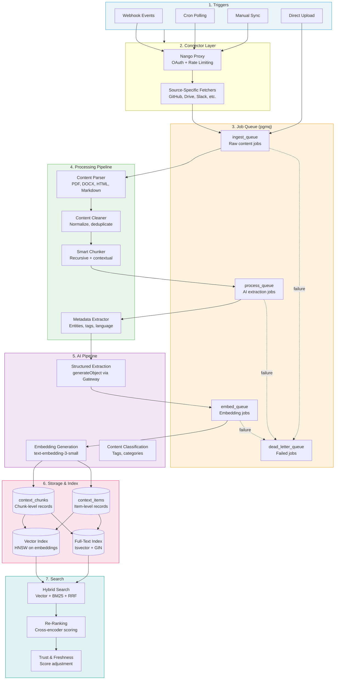
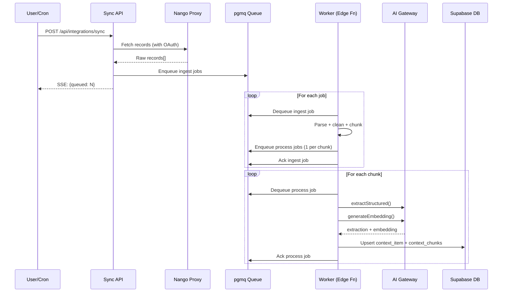

# Ingestion Pipeline Architecture

> **Status**: RFC / Design Document
> **Author**: Engineering
> **Created**: 2026-04-05
> **Stack**: Next.js 16, Supabase (Postgres + pgmq), Vercel AI SDK v6, Nango

---

## Executive Summary

Layers ingests knowledge from 10+ sources (Google Drive, GitHub, Slack, Linear, Notion, Discord, Gmail, Google Calendar, Granola, uploads) and makes it searchable via hybrid vector + BM25 retrieval. The current pipeline works but has structural limitations that will become blockers at scale:

1. **Monolithic sync route** -- a single 1,285-line file (`src/app/api/integrations/sync/route.ts`) contains all connector logic, extraction, embedding, and persistence in one synchronous SSE stream.
2. **No job queue** -- processing happens inline during the HTTP request, capped at 60 seconds (`maxDuration`). Large Drive syncs or slow API responses can timeout.
3. **Fixed-size truncation** -- all content is hard-capped at 12,000 characters with no semantic chunking, losing context from longer documents.
4. **No chunk-level search in practice** -- the `context_chunks` table and `hybrid_search_chunks` RPC exist but are unpopulated; search falls back to item-level.
5. **Embedding model lock-in** -- 1536-dimension vectors (OpenAI text-embedding-3-small) are baked into DB schema; switching models requires full re-embed.
6. **No retry or dead-letter** -- failed items are marked `status: 'error'` with no automatic retry.

This document designs a standardized pipeline that addresses these issues while preserving the existing working system as a migration foundation.

---

## Table of Contents

- [Research Findings](#research-findings)
- [Comparison of Approaches](#comparison-of-approaches)
- [Pipeline Architecture](#pipeline-architecture)
- [Data Flow](#data-flow)
- [Pipeline Stages](#pipeline-stages)
- [Database Schema](#database-schema)
- [Queue and Job System](#queue-and-job-system)
- [Error Handling and Retry](#error-handling-and-retry)
- [Monitoring and Observability](#monitoring-and-observability)
- [Migration Plan](#migration-plan)

---

## Research Findings

### 1. Notion Import/Sync Patterns

Notion's API (version 2025-09-03) introduced **integration webhooks** alongside multi-source databases. Key architectural patterns:

- **Webhooks deliver metadata only** -- page IDs and timestamps, not content. Every webhook event requires a follow-up API call to fetch actual changes. This is identical to our Google Drive webhook pattern.
- **Scalable sync engine pattern**: (1) Connector service with rate limiter, (2) Normalized cache/database, (3) Job queue for webhook + batch sync, (4) Renderer/transformer for blocks-to-Markdown, (5) Admin UI for connection management.
- **Incremental sync via `last_edited_time`** -- Notion's search API supports sorting by `last_edited_time`, enabling delta detection without webhooks.
- **Block-level content model** -- Notion stores content as blocks (paragraphs, headings, lists, code, etc.), requiring recursive traversal to assemble full documents. Our current implementation handles this with `notionBlocksToText()` but only goes 2 levels deep.

*Sources: [Notion Webhooks Reference](https://developers.notion.com/reference/webhooks), [Notion API Architecture Guide (Truto)](https://truto.one/blog/how-to-integrate-with-the-notion-api-architecture-guide-for-b2b-saas), [Auto-Sync Notion to AI (Supermemory)](https://blog.supermemory.ai/auto-sync-notion-to-ai-agent-without-reindexing/)*

### 2. Confluence Data Pipeline

Confluence connector frameworks across Microsoft 365 Copilot, Amazon Bedrock/Kendra, and Elastic share common patterns:

- **Full + incremental crawl modes** -- initial full crawl, then incremental syncs tracking content changes via the source's own change tracking mechanism.
- **CQL-based filtering** -- Confluence Query Language allows fine-grained control over what content is indexed (spaces, labels, content types).
- **Content type diversity** -- pages, blog posts, comments, attachments, and spaces are all treated as indexable objects with different metadata schemas.
- **Access control preservation** -- enterprise connectors preserve Confluence's permission model, filtering search results by user access. Relevant for Layers' org-level RLS.

*Sources: [Microsoft Confluence Cloud Connector](https://learn.microsoft.com/en-us/microsoftsearch/confluence-cloud-connector-overview), [Amazon Kendra Confluence Connector](https://docs.aws.amazon.com/kendra/latest/dg/data-source-v2-confluence.html), [Elastic Confluence Connector](https://www.elastic.co/guide/en/elasticsearch/reference/current/es-connectors-confluence.html)*

### 3. Obsidian Sync & Local-First Architecture

- **CouchDB-based sync** -- Self-hosted LiveSync uses CouchDB or object storage (S3/R2) for server-based sync, with experimental WebRTC peer-to-peer.
- **Plugin-based extensibility** -- Obsidian's plugin architecture allows community connectors (Smart Connections for AI embeddings, Local Sync for project folder sync).
- **Local-first principles** -- data lives on-device first, sync is an overlay. This is the opposite of Layers' cloud-first model but offers insights for offline/edge scenarios.
- **Markdown-native** -- all content is Markdown files, making parsing trivial. The Smart Connections plugin generates local embeddings for note linking.

*Sources: [Obsidian LiveSync (GitHub)](https://github.com/vrtmrz/obsidian-livesync), [Smart Connections (GitHub)](https://github.com/brianpetro/obsidian-smart-connections), [Obsidian Sync Architecture (Forum)](https://forum.obsidian.md/t/obsidian-syncs-operating-architecture/96728)*

### 4. RAG Pipeline Best Practices (2025-2026)

**Chunking**:
- Production default: **recursive splitting at 400-512 tokens with 10-20% overlap**. Semantic chunking benchmarks show mixed results -- 91.9% recall but only 54% end-to-end accuracy vs. 69% for recursive splitting (FloTorch).
- **Contextual retrieval** (Anthropic pattern): prepend each chunk with context (title, heading path, short summary) to make chunks self-contained. This is the highest-ROI improvement.
- **Content-type-aware routing**: PDFs to page-level chunking, web pages to recursive splitting, code to language-aware separators.
- **80% of RAG failures trace to ingestion/chunking**, not the LLM.

**Hybrid Search**:
- Vector + BM25 in parallel, then **cross-encoder re-ranking** (Cohere Rerank v3.5 or similar). This outperforms pure vector search by 18% recall and 12% answer relevancy.
- Retrieve top-100 candidates via hybrid search, re-rank to top-5-10 for the LLM.

**Embedding Models**:
- Domain-specialized fine-tuned models outperform general-purpose by 12-30%.
- **Late chunking** addresses context loss by embedding surrounding context alongside each chunk.

*Sources: [Weaviate Chunking Strategies](https://weaviate.io/blog/chunking-strategies-for-rag), [Firecrawl Best Chunking 2026](https://www.firecrawl.dev/blog/best-chunking-strategies-rag), [PremAI RAG Chunking Benchmark 2026](https://blog.premai.io/rag-chunking-strategies-the-2026-benchmark-guide/), [RAG in 2026 (Apex Logic)](https://www.apex-logic.net/news/rag-in-2026-real-world-implementations-and-best-practices-beyond-the-hype), [RAGFlow Year-End Review 2025](https://ragflow.io/blog/rag-review-2025-from-rag-to-context)*

### 5. Document Processing (Unstructured.io / LlamaIndex)

- **Partition-first architecture**: Unstructured.io detects file type and routes to file-specific partitioning, breaking content into typed elements (paragraphs, tables, headers, images) *before* chunking.
- **Structure-aware chunking**: `by_title` strategy preserves section boundaries, ensuring chunks never cross section borders. Configurable `max_characters` (hard max) and `new_after_n_chars` (soft target).
- **LlamaIndex default**: 1024-token chunks with 20-token overlap, configurable per use case.
- **Multi-modal pipeline**: image OCR, table detection, and PDF layout analysis are first-class. We currently use `pdf-parse` which loses table structure and images.

*Sources: [Unstructured.io Chunking Docs](https://docs.unstructured.io/open-source/core-functionality/chunking), [Unstructured GitHub](https://github.com/Unstructured-IO/unstructured), [Docling RAG-Ready (The New Stack)](https://thenewstack.io/from-unstructured-data-to-rag-ready-with-docling/)*

### 6. Nango / Unified API Platforms

- **Nango architecture**: managed OAuth + token refresh for 700+ APIs, proxy layer that injects credentials and handles rate limits, per-tenant isolation with elastic scaling.
- **AI-generated integrations**: Nango now generates TypeScript connector functions from natural language, editable and version-controlled.
- **Unified API pattern**: standardize multiple APIs into a single interface with your own data models. Nango, Merge, and Apideck all converge on this pattern.
- **Key insight**: unified APIs work best for CRUD operations on similar entities (contacts, tickets, files); they break down for source-specific features (Notion blocks, Linear GraphQL, Slack threads).

*Sources: [Nango Blog: Best Unified API for AI Agents](https://nango.dev/blog/best-unified-api-platform-for-ai-agents-and-rag), [Nango API Unification Docs](https://nango.dev/docs/implementation-guides/use-cases/unified-apis), [10 Best Unified APIs 2026 (Ampersand)](https://www.withampersand.com/blog/the-10-best-unified-api-platforms-in-2026)*

---

## Comparison of Approaches

| Dimension | Current (Layers) | Notion Pattern | Confluence/Enterprise | Unstructured.io | Recommendation |
|---|---|---|---|---|---|
| **Sync trigger** | Manual button + cron | Webhook + polling | Full + incremental crawl | N/A (ETL) | Webhook + polling hybrid |
| **Content fetching** | Inline in request | Job queue | Async crawler | Batch pipeline | Async job queue |
| **Chunking** | None (12K char truncation) | N/A | Configurable | Structure-aware | Recursive + contextual |
| **Embedding** | Per-item, inline | External | Batch | Batch pipeline | Batch, async |
| **Change detection** | Content hash (SHA-256) | `last_edited_time` | Source change tracking | N/A | Hash + timestamp hybrid |
| **Retry** | None | Job queue retry | Configurable | Pipeline retry | Exponential backoff |
| **Deduplication** | `source_type + source_id` | Page ID | Content fingerprint | Element dedup | Hash-based + source ID |

---

## Pipeline Architecture

### Design Principles

1. **Separate concerns** -- connector, processing, and indexing are independent stages connected by a queue.
2. **Fail independently** -- a single document failure does not block the batch. Failed items enter a dead-letter queue.
3. **Idempotent operations** -- every stage can be safely retried without producing duplicates.
4. **Content-type-aware** -- chunking, extraction, and freshness decay are parameterized by content type.
5. **Observable** -- every stage emits structured logs with correlation IDs for end-to-end tracing.

---

## Data Flow



### Connector Lifecycle



---

## Pipeline Stages

### Stage 1: Connector Layer

The connector layer is responsible for authenticating with external APIs and fetching raw content. It stays thin -- no processing logic.

**Current state**: All connector logic lives in `src/app/api/integrations/sync/route.ts` as inline functions (`fetchGitHub`, `fetchGoogleDrive`, `fetchSlack`, etc.).

**Target state**: Each connector is a standalone module in `src/lib/connectors/` implementing a `Connector` interface.

```typescript
// src/lib/connectors/types.ts

export interface RawRecord {
  sourceId: string;
  title: string;
  rawContent: string | Buffer;
  mimeType: string;
  sourceCreatedAt: string | null;
  sourceUpdatedAt: string | null;
  sourceUrl: string | null;
  sourceMetadata: Record<string, unknown>;
}

export interface ConnectorConfig {
  provider: string;
  connectionId: string;
  syncConfig: Record<string, unknown>;
}

export interface FetchResult {
  records: RawRecord[];
  nextPageToken?: string;   // For pagination
  hasMore: boolean;
  debug: string[];
}

export interface Connector {
  readonly provider: string;
  readonly contentType: string;
  readonly supportsWebhook: boolean;
  readonly supportsPagination: boolean;

  fetch(config: ConnectorConfig): Promise<FetchResult>;

  /** Parse a webhook payload into records to ingest */
  parseWebhook?(payload: unknown): Promise<RawRecord[]>;

  /** Return the next polling interval in ms (adaptive) */
  pollingInterval?(lastSyncAt: Date | null): number;
}
```

```typescript
// src/lib/connectors/google-drive.ts (example)

import { Connector, ConnectorConfig, FetchResult } from './types';
import { nango } from '@/lib/nango/client';
import pdfParse from 'pdf-parse';
import mammoth from 'mammoth';

const EXPORTABLE_MIMES: Record<string, string> = {
  'application/vnd.google-apps.document': 'text/plain',
  'application/vnd.google-apps.spreadsheet': 'text/csv',
  'application/vnd.google-apps.presentation': 'text/plain',
};

export const googleDriveConnector: Connector = {
  provider: 'google-drive',
  contentType: 'document',
  supportsWebhook: true,
  supportsPagination: true,

  async fetch(config: ConnectorConfig): Promise<FetchResult> {
    const { connectionId, provider, syncConfig } = config;
    const maxFiles = (syncConfig.max_files as number) ?? 100;
    const debug: string[] = [];
    const records = [];

    // ... fetch and parse logic (extracted from current route)

    return { records, hasMore: false, debug };
  },

  pollingInterval(lastSyncAt) {
    if (!lastSyncAt) return 0; // Immediate first sync
    const hoursSinceSync = (Date.now() - lastSyncAt.getTime()) / 3_600_000;
    // Adaptive: more frequent when recently active
    return hoursSinceSync < 1 ? 5 * 60_000 : 30 * 60_000;
  },
};
```

**Connector registry**:

```typescript
// src/lib/connectors/registry.ts

import { Connector } from './types';
import { googleDriveConnector } from './google-drive';
import { githubConnector } from './github';
import { slackConnector } from './slack';
import { linearConnector } from './linear';
import { notionConnector } from './notion';
import { discordConnector } from './discord';
import { gmailConnector } from './gmail';
import { googleCalendarConnector } from './google-calendar';
import { granolaConnector } from './granola';

const connectors = new Map<string, Connector>();

function register(connector: Connector) {
  connectors.set(connector.provider, connector);
}

register(googleDriveConnector);
register(githubConnector);
register(slackConnector);
register(linearConnector);
register(notionConnector);
register(discordConnector);
register(gmailConnector);
register(googleCalendarConnector);
register(granolaConnector);

export function getConnector(provider: string): Connector | undefined {
  // Handle GitHub variants (github, github-app, etc.)
  if (provider.includes('github')) return connectors.get('github');
  return connectors.get(provider);
}

export function listConnectors(): Connector[] {
  return Array.from(connectors.values());
}
```

### Stage 2: Raw Data Ingestion

After the connector fetches raw records, they are persisted to `context_items` with `status: 'queued'` and a job is enqueued for processing.

**Key change**: fetching and processing are decoupled. The sync API returns immediately after enqueuing, and workers process asynchronously.

```typescript
// src/lib/pipeline/ingest.ts

import { createAdminClient } from '@/lib/supabase/server';
import { computeContentHash, detectChanges, createVersion } from '@/lib/versioning';
import { enqueueProcessJob } from './queue';
import type { RawRecord } from '@/lib/connectors/types';

export async function ingestRecords(
  orgId: string,
  provider: string,
  connectionId: string,
  records: RawRecord[],
): Promise<{ ingested: number; skipped: number; errors: string[] }> {
  const db = createAdminClient();
  let ingested = 0;
  let skipped = 0;
  const errors: string[] = [];

  for (const record of records) {
    try {
      const contentHash = computeContentHash(record.rawContent.toString());

      // Check for existing item
      const { data: existing } = await db
        .from('context_items')
        .select('id, raw_content, content_hash, title, source_metadata')
        .eq('org_id', orgId)
        .eq('source_type', provider)
        .eq('source_id', record.sourceId)
        .maybeSingle();

      if (existing) {
        const changes = detectChanges(
          {
            raw_content: existing.raw_content as string | null,
            content_hash: existing.content_hash as string | null,
            title: existing.title as string,
            source_metadata: existing.source_metadata as Record<string, unknown> | null,
          },
          {
            raw_content: record.rawContent.toString(),
            title: record.title,
            source_metadata: record.sourceMetadata,
          },
        );

        if (!changes.changed) {
          skipped++;
          continue;
        }

        // Version the old state
        await createVersion(db, existing.id, orgId, {
          title: existing.title as string,
          raw_content: existing.raw_content as string | null,
          content_hash: existing.content_hash as string | null,
          source_metadata: existing.source_metadata,
        }, changes.changeType, changes.changedFields, `sync:${provider}`);

        // Update with new content
        await db.from('context_items').update({
          raw_content: record.rawContent.toString(),
          title: record.title,
          content_hash: contentHash,
          source_metadata: record.sourceMetadata,
          source_url: record.sourceUrl,
          status: 'queued',
          updated_at: new Date().toISOString(),
        }).eq('id', existing.id);

        await enqueueProcessJob({
          contextItemId: existing.id,
          orgId,
          contentChanged: changes.contentChanged,
        });
      } else {
        const { data: inserted, error } = await db.from('context_items').insert({
          org_id: orgId,
          source_type: provider,
          source_id: record.sourceId,
          nango_connection_id: connectionId,
          title: record.title,
          raw_content: record.rawContent.toString(),
          content_type: contentTypeFor(provider),
          content_hash: contentHash,
          status: 'queued',
          source_created_at: record.sourceCreatedAt,
          source_url: record.sourceUrl,
          source_metadata: record.sourceMetadata,
        }).select('id').single();

        if (error || !inserted) {
          errors.push(`Insert failed for "${record.title}": ${error?.message}`);
          continue;
        }

        await enqueueProcessJob({
          contextItemId: inserted.id,
          orgId,
          contentChanged: true,
        });
      }

      ingested++;
    } catch (err) {
      errors.push(`${record.title}: ${err instanceof Error ? err.message : String(err)}`);
    }
  }

  return { ingested, skipped, errors };
}
```

### Stage 3: Content Processing

Content processing handles format-specific parsing, cleaning, and normalization.

```typescript
// src/lib/pipeline/parse.ts

import pdfParse from 'pdf-parse';
import mammoth from 'mammoth';
import * as XLSX from 'xlsx';

export interface ParsedContent {
  text: string;
  sections: ContentSection[];
  metadata: {
    pageCount?: number;
    wordCount: number;
    language?: string;
    hasImages: boolean;
    hasTables: boolean;
  };
}

export interface ContentSection {
  heading: string | null;
  level: number;    // 0 = body, 1 = h1, 2 = h2, etc.
  content: string;
  pageNumber?: number;
}

export async function parseContent(
  raw: string | Buffer,
  mimeType: string,
): Promise<ParsedContent> {
  switch (mimeType) {
    case 'application/pdf':
      return parsePdf(raw as Buffer);
    case 'application/vnd.openxmlformats-officedocument.wordprocessingml.document':
      return parseDocx(raw as Buffer);
    case 'application/vnd.openxmlformats-officedocument.spreadsheetml.sheet':
      return parseXlsx(raw as Buffer);
    case 'text/markdown':
      return parseMarkdown(raw.toString());
    case 'text/html':
      return parseHtml(raw.toString());
    default:
      return parsePlainText(raw.toString());
  }
}

function parsePlainText(text: string): ParsedContent {
  const sections = splitBySections(text);
  return {
    text,
    sections,
    metadata: {
      wordCount: text.split(/\s+/).length,
      hasImages: false,
      hasTables: false,
    },
  };
}

async function parsePdf(buffer: Buffer): Promise<ParsedContent> {
  const parsed = await pdfParse(buffer);
  const sections: ContentSection[] = [];

  // Split by page (pdf-parse provides per-page text via numpages)
  const pages = parsed.text.split(/\f/); // Form feed = page break
  for (let i = 0; i < pages.length; i++) {
    const pageText = pages[i].trim();
    if (pageText) {
      sections.push({
        heading: `Page ${i + 1}`,
        level: 0,
        content: pageText,
        pageNumber: i + 1,
      });
    }
  }

  return {
    text: parsed.text,
    sections,
    metadata: {
      pageCount: parsed.numpages,
      wordCount: parsed.text.split(/\s+/).length,
      hasImages: false, // pdf-parse does not detect images
      hasTables: false, // pdf-parse does not detect tables
    },
  };
}

function parseMarkdown(text: string): ParsedContent {
  const sections: ContentSection[] = [];
  const headingRegex = /^(#{1,6})\s+(.+)$/gm;
  let lastIndex = 0;
  let match;

  while ((match = headingRegex.exec(text)) !== null) {
    // Capture content before this heading
    if (match.index > lastIndex) {
      const beforeContent = text.slice(lastIndex, match.index).trim();
      if (beforeContent && sections.length > 0) {
        sections[sections.length - 1].content += '\n' + beforeContent;
      } else if (beforeContent) {
        sections.push({ heading: null, level: 0, content: beforeContent });
      }
    }
    sections.push({
      heading: match[2],
      level: match[1].length,
      content: '',
    });
    lastIndex = match.index + match[0].length;
  }

  // Remaining content
  const remaining = text.slice(lastIndex).trim();
  if (remaining && sections.length > 0) {
    sections[sections.length - 1].content += '\n' + remaining;
  } else if (remaining) {
    sections.push({ heading: null, level: 0, content: remaining });
  }

  return {
    text,
    sections: sections.length > 0 ? sections : [{ heading: null, level: 0, content: text }],
    metadata: {
      wordCount: text.split(/\s+/).length,
      hasImages: /!\[.*?\]\(.*?\)/.test(text),
      hasTables: /\|.*\|.*\|/.test(text),
    },
  };
}
```

### Stage 4: Smart Chunking

The chunking strategy is **content-type-aware** and follows current best practices: recursive splitting at 400-512 tokens with contextual headers.

```typescript
// src/lib/pipeline/chunk.ts

import type { ContentSection, ParsedContent } from './parse';

export interface Chunk {
  index: number;
  content: string;          // The actual chunk text
  contextPrefix: string;    // Prepended context (title, heading path)
  tokenEstimate: number;
  sectionHeading: string | null;
  pageNumber?: number;
}

export interface ChunkConfig {
  maxTokens: number;       // Hard max per chunk (default: 512)
  targetTokens: number;    // Soft target (default: 400)
  overlapTokens: number;   // Overlap between chunks (default: 50)
  contextTemplate: string; // Template for context prefix
}

const DEFAULT_CONFIG: ChunkConfig = {
  maxTokens: 512,
  targetTokens: 400,
  overlapTokens: 50,
  contextTemplate: 'Document: {title}\nSection: {section}\n\n',
};

/** ~4 chars per token is a practical estimate for English text */
const CHARS_PER_TOKEN = 4;

export function chunkContent(
  parsed: ParsedContent,
  title: string,
  contentType: string,
  configOverrides?: Partial<ChunkConfig>,
): Chunk[] {
  const config = { ...DEFAULT_CONFIG, ...getContentTypeDefaults(contentType), ...configOverrides };
  const chunks: Chunk[] = [];
  let chunkIndex = 0;

  for (const section of parsed.sections) {
    const sectionChunks = chunkSection(section, title, config, chunkIndex);
    chunks.push(...sectionChunks);
    chunkIndex += sectionChunks.length;
  }

  // If no sections produced chunks, chunk the full text
  if (chunks.length === 0 && parsed.text.trim()) {
    const fallbackSection: ContentSection = {
      heading: null,
      level: 0,
      content: parsed.text,
    };
    return chunkSection(fallbackSection, title, config, 0);
  }

  return chunks;
}

function chunkSection(
  section: ContentSection,
  title: string,
  config: ChunkConfig,
  startIndex: number,
): Chunk[] {
  const contextPrefix = config.contextTemplate
    .replace('{title}', title)
    .replace('{section}', section.heading ?? 'Main content');

  const text = section.content.trim();
  if (!text) return [];

  const maxChars = config.maxTokens * CHARS_PER_TOKEN;
  const targetChars = config.targetTokens * CHARS_PER_TOKEN;
  const overlapChars = config.overlapTokens * CHARS_PER_TOKEN;

  // Short content: single chunk
  if (text.length <= maxChars) {
    return [{
      index: startIndex,
      content: text,
      contextPrefix,
      tokenEstimate: Math.ceil(text.length / CHARS_PER_TOKEN),
      sectionHeading: section.heading,
      pageNumber: section.pageNumber,
    }];
  }

  // Recursive split: try paragraph -> sentence -> word boundaries
  const chunks: Chunk[] = [];
  const paragraphs = text.split(/\n\n+/);
  let buffer = '';
  let idx = startIndex;

  for (const para of paragraphs) {
    if ((buffer + '\n\n' + para).length > targetChars && buffer) {
      chunks.push({
        index: idx++,
        content: buffer.trim(),
        contextPrefix,
        tokenEstimate: Math.ceil(buffer.trim().length / CHARS_PER_TOKEN),
        sectionHeading: section.heading,
        pageNumber: section.pageNumber,
      });
      // Overlap: keep last portion
      const words = buffer.trim().split(/\s+/);
      const overlapWords = Math.ceil(overlapChars / 5); // ~5 chars per word
      buffer = words.slice(-overlapWords).join(' ') + '\n\n' + para;
    } else {
      buffer = buffer ? buffer + '\n\n' + para : para;
    }
  }

  if (buffer.trim()) {
    chunks.push({
      index: idx,
      content: buffer.trim(),
      contextPrefix,
      tokenEstimate: Math.ceil(buffer.trim().length / CHARS_PER_TOKEN),
      sectionHeading: section.heading,
      pageNumber: section.pageNumber,
    });
  }

  return chunks;
}

/** Content-type-specific chunking defaults */
function getContentTypeDefaults(contentType: string): Partial<ChunkConfig> {
  switch (contentType) {
    case 'message':
      // Chat messages: smaller chunks, no overlap (messages are atomic)
      return { maxTokens: 256, targetTokens: 200, overlapTokens: 0 };
    case 'issue':
      // Issues: medium chunks, small overlap
      return { maxTokens: 384, targetTokens: 300, overlapTokens: 30 };
    case 'meeting_transcript':
      // Transcripts: larger chunks to preserve conversational context
      return { maxTokens: 768, targetTokens: 600, overlapTokens: 100 };
    case 'email_thread':
      // Emails: medium, per-message natural boundaries
      return { maxTokens: 384, targetTokens: 300, overlapTokens: 20 };
    case 'calendar_event':
      // Events are typically short, single chunk
      return { maxTokens: 256, targetTokens: 200, overlapTokens: 0 };
    default:
      // Documents: default
      return {};
  }
}
```

### Stage 5: Metadata Extraction

The existing `extractStructured()` and `classifyContent()` functions are consolidated into a single AI call per item (not per chunk) to control costs.

```typescript
// src/lib/pipeline/extract.ts (enhanced)

import { generateObject } from 'ai';
import { z } from 'zod';
import { extractionModel } from '@/lib/ai/config';

const ExtractionSchema = z.object({
  title: z.string(),
  description_short: z.string(),
  description_long: z.string(),
  entities: z.object({
    people: z.array(z.string()),
    topics: z.array(z.string()),
    action_items: z.array(z.string()),
    decisions: z.array(z.string()),
  }),
  tags: z.array(z.string()).describe('Auto-generated tags for faceted search'),
  categories: z.array(z.string()).describe('High-level categories'),
  language: z.string().describe('ISO 639-1 language code'),
  emotional_signals: z.array(z.string()),
  tacit_observations: z.array(z.string()),
  confidence_score: z.number().min(0).max(1),
  source_quote: z.string().optional(),
});

export type Extraction = z.infer<typeof ExtractionSchema>;

/**
 * Extract structured metadata from content.
 * Called once per context_item (not per chunk) to minimize AI costs.
 * Chunks inherit the parent item's metadata.
 */
export async function extractMetadata(
  rawContent: string,
  title: string,
  contentType: string,
): Promise<Extraction> {
  // Use first 12K chars for extraction (covers most content)
  const truncated = rawContent.slice(0, 12_000);

  const result = await generateObject({
    model: extractionModel,
    schema: ExtractionSchema,
    prompt: `Extract structured metadata from this ${contentType}.

Title: ${title}

Content:
${truncated}

Extract title, summaries, entities, tags, categories, language, emotional signals, tacit observations, confidence score, and the most important quote.`,
  });

  return result.object;
}
```

### Stage 6: Embedding Generation

Embeddings are generated **per chunk** (not per item) for granular retrieval. Batch embedding reduces API calls.

```typescript
// src/lib/pipeline/embed.ts

import { generateEmbeddings, generateEmbedding } from '@/lib/embeddings';
import type { Chunk } from './chunk';

export interface EmbeddedChunk extends Chunk {
  embedding: number[];
}

/**
 * Generate embeddings for a batch of chunks.
 * Each chunk's contextPrefix is prepended to its content for embedding,
 * implementing the "contextual retrieval" pattern.
 */
export async function embedChunks(
  chunks: Chunk[],
  opts?: { orgId?: string; userId?: string },
): Promise<EmbeddedChunk[]> {
  if (chunks.length === 0) return [];

  // Combine context prefix + content for embedding
  const texts = chunks.map((c) => `${c.contextPrefix}${c.content}`);

  const embeddings = await generateEmbeddings(texts, opts);

  return chunks.map((chunk, i) => ({
    ...chunk,
    embedding: embeddings[i],
  }));
}

/**
 * Generate a single embedding for the full item (for item-level search).
 * Uses the description_long if available, falls back to truncated raw content.
 */
export async function embedItem(
  descriptionLong: string | null,
  rawContent: string,
  opts?: { orgId?: string; userId?: string },
): Promise<number[]> {
  const text = descriptionLong ?? rawContent.slice(0, 8_000);
  return generateEmbedding(text, opts);
}
```

### Stage 7: Search Index

The search layer combines item-level and chunk-level hybrid search. The existing `hybrid_search` and `hybrid_search_chunks` RPCs continue to work, with chunks now populated.

**New: Re-ranking stage** (optional, higher quality for chat queries):

```typescript
// src/lib/pipeline/rerank.ts

import { generateObject } from 'ai';
import { z } from 'zod';
import { gateway } from '@/lib/ai/config';
import type { ChunkSearchResult } from '@/lib/db/search';

/**
 * Re-rank search results using a cross-encoder approach.
 * Uses an LLM to score query-document relevance.
 *
 * Only invoked for chat queries (not for library browsing).
 * Operates on the top-N candidates from hybrid search.
 */
export async function rerankResults(
  query: string,
  results: ChunkSearchResult[],
  topK: number = 5,
): Promise<ChunkSearchResult[]> {
  if (results.length <= topK) return results;

  const candidates = results.slice(0, 20); // Score top 20

  const { object } = await generateObject({
    model: gateway.languageModel('anthropic/claude-haiku-4-5-20251001'),
    schema: z.object({
      rankings: z.array(z.object({
        index: z.number(),
        relevance: z.number().min(0).max(1),
      })),
    }),
    prompt: `Score each document's relevance to the query on a 0-1 scale.

Query: ${query}

Documents:
${candidates.map((r, i) => `[${i}] ${r.title}: ${r.parent_content.slice(0, 300)}`).join('\n\n')}

Return a ranking for each document index.`,
  });

  const scoreMap = new Map(object.rankings.map((r) => [r.index, r.relevance]));

  return candidates
    .map((result, i) => ({
      ...result,
      rrf_score: result.rrf_score * (scoreMap.get(i) ?? 0.5),
    }))
    .sort((a, b) => b.rrf_score - a.rrf_score)
    .slice(0, topK);
}
```

### Stage 8: Deduplication

Content-hash-based deduplication across sources prevents the same document from being indexed multiple times (e.g., a PDF in Drive and attached to a Slack message).

```typescript
// src/lib/pipeline/dedup.ts

import { createAdminClient } from '@/lib/supabase/server';
import { computeContentHash } from '@/lib/versioning';

export interface DedupResult {
  isDuplicate: boolean;
  existingItemId: string | null;
  existingSourceType: string | null;
}

/**
 * Check if content already exists in the org via content hash.
 * This catches cross-source duplicates (same PDF in Drive and Slack).
 */
export async function checkDuplicate(
  orgId: string,
  content: string,
  currentSourceType: string,
  currentSourceId: string,
): Promise<DedupResult> {
  const hash = computeContentHash(content);
  const db = createAdminClient();

  const { data } = await db
    .from('context_items')
    .select('id, source_type, source_id')
    .eq('org_id', orgId)
    .eq('content_hash', hash)
    .neq('source_id', currentSourceId) // Exclude self
    .limit(1)
    .maybeSingle();

  if (data) {
    return {
      isDuplicate: true,
      existingItemId: data.id,
      existingSourceType: data.source_type,
    };
  }

  return { isDuplicate: false, existingItemId: null, existingSourceType: null };
}
```

---

## Database Schema

### Existing Tables (no changes)

- `context_items` -- item-level records with embeddings, metadata, and status
- `context_item_versions` -- version history for change tracking

### Schema Additions

```sql
-- ============================================================
-- context_chunks: chunk-level records for granular retrieval
-- (table may already exist but is currently unpopulated)
-- ============================================================

CREATE TABLE IF NOT EXISTS context_chunks (
  id              uuid PRIMARY KEY DEFAULT gen_random_uuid(),
  context_item_id uuid NOT NULL REFERENCES context_items(id) ON DELETE CASCADE,
  org_id          uuid NOT NULL REFERENCES organizations(id),
  chunk_index     int NOT NULL,
  content         text NOT NULL,
  context_prefix  text,           -- Contextual header for retrieval
  section_heading text,
  page_number     int,
  token_estimate  int NOT NULL,
  embedding       vector(1536),   -- Same dimension as context_items
  created_at      timestamptz DEFAULT now(),
  UNIQUE (context_item_id, chunk_index)
);

-- HNSW index for vector search on chunks
CREATE INDEX IF NOT EXISTS idx_context_chunks_embedding
  ON context_chunks USING hnsw (embedding vector_cosine_ops)
  WITH (m = 16, ef_construction = 64);

-- Full-text search on chunk content
ALTER TABLE context_chunks
  ADD COLUMN IF NOT EXISTS fts tsvector
  GENERATED ALWAYS AS (to_tsvector('english', content)) STORED;

CREATE INDEX IF NOT EXISTS idx_context_chunks_fts
  ON context_chunks USING gin (fts);

-- Lookup by parent item
CREATE INDEX IF NOT EXISTS idx_context_chunks_item
  ON context_chunks (context_item_id);

-- Org-scoped queries
CREATE INDEX IF NOT EXISTS idx_context_chunks_org
  ON context_chunks (org_id);

-- ============================================================
-- ingestion_jobs: job tracking for observability
-- ============================================================

CREATE TABLE IF NOT EXISTS ingestion_jobs (
  id              uuid PRIMARY KEY DEFAULT gen_random_uuid(),
  org_id          uuid NOT NULL REFERENCES organizations(id),
  integration_id  uuid REFERENCES integrations(id),
  provider        text NOT NULL,
  status          text NOT NULL DEFAULT 'pending',
    -- pending | fetching | processing | completed | failed
  trigger_type    text NOT NULL,
    -- manual | cron | webhook
  records_fetched int DEFAULT 0,
  records_ingested int DEFAULT 0,
  records_skipped int DEFAULT 0,
  records_failed  int DEFAULT 0,
  error_message   text,
  started_at      timestamptz DEFAULT now(),
  completed_at    timestamptz,
  duration_ms     int,
  metadata        jsonb DEFAULT '{}'::jsonb,
  created_at      timestamptz DEFAULT now()
);

CREATE INDEX IF NOT EXISTS idx_ingestion_jobs_org_status
  ON ingestion_jobs (org_id, status);

CREATE INDEX IF NOT EXISTS idx_ingestion_jobs_created
  ON ingestion_jobs (created_at DESC);

-- ============================================================
-- Add content_hash index for cross-source deduplication
-- ============================================================

CREATE INDEX IF NOT EXISTS idx_context_items_content_hash
  ON context_items (org_id, content_hash)
  WHERE content_hash IS NOT NULL;

-- ============================================================
-- Add ingested_at column if missing (used by classify cron)
-- ============================================================

ALTER TABLE context_items
  ADD COLUMN IF NOT EXISTS ingested_at timestamptz DEFAULT now();
```

### RLS Policies

```sql
-- context_chunks inherits org-level access from context_items
ALTER TABLE context_chunks ENABLE ROW LEVEL SECURITY;

CREATE POLICY "Org members can read chunks"
  ON context_chunks FOR SELECT
  USING (org_id IN (
    SELECT org_id FROM org_members WHERE user_id = auth.uid()
  ));

-- ingestion_jobs: org members can view their org's jobs
ALTER TABLE ingestion_jobs ENABLE ROW LEVEL SECURITY;

CREATE POLICY "Org members can read ingestion jobs"
  ON ingestion_jobs FOR SELECT
  USING (org_id IN (
    SELECT org_id FROM org_members WHERE user_id = auth.uid()
  ));
```

---

## Queue and Job System

### Supabase Queues (pgmq)

Supabase Queues provides Postgres-native durable message queues with guaranteed delivery, built on the pgmq extension. This is the recommended approach for Layers because:

1. **No additional infrastructure** -- runs inside existing Supabase Postgres.
2. **Exactly-once delivery** -- within a configurable visibility window.
3. **Transaction safety** -- queue operations participate in Postgres transactions.
4. **Observability** -- messages are queryable rows in Postgres.

### Queue Setup

```sql
-- Enable pgmq extension (if not already enabled)
CREATE EXTENSION IF NOT EXISTS pgmq;

-- Create queues for each pipeline stage
SELECT pgmq.create('ingest');      -- Raw content to process
SELECT pgmq.create('process');     -- AI extraction + chunking
SELECT pgmq.create('embed');       -- Embedding generation
SELECT pgmq.create('dead_letter'); -- Failed jobs after max retries
```

### Queue Message Schema

```typescript
// src/lib/pipeline/queue.ts

import { createAdminClient } from '@/lib/supabase/server';

interface IngestJobMessage {
  type: 'ingest';
  contextItemId: string;
  orgId: string;
  contentChanged: boolean;
  attempt: number;
  createdAt: string;
}

interface ProcessJobMessage {
  type: 'process';
  contextItemId: string;
  orgId: string;
  attempt: number;
  createdAt: string;
}

interface EmbedJobMessage {
  type: 'embed';
  contextItemId: string;
  orgId: string;
  chunkIds: string[];
  attempt: number;
  createdAt: string;
}

type JobMessage = IngestJobMessage | ProcessJobMessage | EmbedJobMessage;

const MAX_ATTEMPTS = 3;
const VISIBILITY_TIMEOUT_SEC = 120; // 2 minutes per job

export async function enqueueProcessJob(params: {
  contextItemId: string;
  orgId: string;
  contentChanged: boolean;
}) {
  const db = createAdminClient();
  const message: IngestJobMessage = {
    type: 'ingest',
    contextItemId: params.contextItemId,
    orgId: params.orgId,
    contentChanged: params.contentChanged,
    attempt: 1,
    createdAt: new Date().toISOString(),
  };

  await db.rpc('pgmq_send', {
    queue_name: 'ingest',
    message: JSON.stringify(message),
  });
}

export async function dequeueAndProcess(queueName: string) {
  const db = createAdminClient();

  const { data: messages } = await db.rpc('pgmq_read', {
    queue_name: queueName,
    vt: VISIBILITY_TIMEOUT_SEC,
    qty: 5, // Process up to 5 messages per invocation
  });

  if (!messages?.length) return { processed: 0 };

  let processed = 0;

  for (const msg of messages) {
    const job = JSON.parse(msg.message) as JobMessage;

    try {
      switch (job.type) {
        case 'ingest':
          await processIngestJob(job);
          break;
        case 'process':
          await processExtractJob(job);
          break;
        case 'embed':
          await processEmbedJob(job);
          break;
      }

      // Acknowledge successful processing
      await db.rpc('pgmq_delete', {
        queue_name: queueName,
        msg_id: msg.msg_id,
      });
      processed++;
    } catch (err) {
      console.error(`[queue:${queueName}] Job failed:`, err);

      if (job.attempt >= MAX_ATTEMPTS) {
        // Move to dead letter queue
        await db.rpc('pgmq_send', {
          queue_name: 'dead_letter',
          message: JSON.stringify({
            ...job,
            error: err instanceof Error ? err.message : String(err),
            failedAt: new Date().toISOString(),
            originalQueue: queueName,
          }),
        });
        await db.rpc('pgmq_delete', {
          queue_name: queueName,
          msg_id: msg.msg_id,
        });
      }
      // Otherwise, message becomes visible again after VISIBILITY_TIMEOUT_SEC
    }
  }

  return { processed };
}
```

### Worker Invocation

Workers are triggered by **Supabase Cron** (pg_cron) calling Edge Functions:

```sql
-- Poll queues every 30 seconds
SELECT cron.schedule(
  'process-ingest-queue',
  '30 seconds',
  $$SELECT net.http_post(
    url := current_setting('app.settings.edge_function_url') || '/pipeline-worker',
    headers := jsonb_build_object(
      'Authorization', 'Bearer ' || current_setting('app.settings.service_role_key')
    ),
    body := '{"queue": "ingest"}'::jsonb
  )$$
);
```

Alternatively, use the existing Next.js cron routes:

```typescript
// src/app/api/cron/pipeline-worker/route.ts

import { NextRequest, NextResponse } from 'next/server';
import { dequeueAndProcess } from '@/lib/pipeline/queue';

export const maxDuration = 60;
export const dynamic = 'force-dynamic';

export async function POST(request: NextRequest) {
  const authHeader = request.headers.get('authorization');
  if (authHeader !== `Bearer ${process.env.CRON_SECRET}`) {
    return NextResponse.json({ error: 'Unauthorized' }, { status: 401 });
  }

  const results = await Promise.all([
    dequeueAndProcess('ingest'),
    dequeueAndProcess('process'),
    dequeueAndProcess('embed'),
  ]);

  return NextResponse.json({
    ingest: results[0],
    process: results[1],
    embed: results[2],
  });
}

export async function GET(request: NextRequest) {
  return POST(request);
}
```

---

## Error Handling and Retry

### Retry Strategy

| Stage | Max Retries | Backoff | Visibility Timeout |
|---|---|---|---|
| Ingest (parse/chunk) | 3 | Exponential: 30s, 2m, 10m | 120s |
| Process (AI extraction) | 3 | Exponential: 60s, 5m, 30m | 180s |
| Embed (vector generation) | 5 | Exponential: 30s, 2m, 10m, 30m, 1h | 120s |
| Webhook delivery | 3 | Fixed: 5s | N/A |

Embedding gets more retries because transient API rate limits are common and the operation is cheap.

### Error Classification

```typescript
// src/lib/pipeline/errors.ts

export type ErrorCategory =
  | 'transient'        // API timeout, rate limit, 5xx -- auto-retry
  | 'content'          // Unparseable content -- skip, mark error
  | 'auth'             // Token expired -- trigger re-auth
  | 'quota'            // Credit exhaustion -- pause, notify
  | 'permanent';       // Bug, schema mismatch -- dead-letter

export function classifyError(err: unknown): ErrorCategory {
  if (err instanceof Error) {
    const msg = err.message.toLowerCase();

    if (msg.includes('rate limit') || msg.includes('429') || msg.includes('timeout')) {
      return 'transient';
    }
    if (msg.includes('401') || msg.includes('403') || msg.includes('token')) {
      return 'auth';
    }
    if (msg.includes('credit') || msg.includes('quota') || msg.includes('billing')) {
      return 'quota';
    }
    if (msg.includes('parse') || msg.includes('invalid') || msg.includes('corrupt')) {
      return 'content';
    }
  }
  return 'permanent';
}
```

### Dead Letter Queue Processing

Items in the dead-letter queue are surfaced in the admin dashboard and can be:

1. **Retried** -- manually re-enqueued after the underlying issue is fixed.
2. **Skipped** -- permanently marked as `status: 'error'` with a human-readable reason.
3. **Escalated** -- triggers a Discord alert for the engineering team.

---

## Monitoring and Observability

### Structured Logging

Every pipeline stage emits structured logs with correlation IDs:

```typescript
// src/lib/pipeline/logger.ts

export function pipelineLog(
  stage: string,
  jobId: string,
  orgId: string,
  data: Record<string, unknown>,
) {
  console.log(JSON.stringify({
    _type: 'pipeline',
    stage,
    jobId,
    orgId,
    timestamp: new Date().toISOString(),
    ...data,
  }));
}
```

### Key Metrics

| Metric | Source | Alert Threshold |
|---|---|---|
| Queue depth (per queue) | `pgmq.metrics('ingest')` | > 100 messages for 5 min |
| Job processing time | `ingestion_jobs.duration_ms` | P95 > 30s |
| Dead letter queue size | `pgmq.metrics('dead_letter')` | > 0 (any message) |
| Embedding API errors | Structured logs | > 5% error rate |
| Credit consumption rate | `credit_transactions` | > 80% of balance |
| Sync freshness | `integrations.last_sync_at` | > 1 hour stale |
| Chunk count per item | `context_chunks` group by `context_item_id` | > 50 (suspicious) |

### Dashboard Query (for admin UI)

```sql
-- Pipeline health overview
SELECT
  status,
  count(*) as count,
  avg(duration_ms)::int as avg_duration_ms,
  max(created_at) as latest
FROM ingestion_jobs
WHERE created_at > now() - interval '24 hours'
GROUP BY status;

-- Queue depths
SELECT
  queue_name,
  queue_length,
  newest_msg_age_sec,
  oldest_msg_age_sec
FROM pgmq.metrics_all();

-- Items stuck in processing
SELECT id, title, source_type, status, updated_at
FROM context_items
WHERE status IN ('processing', 'queued')
  AND updated_at < now() - interval '10 minutes'
ORDER BY updated_at ASC
LIMIT 20;
```

---

## Migration Plan

The migration is designed to be **incremental and backward-compatible**. The existing sync route continues working throughout the migration.

### Phase 1: Extract Connectors (Week 1-2)

**Goal**: Move connector logic out of the monolithic route into standalone modules.

1. Create `src/lib/connectors/` directory with `types.ts` and `registry.ts`.
2. Extract each `fetch*` function into its own connector file (e.g., `google-drive.ts`, `github.ts`).
3. Update `src/app/api/integrations/sync/route.ts` to import from the registry instead of inline functions.
4. **No behavior change** -- the sync route still works identically, just refactored.

```
src/lib/connectors/
  types.ts              # Connector interface + RawRecord type
  registry.ts           # Connector map + lookup
  google-drive.ts       # Extracted from sync/route.ts
  github.ts
  slack.ts
  linear.ts
  notion.ts
  discord.ts
  gmail.ts
  google-calendar.ts
  granola.ts
```

### Phase 2: Add Pipeline Modules (Week 2-3)

**Goal**: Implement parsing, chunking, and the processing pipeline as library code.

1. Create `src/lib/pipeline/` directory with `parse.ts`, `chunk.ts`, `extract.ts`, `embed.ts`, `dedup.ts`.
2. Write unit tests for chunking with various content types.
3. **No production change yet** -- pipeline modules exist but are not wired into the sync route.

### Phase 3: Enable Supabase Queues (Week 3-4)

**Goal**: Set up pgmq queues and the worker cron job.

1. Run the SQL migration to create queues and the `ingestion_jobs` table.
2. Create `src/lib/pipeline/queue.ts` with enqueue/dequeue logic.
3. Create `src/app/api/cron/pipeline-worker/route.ts`.
4. Add the `context_chunks` table (if not already present) and indexes.

### Phase 4: Wire Pipeline to Sync (Week 4-5)

**Goal**: The sync route enqueues jobs instead of processing inline.

1. Modify `src/app/api/integrations/sync/route.ts`:
   - Fetch records using connector registry.
   - Call `ingestRecords()` which enqueues jobs.
   - SSE stream reports queued count and exits quickly.
2. Workers pick up jobs and run the full pipeline (parse -> chunk -> extract -> embed -> persist).
3. **Feature flag**: `PIPELINE_V2=true` env var to toggle between old (inline) and new (queued) behavior.

### Phase 5: Populate Chunks + Enable Chunk Search (Week 5-6)

**Goal**: Backfill chunks for existing items and switch search to chunk-level.

1. Create a backfill script that re-processes all `status: 'ready'` items through the chunking pipeline.
2. Run as a background job (batch of 10, with rate limiting).
3. Once chunk coverage > 90%, enable `searchContextChunks()` as the primary search path.

### Phase 6: Webhook Integration (Week 6-7)

**Goal**: Connect webhook receivers to the queue-based pipeline.

1. Update `src/app/api/webhooks/google-drive/route.ts` to enqueue jobs instead of processing inline.
2. Add Notion webhook receiver.
3. Add Linear webhook receiver (currently uses cron).
4. Implement adaptive polling intervals for sources without webhooks.

### Phase 7: Observability + Cleanup (Week 7-8)

**Goal**: Monitoring, alerting, and removal of old code paths.

1. Add pipeline metrics to admin dashboard.
2. Set up Discord alerts for dead-letter queue.
3. Remove the `PIPELINE_V2` feature flag, making the queue-based pipeline the only path.
4. Archive the old inline processing code.

---

## Appendix: Content Type Matrix

| Content Type | Sources | Chunking Strategy | Avg Chunks/Item | Freshness Half-Life |
|---|---|---|---|---|
| `document` | Drive, Notion, Upload | Recursive 512-token, section-aware | 5-20 | 180 days |
| `issue` | GitHub, Linear | Recursive 384-token | 1-3 | 60 days |
| `message` | Slack, Discord | Fixed 256-token, per-window | 2-5 | 30 days |
| `meeting_transcript` | Granola | Recursive 768-token | 10-30 | 90 days |
| `email_thread` | Gmail | Recursive 384-token, per-message | 3-8 | 60 days |
| `calendar_event` | Google Calendar | Single chunk (usually < 256 tokens) | 1 | 30 days |
| `code` | GitHub (future) | Language-aware, function-level | 5-15 | 120 days |

## Appendix: Estimated Costs Per Sync

| Operation | Model | Cost per 1K items | Notes |
|---|---|---|---|
| Extraction | Gemini Flash Lite | ~$0.30 | 1 call/item, ~3K tokens |
| Embedding (items) | text-embedding-3-small | ~$0.02 | 1 call/item |
| Embedding (chunks) | text-embedding-3-small | ~$0.10 | ~5 chunks/item avg |
| Classification | Gemini Flash Lite | ~$0.15 | Optional, 1 call/item |
| Re-ranking | Claude Haiku | ~$1.50 | Optional, per search query |
| **Total per sync** | | **~$0.57/1K items** | Without re-ranking |

*Note: Costs assume Vercel AI Gateway pricing. Actual costs depend on content length and chunk count.*
