# Knowledge Library Hub & Sharing

> Status: Architecture Overview (Product-Focused)
> Owner: Mirror Factory (Alfonso, Kyle, Bobby)
> Last updated: 2026-04-06
> Type: "How it all fits together" -- user journeys, UX flows, content lifecycle
>
> **Related technical docs:**
> - `content-organization.md` -- collections, tags, smart collections, AI classification
> - `sharing-permissions.md` -- per-resource permission model, RLS policies
> - `sharing-system.md` -- current implementation (conversation sharing, public links)
> - `org-permissions-system.md` -- org roles (Owner/Admin/Member/Guest)
> - `universal-artifact-system.md` -- artifact types, versioning, sandbox management
> - `ingestion-pipeline.md` -- how external content enters the system
> - `knowledge-library-system-v2.md` -- detailed requirements from product sessions
> - `accounts-orgs-sharing.md` -- current account/org model

---

## Table of Contents

1. [The Library as the Hub](#1-the-library-as-the-hub)
2. [Content Types and Their Capabilities](#2-content-types-and-their-capabilities)
3. [How Content Enters the Library](#3-how-content-enters-the-library)
4. [Navigating the Library](#4-navigating-the-library)
5. [Sharing Model](#5-sharing-model)
6. [Using Library Content in Chat](#6-using-library-content-in-chat)
7. [Download and Export](#7-download-and-export)
8. [Access Control Layers](#8-access-control-layers)
9. [Artifact Sandbox Sharing](#9-artifact-sandbox-sharing)
10. [The "Shared With Me" Experience](#10-the-shared-with-me-experience)
11. [Library Search and Discovery](#11-library-search-and-discovery)
12. [Future: Cross-Org Content Marketplace](#12-future-cross-org-content-marketplace)

---

## 1. The Library as the Hub

The Knowledge Library is the single place where **all content in Layers lives**. Whether a document was synced from Google Drive, a meeting transcript pulled from Granola, an artifact built by the AI, or a file uploaded by a team member -- it surfaces in the Library with a consistent card, consistent actions, and consistent search.

Think of the Library as the home screen for knowledge. Every other surface in Layers (chat, artifacts panel, context sidebar) is a *lens* into the Library -- a filtered, contextual view -- but the Library is the canonical source.

### What the Library unifies

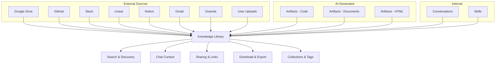

### Core principles

1. **One item, many views.** An item lives in one canonical location (the `context_items` or `artifacts` table) but can appear in multiple collections, search results, and chat contexts simultaneously. No duplication.
2. **Unified card format.** Every content type renders as a card with: icon (type-specific), title, source badge, description snippet, tags, date, and actions. List view and grid view are interchangeable.
3. **Everything is searchable.** Every item gets an embedding (vector) and full-text index (BM25) on ingestion. There is no content that enters the Library without being indexed.
4. **Org-scoped by default.** All Library content belongs to an organization. All org members can see all Library content (today). Per-item restrictions are a future enhancement.

> **Technical reference:** See `content-organization.md` for the collections/tags/smart-collections schema. See `accounts-orgs-sharing.md` for the org ownership model.

---

## 2. Content Types and Their Capabilities

Every item in the Library has a type, and each type comes with a specific set of capabilities.

| Type | Source(s) | Viewable | Editable | Shareable | Downloadable | Usable in Chat |
|------|-----------|----------|----------|-----------|-------------|----------------|
| **Documents** | Google Drive, Notion, uploads | Yes -- rendered HTML/Markdown | Via source app (Drive, Notion) | Yes -- org link or public link | Yes (PDF, Markdown) | Yes (`search_context`) |
| **Meeting transcripts** | Granola | Yes -- transcript viewer with speaker labels | No (read-only from source) | Yes -- org link or public link | Yes (Markdown) | Yes (`search_context`) |
| **Code / Issues** | GitHub, Linear | Yes -- syntax-highlighted code, issue cards | Via source app (GitHub, Linear) | Yes -- org link or public link | No | Yes (`search_context`) |
| **Messages** | Slack, Gmail | Yes -- threaded message viewer | No (read-only from source) | Yes -- org link or public link | No | Yes (`search_context`) |
| **Artifacts (code)** | AI-generated via `write_code` / `run_project` | Yes -- code editor + file tree + live sandbox preview | Yes -- in-app Monaco-style editor | Yes -- public share link | Yes (ZIP with all project files) | Yes (`search_context` + `artifact_get`) |
| **Artifacts (documents)** | AI-generated via `create_document` | Yes -- rendered rich text | Yes -- TipTap editor in artifact panel | Yes -- public share link | Yes (HTML, Markdown) | Yes (`search_context` + `artifact_get`) |
| **Artifacts (HTML)** | AI-generated | Yes -- rendered preview | Yes -- code editor | Yes -- public share link | Yes (HTML) | Yes (`search_context` + `artifact_get`) |
| **Uploads** | Direct file upload by user | Yes -- type-appropriate viewer | No (original format preserved) | Yes -- org link or public link | Yes (original format) | Yes (`search_context`) |

### What every item has

Regardless of type, every Library item carries this metadata:

- **Title** -- auto-generated if not provided
- **Description (3 levels)** -- oneliner (~10 words), short (~50 words), long (~200 words); all AI-generated on ingestion
- **Tags** -- AI-generated + user-assigned
- **Category** -- AI-assigned classification
- **Source badge** -- icon + label indicating where it came from
- **Timestamps** -- created, updated, last viewed
- **Embedding** -- vector for semantic search
- **Search index** -- BM25 full-text index

> **Technical reference:** See `universal-artifact-system.md` Section 3.2 for artifact-specific types. See `knowledge-library-system-v2.md` Section B for the full AI classification registry.

---

## 3. How Content Enters the Library

Content arrives through four pathways. Each pathway feeds through an ingestion pipeline that classifies, tags, embeds, and indexes the content.

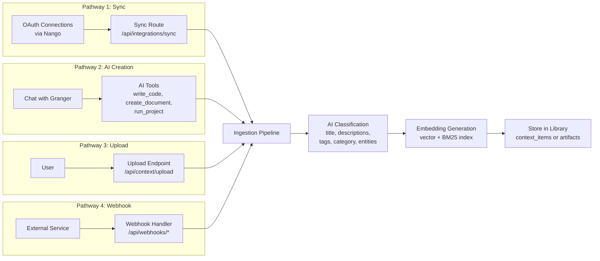

### Pathway details

| Pathway | Trigger | Sources | Current Status |
|---------|---------|---------|----------------|
| **Sync** | User clicks "Sync" on a connection, or scheduled cron | Google Drive, GitHub, Slack, Linear, Notion, Gmail, Granola | Implemented -- monolithic sync route |
| **AI creation** | AI calls a tool during a conversation | `write_code`, `create_document`, `edit_document`, `run_project` | Implemented -- saves to `artifacts` table |
| **Upload** | User drags a file or clicks "Upload" | PDF, DOCX, TXT, MD, CSV, images | Implemented -- basic upload flow |
| **Webhook** | External service sends an event | Linear (issue updates), Google Drive (file changes), Stripe, Discord | Implemented -- per-service webhook handlers |

> **Technical reference:** See `ingestion-pipeline.md` for the pipeline architecture, chunking strategy, and embedding model details.

---

## 4. Navigating the Library

The Library sidebar provides multiple navigation paths so users can find content the way that makes sense to them.

### Sidebar structure

```
+----------------------------------+
| LIBRARY                          |
|                                  |
| > All Items                      |
| > Recent                         |
| > Pinned                         |
| > Shared with Me                 |
|                                  |
| COLLECTIONS                      |
| > Marketing Assets         (24)  |
|   > Brand Guidelines       (8)   |
|   > Campaign Docs          (16)  |
| > Engineering Specs        (41)  |
| > Q1 Planning              (12)  |
| + New Collection                 |
|                                  |
| SMART COLLECTIONS                |
| > Unread this week         (7)   |
| > Stale (>30 days)         (15)  |
| > AI-generated             (33)  |
|                                  |
| SOURCES                          |
| > Google Drive             (156) |
| > GitHub                   (89)  |
| > Slack                    (234) |
| > Linear                   (67)  |
| > Granola                  (23)  |
| > Uploads                  (18)  |
|                                  |
| TAGS                             |
| product  design  eng  q1         |
| roadmap  meeting  decision       |
+----------------------------------+
```

### Navigation modes

1. **Browse by collection** -- User-created folders, up to 3 levels of nesting. Drag-and-drop to organize. Items can belong to multiple collections (references, not copies).
2. **Browse by source** -- Filter to see only items from a specific integration (Google Drive, GitHub, etc.).
3. **Browse by tag** -- Click any tag to filter. Tags are combinable (AND logic).
4. **Smart collections** -- Saved filter queries that auto-populate. Examples: "All documents modified this week," "Stale items not viewed in 30+ days," "Items tagged 'decision' from Slack."
5. **Search** -- Full-text + semantic search from the top bar. See [Section 11](#11-library-search-and-discovery).
6. **Pinned** -- Items the user or team has pinned for quick access. Pins are per-user (personal) or per-org (team-wide).
7. **Recent** -- Last 50 items viewed or modified by the user.

### Main content area

The main content area shows items as cards (grid) or rows (list). Both views show:
- Type icon + source badge
- Title
- Description snippet (oneliner)
- Tags (first 3, with "+N more")
- Last updated timestamp
- Quick actions: Open, Share, Pin, Archive, Delete

Right-clicking any item opens a context menu with the full action set:
- Open in Viewer
- Open in Chat (starts new conversation with this item as context)
- Share (opens share dialog)
- Copy Link
- Edit Metadata (title, description, tags)
- Move to Collection
- Pin / Unpin
- Archive / Unarchive
- Download
- View Version History
- Delete

> **Technical reference:** See `content-organization.md` for the `CollectionsSidebar` component (432 lines), collection CRUD APIs, and tag management APIs.

---

## 5. Sharing Model

Sharing in Layers operates at three scopes: within the org, via links, and (future) across orgs.

### 5.1 Within an organization

**Current state:** All org members see all Library content by default. There is no per-item restriction within an org. This follows the "open by default" philosophy -- every team member has full visibility into the org's knowledge base.

**Future state:** Per-item permissions will allow restricting specific items to certain members. See `sharing-permissions.md` for the planned permission levels (none, view, comment, edit, admin, owner).

| Action | Who Can Do It (Today) | Who Can Do It (Future) |
|--------|----------------------|----------------------|
| View any Library item | All org members | Members with view+ permission |
| Edit artifacts | All org members | Members with edit+ permission |
| Delete items | All org members | Owners and admins only |
| Share externally | All org members | Members with admin+ permission |
| Pin for team | All org members | All org members |

### 5.2 External sharing via links

Layers supports sharable links that extend access beyond the organization.

**Currently implemented (conversations only):**
- Public share links for conversations (`/share/[token]`)
- Read-only view with branded layout
- Optional org-only restriction (`allow_public_view` flag)
- Deactivation support (`is_active` flag)

**Planned (all content types):**
- Public share links for artifacts
- Public share links for documents/context items
- Public share links for collections (share an entire folder)
- Optional password protection
- Optional expiry date
- View count tracking

### 5.3 Sharing UX flow

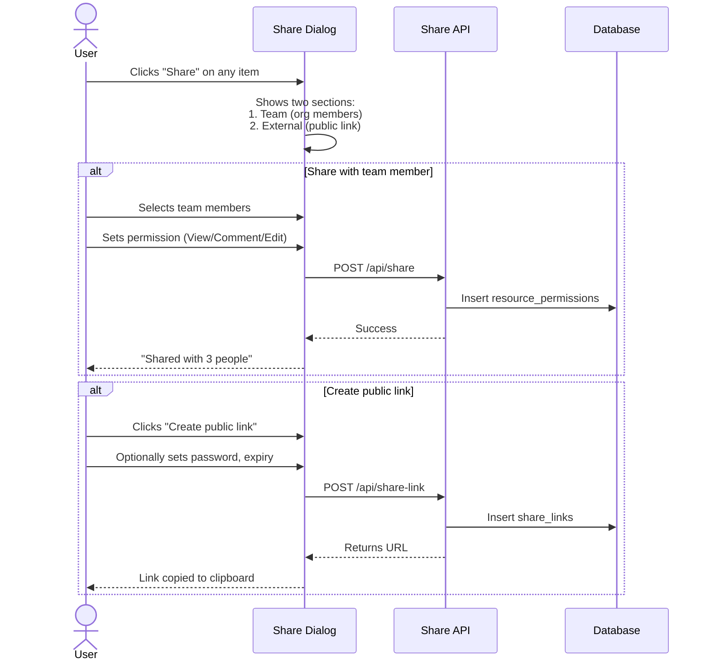

### The share dialog

```
+------------------------------------------+
| Share "Q1 Product Roadmap"               |
|------------------------------------------|
|                                          |
| TEAM SHARING                             |
| Share with org members:                  |
|                                          |
| [x] Kyle Martinez        Can Edit   v   |
| [x] Bobby Chen           Can View   v   |
| [ ] Sarah Kim            --------   v   |
|                                          |
| [Share with selected]                    |
|                                          |
|------------------------------------------|
|                                          |
| LINK SHARING                             |
|                                          |
| ( ) Org members only (requires login)    |
| (x) Anyone with the link                 |
|                                          |
| Permission: Can View  v                  |
| Password:   [optional]                   |
| Expires:    [Never         v]            |
|                                          |
| [Create Link]                            |
|                                          |
| Active links:                            |
| layers.so/s/a8f3c2... | Created Apr 2   |
|   [Copy] [Deactivate]                   |
|                                          |
+------------------------------------------+
```

### Share link lifecycle

1. **Creation** -- User clicks "Create Link." System generates a 32-character hex token, stores it in `share_links` with the resource reference, permission level, and optional password/expiry.
2. **Distribution** -- User copies the URL (`layers.so/s/[token]`) and sends it via any channel (Slack, email, etc.).
3. **Access** -- Recipient opens the link. System looks up the token, checks `is_active`, checks expiry, checks password (if set). If all pass, renders a read-only (or permitted) view.
4. **Deactivation** -- User can deactivate the link at any time from the share dialog. Deactivated links return a 404.

> **Technical reference:** See `sharing-system.md` for the current conversation sharing implementation. See `sharing-permissions.md` for the planned unified `resource_permissions` and `share_links` schema.

---

## 6. Using Library Content in Chat

The Library and chat are deeply connected. Users can bring Library content into conversations, and the AI can search the Library autonomously.

### User-initiated: @mention and context attachment

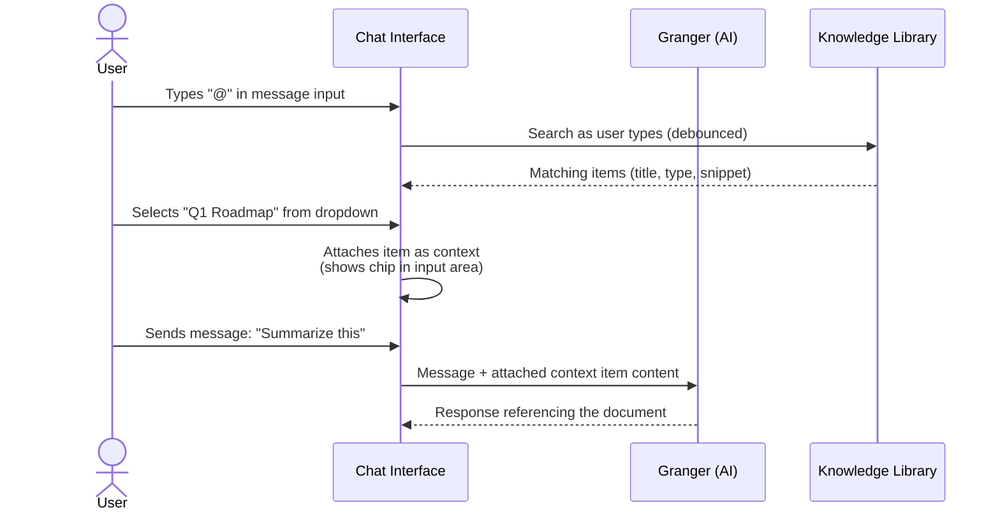

**How it works today:**
- User types `@` in the chat input to trigger the context picker
- Search results show Library items matching the query
- Selected items are attached to the message as context
- The AI receives the item's content alongside the user's message

### AI-initiated: autonomous search

The AI (Granger) can search the Library on its own using the `search_context` tool. This happens automatically when the AI determines it needs information to answer a question.

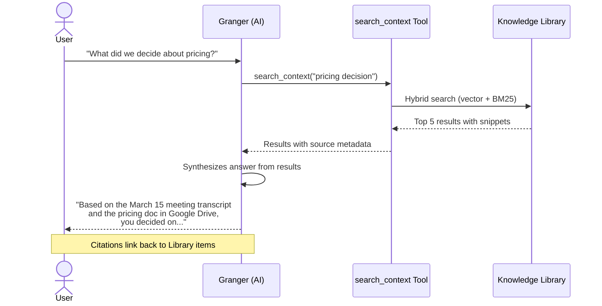

### Citations and source linking

When the AI references a Library item in its response:
- The source is displayed as a clickable citation badge
- Clicking the badge opens the item in the Library viewer
- The AI includes the item title, source, and relevant excerpt
- Users can verify the AI's claims by checking the original source

### Shared items in chat

Items shared from other users (via "Shared with me") are also searchable in chat. When a team member shares a document, it becomes part of the recipient's searchable knowledge base. The AI treats shared items identically to owned items in search results.

> **Technical reference:** The `search_context` tool is defined in `src/lib/ai/tools.ts`. The hybrid search function is in `src/lib/db/search.ts`. See `context-engineering.md` for how context is assembled for each AI call.

---

## 7. Download and Export

Users can download Library content in various formats depending on the content type.

### Individual item download

| Content Type | Available Formats | How |
|-------------|-------------------|-----|
| Documents (Drive, Notion) | PDF, Markdown, HTML | "Download" from context menu or detail view |
| Meeting transcripts | Markdown | "Download" from context menu |
| Artifacts (code projects) | ZIP (all project files) | "Download" from artifact panel |
| Artifacts (documents) | HTML, Markdown | "Download" from artifact panel |
| Artifacts (HTML) | HTML | "Download" from artifact panel |
| Uploads | Original format | "Download" from context menu |
| Code/Issues | Not downloadable | View in source app (GitHub, Linear) |
| Messages | Not downloadable | View in source app (Slack, Gmail) |

### Bulk export

Users can select multiple items and export them together:

1. **Select items** -- Checkbox on each card/row, or "Select All" in current view.
2. **Click "Export"** -- Opens export dialog.
3. **Choose format** -- ZIP (preserves folder structure from collections), or flat file list.
4. **Download** -- Browser downloads a ZIP file containing all selected items in their chosen format.

### Collection export

Entire collections can be exported as a package:
- Preserves the collection's folder hierarchy
- Each item exported in its most appropriate format (Markdown for docs, original for uploads, ZIP for code projects)
- Includes a `manifest.json` with metadata for all items

### Artifact ZIP structure

When downloading a code artifact (sandbox project), the ZIP contains the full project:

```
my-dashboard-v5.zip
  /src
    App.jsx
    main.jsx
    components/
      Header.jsx
      Chart.jsx
  /public
    index.html
  package.json
  vite.config.js
  README.md (auto-generated with description + setup instructions)
```

---

## 8. Access Control Layers

Access control in Layers is layered. Each layer narrows or extends who can see what.

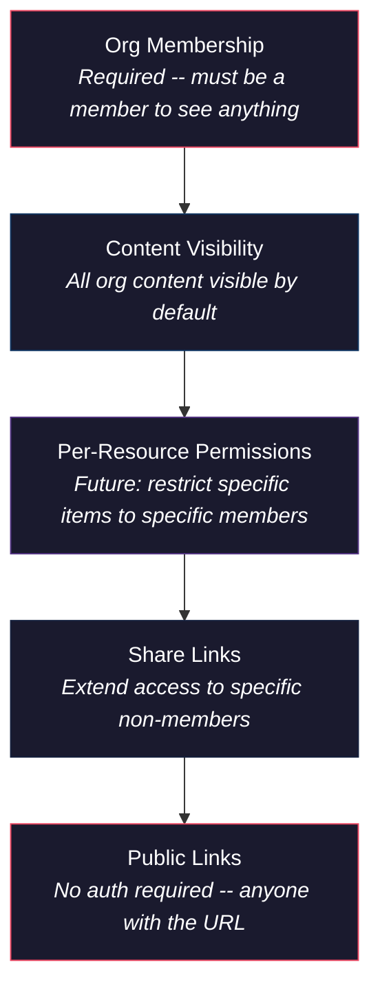

### Layer breakdown

| Layer | Enforcement | Current State | Future State |
|-------|-------------|---------------|--------------|
| **Org membership** | Supabase RLS -- every query includes `org_id` check | Implemented | Multi-org support planned |
| **Content visibility** | All org members see all content | Implemented (open by default) | Default remains open |
| **Per-resource permissions** | `resource_permissions` table + RLS policies | Not implemented | Planned -- view/comment/edit/admin/owner per item |
| **Share links** | `share_links` table with token lookup | Conversations only | All content types planned |
| **Public links** | Token-based access, no auth required | Conversations only | All content types planned |

### Role hierarchy (org-level)

| Role | Library Access | Sharing | Admin |
|------|---------------|---------|-------|
| **Owner** | Full access to all content | Can share anything externally | Full org settings, billing, delete org |
| **Admin** | Full access to all content | Can share anything externally | Manage members, settings |
| **Member** | Full access to all content | Can share own items externally | No admin access |
| **Guest** (future) | Access only to items shared with them | Cannot share | No admin access |

> **Technical reference:** See `org-permissions-system.md` for the full role hierarchy and planned evolution. See `sharing-permissions.md` for the per-resource permission model design.

---

## 9. Artifact Sandbox Sharing

Artifacts with sandboxes (live-running code projects) have a unique sharing model because they involve ephemeral compute resources alongside persistent content.

### How sandbox URLs work

Each sandbox artifact can have a **live preview URL** -- a URL where the running application is accessible (e.g., `https://layers-a8f3c2d1-k9x2m.e2b.dev`). These URLs are generated by the sandbox runtime (E2B/Vercel) when the sandbox starts.

**Sandbox URL lifecycle:**

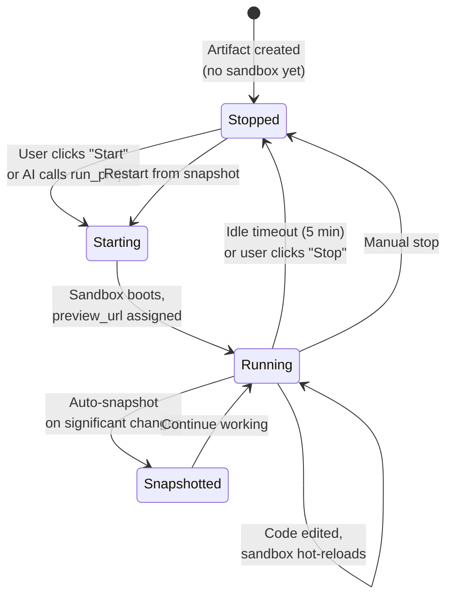

**Key characteristics of sandbox URLs:**
- **Ephemeral** -- URLs are generated at sandbox start and become invalid when the sandbox stops. They are not stable, permanent addresses.
- **Session-scoped** -- Only the user who started the sandbox (or their org members viewing the same chat) sees the live preview. The URL is not useful to share externally because it expires.
- **Stored transiently** -- The `artifacts.preview_url` column holds the last known URL, but it may be stale if the sandbox has stopped.
- **Port-specific** -- Each sandbox exposes a specific port (e.g., 5173 for Vite, 3000 for Next.js). The preview URL maps to that port.

### Sharing a sandbox artifact

When a user clicks "Share" on a sandbox artifact, they are **not sharing the live sandbox URL**. Instead:

1. **A persistent share link is created** -- points to the artifact's content (code + metadata), not the ephemeral sandbox.
2. **Viewers see a static representation** -- code files with syntax highlighting + a screenshot/snapshot of the last rendered preview.
3. **Viewers do NOT get a live sandbox** -- running a sandbox costs compute resources. External viewers see the code and a preview image, not a running application.

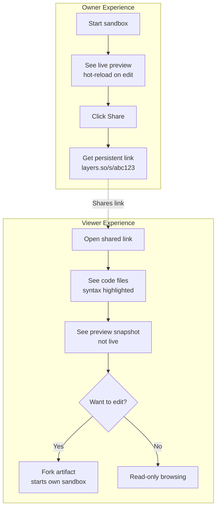

### Viewer capabilities on shared sandbox artifacts

| Capability | External Viewer (public link) | Org Member |
|-----------|------------------------------|------------|
| View code files | Yes (read-only) | Yes |
| View preview snapshot | Yes (static image) | Yes |
| See live sandbox | No | Yes (if sandbox is running) |
| Edit code | No | Yes (future: with edit permission) |
| Fork artifact | No (future: with account) | Yes |
| Start own sandbox | No | Yes |
| Download as ZIP | Yes | Yes |

### Sandbox cost implications

- Starting a sandbox consumes CPU and memory. Cost is tracked in `sandbox_usage`.
- Only org members with active sessions can start sandboxes.
- External viewers via share links never trigger sandbox compute.
- Sandboxes auto-stop after 5 minutes of inactivity to control costs.
- Sandbox state is preserved via snapshots in `sandbox_snapshots`, so restart is fast (no cold boot from source files).

> **Technical reference:** See `universal-artifact-system.md` Phase 6 for the per-artifact sandbox API (start/stop/restart/status), sandbox naming convention, and UI controls. The sandbox execution logic lives in `src/lib/sandbox/execute.ts`.

---

## 10. The "Shared With Me" Experience

When someone shares content with a user, it appears in a dedicated "Shared with Me" section in the Library sidebar.

### How items appear in "Shared with Me"

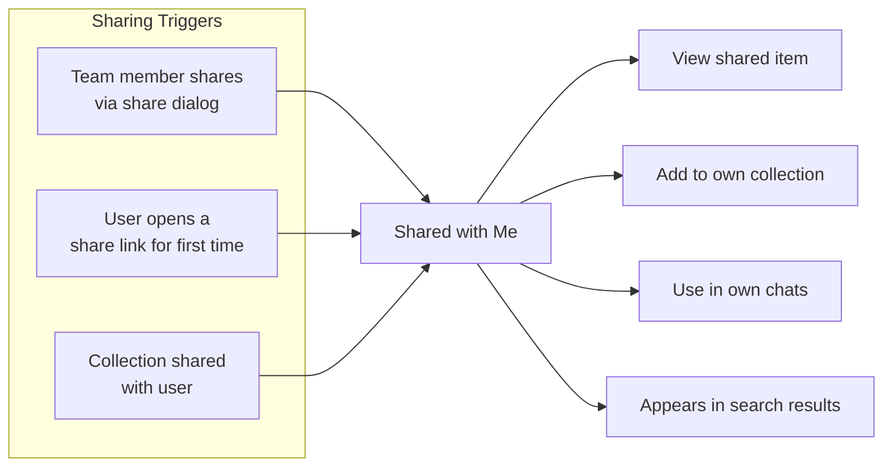

### What the user sees

```
+------------------------------------------+
| SHARED WITH ME                           |
|------------------------------------------|
|                                          |
| From Kyle Martinez                       |
|   Q1 Product Roadmap       Apr 3  [pin]  |
|     Can Edit | Google Drive              |
|   Sprint Retro Notes        Apr 1  [pin]  |
|     Can View | Granola                   |
|                                          |
| From Bobby Chen                          |
|   Auth System Design        Mar 28 [pin]  |
|     Can View | Upload                    |
|   API Rate Limiter          Mar 25 [pin]  |
|     Can Edit | Artifact (code)           |
|                                          |
| Via link (first visited)                 |
|   Design System v2          Apr 2  [pin]  |
|     Can View | Public link               |
|                                          |
+------------------------------------------+
```

### Shared item metadata

Each shared item shows:
- **Who shared it** -- name and avatar of the person who shared
- **When** -- date the item was shared or first visited (for links)
- **Permission level** -- View, Comment, or Edit
- **Source type** -- where the content originally came from
- **Quick actions** -- Pin, Add to Collection, Open in Chat, Open in Viewer

### Working with shared items

- **Add to collections** -- Shared items can be organized into the user's own collections (creates a reference, not a copy).
- **Use in chat** -- Shared items appear in `@mention` search results and are searchable by the AI via `search_context`.
- **Pin** -- Pin shared items for quick access, just like owned items.
- **Edit (if permitted)** -- If the sharer granted edit permission, the user can modify the item. Changes are reflected for all users with access.
- **Cannot delete** -- Only the owner (or org admins) can delete items. Shared users can remove the item from their "Shared with Me" view but the item persists.

---

## 11. Library Search and Discovery

Search is the fastest path to any item in the Library. Layers uses a hybrid search system combining semantic understanding (vector search) with keyword precision (BM25 full-text search).

### How search works

```mermaid
flowchart TD
    Q[User query:<br/>"pricing decision from March"] --> EXPAND[Query Expansion<br/>Multi-query if ambiguous]

    EXPAND --> VEC[Vector Search<br/>Cosine similarity<br/>on embeddings]
    EXPAND --> BM25[BM25 Full-Text Search<br/>on search_tsv column]

    VEC --> RRF[Reciprocal Rank Fusion<br/>Combines both rankings]
    BM25 --> RRF

    RRF --> WEIGHT[Apply Weights<br/>priority_weight,<br/>recency, source trust]
    WEIGHT --> FILTER[Apply Filters<br/>type, source, tags,<br/>collection, date range]
    FILTER --> RESULTS[Ranked Results<br/>with snippets + highlights]
```

### Search capabilities

| Feature | Status | Description |
|---------|--------|-------------|
| Full-text keyword search | Implemented | BM25 on `search_tsv` column -- matches titles, content, file names |
| Semantic / vector search | Implemented | Cosine similarity on embeddings -- understands meaning, not just keywords |
| Hybrid ranking (RRF) | Implemented | Reciprocal Rank Fusion combines vector + BM25 rankings |
| Priority weighting | Implemented | Items with higher `priority_weight` rank higher |
| Multi-query expansion | Implemented | Ambiguous queries are expanded into multiple search queries |
| Filter by type | Implemented | Document, code, meeting, issue, message, artifact, upload |
| Filter by source | Implemented | Google Drive, GitHub, Slack, Linear, Granola, Notion, Gmail, upload |
| Filter by tags | Planned | Combine tag filters with text search |
| Filter by collection | Planned | Search within a specific collection |
| Filter by date range | Planned | "Last 7 days," "This month," custom range |
| Filter by author | Planned | Who created or shared the item |
| "More like this" | Planned | Find items similar to a selected item (nearest-neighbor on embedding) |
| Related items | Planned | Pre-computed similarity links shown on item detail view |
| Smart collections | Phase 1 done (DB + API) | Saved filter queries that auto-populate; filter engine pending |
| Search suggestions | Planned | Autocomplete from recent searches and popular queries |

### Search result cards

Each search result shows:
- Type icon + source badge
- Title (with keyword highlights)
- Snippet (with keyword highlights, ~2 lines)
- Tags (matching tags emphasized)
- Confidence score (RRF-based, displayed as a relevance bar)
- Last updated date
- Quick actions: Open, Open in Chat, Pin

### Discovery features (planned)

- **"Related items" panel** -- On any item's detail view, show 5-10 related items based on embedding similarity.
- **"More like this" from search** -- Click on any search result to find similar items.
- **Smart collection suggestions** -- AI suggests smart collections based on usage patterns ("You often search for 'sprint' + 'retro' -- want a smart collection?").
- **Trending in org** -- Items with the most views/references this week.
- **Recently shared** -- Items recently shared by team members.

> **Technical reference:** The search RPC is `search_context_items` in Supabase. The text-only fallback is `search_context_items_text`. See `src/lib/db/search.ts` for the client-side search function.

---

## 12. Future: Cross-Org Content Marketplace

Looking further ahead, the Library can evolve from an org-internal tool into a marketplace for knowledge sharing across organizations.

### Vision

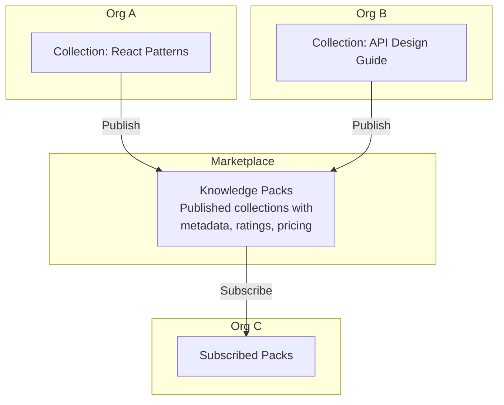

### Knowledge packs

A "knowledge pack" is a published collection with:
- Title, description, and cover image
- Curated set of items (documents, templates, guides)
- Pricing: free, one-time, or subscription
- Version history (publisher can update, subscribers receive updates)
- Ratings and reviews from other orgs
- Usage stats (downloads, active subscribers)

### Marketplace features

| Feature | Description |
|---------|-------------|
| **Publish** | Org publishes a collection as a knowledge pack. Items are sanitized (no internal references or PII). |
| **Browse** | Users browse packs by category, rating, price. Search across all published packs. |
| **Subscribe** | Org subscribes to a pack. Items are copied into their Library with a "subscribed" badge. |
| **Sync** | When the publisher updates the pack, subscribers receive the update (opt-in per update). |
| **Revenue sharing** | Publishers earn a percentage of subscription revenue. Layers takes a platform fee. |
| **Moderation** | All published packs go through automated quality checks and optional human review. |

### Use cases

- A design agency publishes their brand guideline templates
- An engineering team publishes their architecture decision records (ADRs) as a learning resource
- A consultancy publishes industry research packs
- An AI prompt library curated by power users

This feature is **long-term** (6+ months out) and depends on the per-resource permission system, collection sharing, and a moderation pipeline being in place first.

---

## Appendix: User Journey Maps

### Journey 1: New team member onboarding

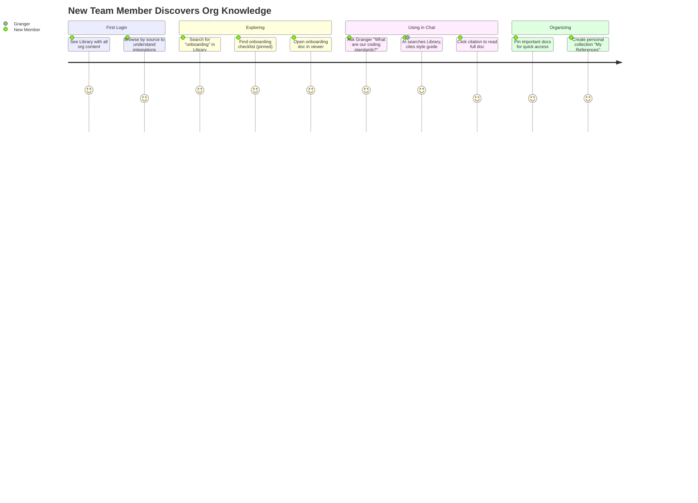

### Journey 2: Sharing a project artifact

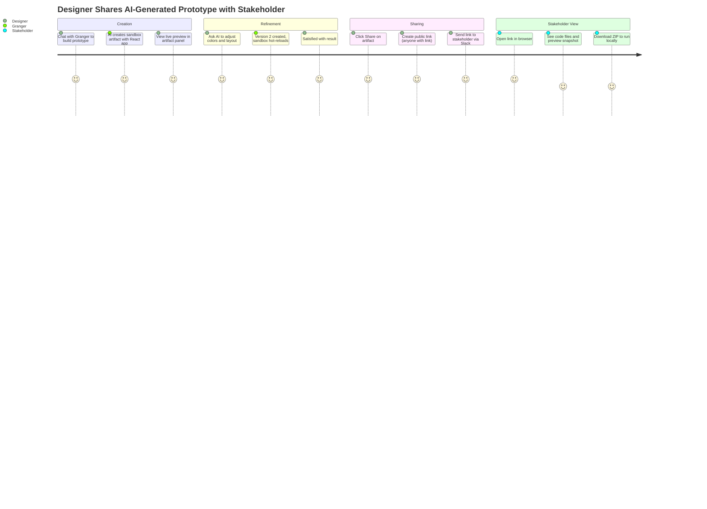

### Journey 3: Using shared context in a conversation

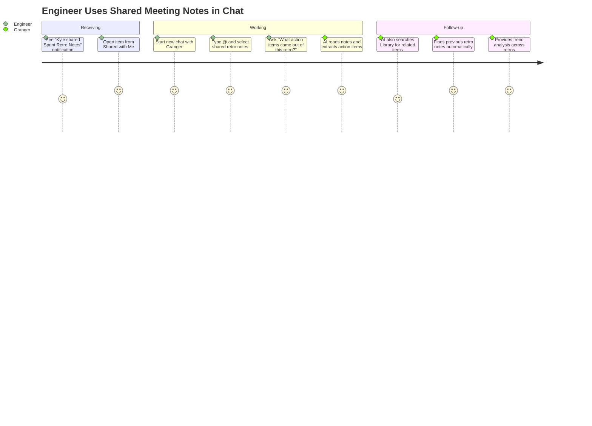

---

## Appendix: Implementation Priority

This document describes the full vision. Implementation follows this priority order:

| Priority | Feature | Depends On | Status |
|----------|---------|------------|--------|
| P0 | Library sidebar with collections, tags, pins | `content-organization.md` Phase 1 | Done |
| P0 | Search (hybrid vector + BM25) | `ingestion-pipeline.md` | Done |
| P0 | Conversation sharing (public links) | `sharing-system.md` | Done |
| P1 | Artifact sharing (public links) | Share link infrastructure | Planned |
| P1 | Context item sharing (public links) | Share link infrastructure | Planned |
| P1 | Smart collection filter engine | `content-organization.md` Phase 2 | Planned |
| P1 | Download/export for all types | Per-type format converters | Planned |
| P2 | Per-resource permissions | `sharing-permissions.md` | RFC |
| P2 | "Shared with Me" section | Per-resource permissions | Planned |
| P2 | Collection sharing | Per-resource permissions | Planned |
| P2 | Faceted search filters | Search infrastructure | Planned |
| P3 | Guest access (cross-org) | `org-permissions-system.md` | Proposal |
| P3 | "More like this" / related items | Embedding similarity precompute | Planned |
| P4 | Cross-org marketplace | Everything above | Future |
