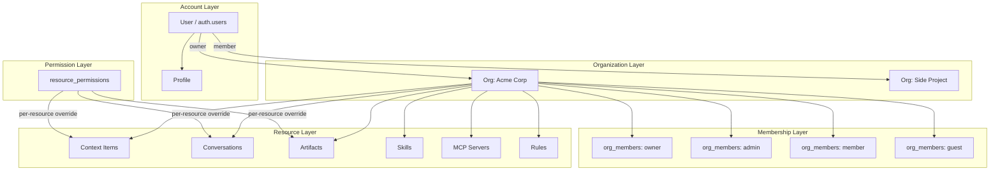
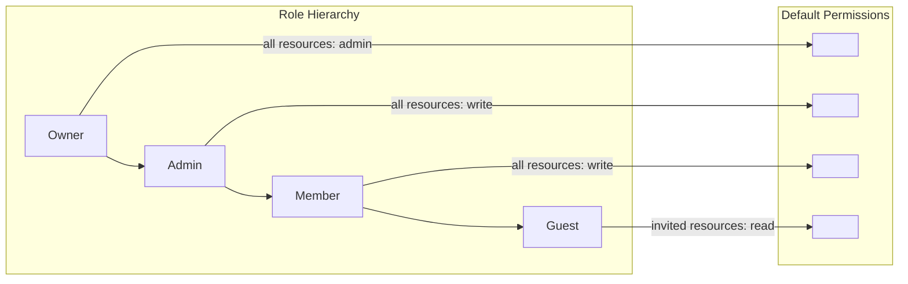
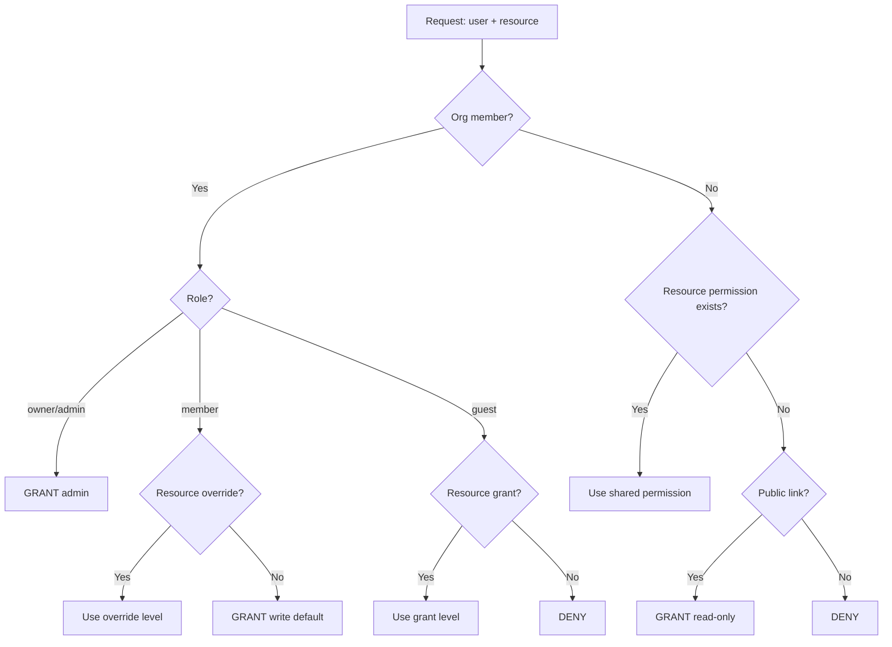
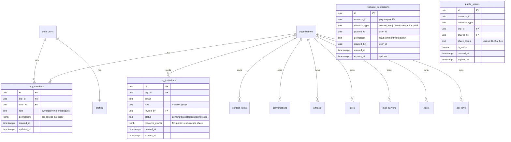
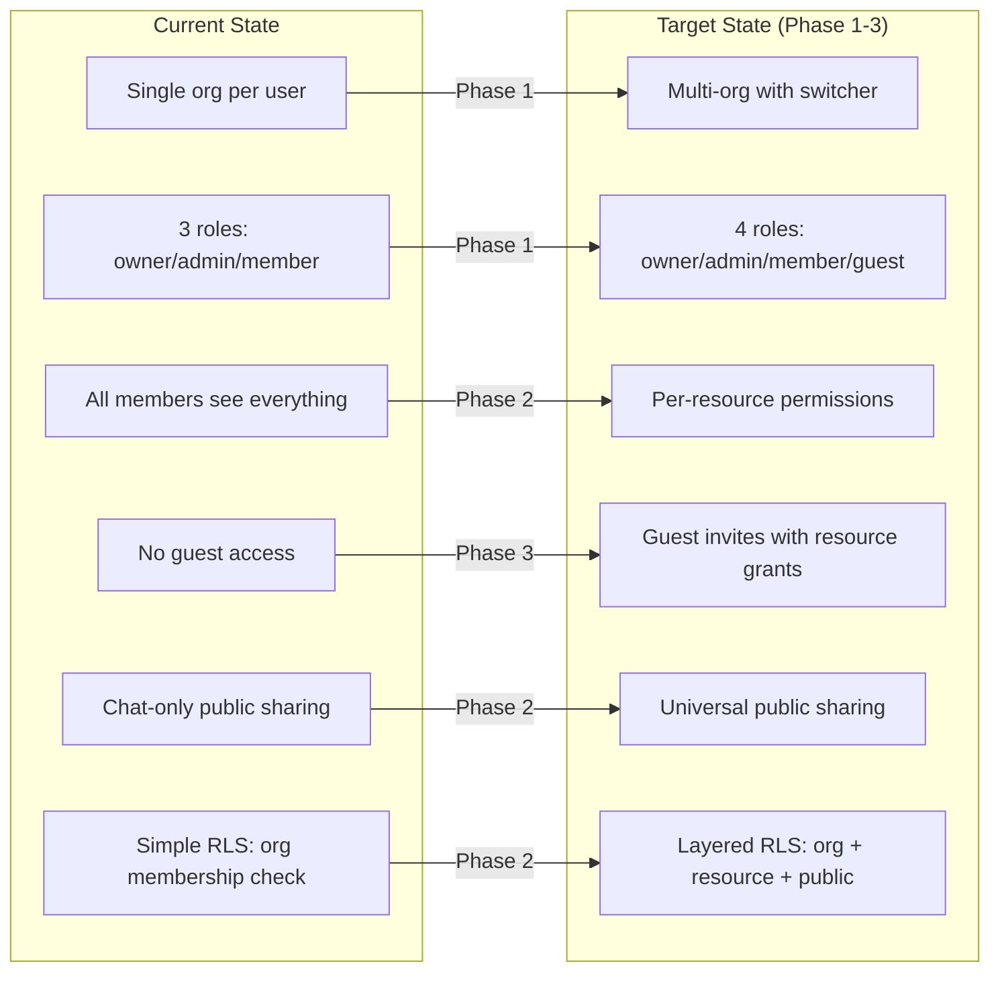

# Organization & Permissions System — Architecture Document

> Status: Proposal
> Date: 2026-04-05
> Author: Architecture Team
> Supersedes: [accounts-orgs-sharing.md](./accounts-orgs-sharing.md) (current state docs)

---

## Executive Summary

Layers currently operates with a single-org-per-user model where all org members share full access to all content. This document proposes an incremental evolution toward a mature multi-org, role-based permissions system inspired by best practices from GitHub, Notion, Linear, Slack, and Claude Teams.

**Key goals:**
1. Users can create and join multiple organizations
2. Clear role hierarchy: Owner > Admin > Member > Guest
3. Per-resource permissions for context items, conversations, artifacts, and skills
4. Cross-org sharing via guest invitations and public links
5. Supabase RLS enforcement at every layer
6. Incremental migration path from current state

**Design principles:**
- Org-scoped by default, user-scoped by exception
- RLS is the security boundary, not application code
- Simple RBAC first, attribute-based access later if needed
- Billing follows the org, not the user

---

## 1. Research Findings

### 1.1 GitHub Organizations

GitHub pioneered the personal-account-plus-org model that most developer tools now follow.

**Account model:** Users have personal accounts and can create or join unlimited organizations. Each org is a separate billing entity.

**Role hierarchy (org-level):**
| Role | Capabilities |
|------|-------------|
| Owner | Full admin, delete org, manage billing, transfer repos |
| Admin | Manage members, teams, settings (cannot delete org) |
| Member | Default role — create repos, push to assigned repos |
| Billing Manager | Manage billing only (no code access) |
| Moderator | Block users, manage comments, set interaction limits |
| Security Manager | View security alerts, read all repos |
| Outside Collaborator | Access to specific repos only, not an org member |

**Resource permissions (per-repository):** Five graduated levels — Read, Triage, Write, Maintain, Admin — assignable per repo per user or team.

**Teams:** Nested teams with inheritance. A team can have sub-teams, and permissions cascade downward. Team maintainers manage membership without being org admins.

**Billing:** Per-seat pricing. Free tier, Team ($4/user/mo), Enterprise ($21/user/mo). Outside collaborators consume a seat only if they access private repos.

**Key takeaway for Layers:** The team-based permission layer between org-level roles and resource-level access is powerful but adds complexity. Start with org roles + per-resource sharing, add teams later.

Sources:
- [Roles in an organization — GitHub Docs](https://docs.github.com/en/organizations/managing-peoples-access-to-your-organization-with-roles/roles-in-an-organization)
- [Repository roles for an organization — GitHub Docs](https://docs.github.com/en/organizations/managing-user-access-to-your-organizations-repositories/managing-repository-roles/repository-roles-for-an-organization)
- [GitHub Pricing](https://github.com/pricing)

### 1.2 Notion Workspaces

Notion uses a workspace model with deeply nested page-level permissions.

**Account model:** Users have personal accounts and can belong to multiple workspaces. Each workspace is a billing entity.

**Role hierarchy:**
| Role | Capabilities |
|------|-------------|
| Workspace Owner | All settings, billing, delete workspace, manage all users |
| Membership Admin | Manage members and groups (cannot change workspace settings) |
| Member | Create pages, use AI, access teamspaces |
| Guest | Access only pages explicitly shared with them — free of charge |

**Permission granularity (per-page):** Full Access, Can Edit, Can Comment, Can View — applied at any level in the page tree and inherited by child pages.

**Teamspaces:** Organizational units within a workspace — Open (anyone joins), Closed (visible but invite-only), or Private (invisible unless invited). Each teamspace has its own members and permission defaults.

**Guest limits:** 10 (Free), 100 (Plus), 250 (Business), Custom (Enterprise). Guests are free — they only access explicitly shared pages.

**Billing:** Per-member/month. Free, Plus ($10/mo), Business ($20/mo), Enterprise (custom). Guests are free.

**Key takeaway for Layers:** Notion's guest model (free, page-level access only) is excellent for cross-org collaboration. Teamspaces are powerful but complex — defer to Phase 3.

Sources:
- [Sharing & permissions — Notion Help Center](https://www.notion.com/help/sharing-and-permissions)
- [Who's who in a workspace — Notion Help Center](https://www.notion.com/help/whos-who-in-a-workspace)
- [Intro to teamspaces — Notion Help Center](https://www.notion.com/help/intro-to-teamspaces)
- [Notion Pricing](https://www.notion.com/pricing)

### 1.3 Linear Teams

Linear uses a workspace + teams model optimized for project management.

**Account model:** Users belong to a workspace. Each workspace has teams (Engineering, Design, etc.) that own issues and projects.

**Role hierarchy:**
| Role | Capabilities |
|------|-------------|
| Admin | Full workspace management, billing, security |
| Member | Full access to public teams, create issues, projects |
| Guest | Access only to invited teams — Business/Enterprise only |
| Team Owner | Manage team settings, labels, templates, membership (new Dec 2025) |

**Key features:**
- Private teams: Only visible/accessible to explicit members
- Team owners: Granular control over who manages team settings, labels, templates, membership
- Guests see only their invited teams, cannot access workspace-wide features (views, initiatives)
- Only team owners can invite guests

**Billing:** Per-seat. Free (up to 250 issues), Standard ($8/user/mo), Plus ($14/user/mo), Business, Enterprise. Guests are billed as regular members.

**Key takeaway for Layers:** Linear's team owner concept is elegant — it delegates admin-like power within a scope without granting org-wide access. Their private teams model maps well to Layers' potential "private collections."

Sources:
- [Members and roles — Linear Docs](https://linear.app/docs/members-roles)
- [Private teams — Linear Docs](https://linear.app/docs/private-teams)
- [Team owners — Linear Changelog](https://linear.app/changelog/2025-12-17-team-owners)

### 1.4 Slack Workspaces

Slack's model evolved from single workspace to Enterprise Grid for large organizations.

**Account model:** Users join workspaces. Enterprise Grid adds an "organization" layer above workspaces. Users can belong to multiple workspaces within an org.

**Role hierarchy:**
| Role | Capabilities |
|------|-------------|
| Org Owner (Grid) | Manage all workspaces, org-level policies |
| Org Admin (Grid) | Manage workspaces, users across org |
| Workspace Owner | Full workspace management |
| Workspace Admin | Manage channels, members, settings |
| Member | Default access |
| Multi-Channel Guest | Access to specified channels only |
| Single-Channel Guest | Access to one channel only (free) |

**Guest model:** 5 guests per paid member ratio. Multi-channel guests are billed; single-channel guests are free. Guests can be set to auto-expire.

**Key takeaway for Layers:** The guest expiration concept is valuable for temporary collaborators. The two-tier guest model (multi/single channel) is overengineered for Layers' needs.

Sources:
- [Permissions by role in Slack](https://slack.com/help/articles/201314026-Permissions-by-role-in-Slack)
- [Types of roles in Slack](https://slack.com/help/articles/360018112273-Types-of-roles-in-Slack)
- [Understand guest roles in Slack](https://slack.com/help/articles/202518103-Understand-guest-roles-in-Slack)

### 1.5 Claude Teams/Enterprise

Anthropic's approach to team management, relevant as a direct competitor in AI workspace tools.

**Account model:** Individual accounts upgrade to Team or Enterprise plans. Organization = billing entity with admin controls.

**Admin controls:**
- Self-serve seat management with standard vs premium seat types
- Granular spend controls at org and individual user level
- Usage analytics including Claude Code metrics
- Managed policy settings (tool permissions, file access restrictions, MCP server configs)
- Compliance API for programmatic access to usage data and conversation logs (Enterprise)

**Hierarchy:** Organization-level policies > Project-specific settings > User preferences, with allow/ask/deny rules for commands and actions.

**Key takeaway for Layers:** The hierarchical policy model (org > project > user) with allow/ask/deny is elegant. The per-user spend controls are essential for AI products where usage = cost.

Sources:
- [Claude Code and new admin controls for business plans — Anthropic](https://www.anthropic.com/news/claude-code-on-team-and-enterprise)
- [Manage members on Team and Enterprise plans — Claude Help Center](https://support.claude.com/en/articles/13133750-manage-members-on-team-and-enterprise-plans)

---

## 2. Comparison Table

| Dimension | GitHub | Notion | Linear | Slack | Claude Teams | **Layers (Proposed)** |
|-----------|--------|--------|--------|-------|--------------|----------------------|
| **Account model** | Personal + unlimited orgs | Personal + unlimited workspaces | Single workspace | Workspace (multi in Grid) | Individual + org | Personal + unlimited orgs |
| **Top-level entity** | Organization | Workspace | Workspace | Workspace / Org (Grid) | Organization | Organization |
| **Role hierarchy** | Owner > Admin > Member | Owner > Admin > Member > Guest | Admin > Member > Guest | Owner > Admin > Member > Guest | Admin > Member | Owner > Admin > Member > Guest |
| **Sub-org grouping** | Teams (nested) | Teamspaces | Teams | Channels | Projects | Collections (Phase 3) |
| **Resource permissions** | 5 levels per repo | 4 levels per page | Team-scoped | Channel-scoped | Policy-based | 4 levels per resource |
| **Guest access** | Outside collaborator (per-repo) | Per-page (free) | Per-team (paid) | Per-channel (free/paid) | N/A | Per-resource (free) |
| **Guest limits** | Unlimited (seats used) | 10–250+ by plan | Unlimited (paid) | 5:1 member ratio | N/A | 10–unlimited by plan |
| **Invitation flow** | Email + accept | Email/link + accept | Email + accept | Email/link + accept | Admin provision | Email + accept |
| **Cross-org sharing** | Forks / collaborators | Guest invites | Not supported | Slack Connect | N/A | Guest invites + public links |
| **Billing model** | Per-seat/mo | Per-member/mo (guests free) | Per-seat/mo (guests paid) | Per-member/mo | Per-seat/mo | Per-member/mo (guests free) |
| **API access control** | PAT + OAuth apps + fine-grained tokens | API token (workspace-scoped) | API key (workspace-scoped) | Bot/user tokens + scopes | API key + org scoping | API key (org-scoped) + RLS |
| **Enforcement layer** | App logic + GitHub Apps | App logic | App logic | App logic | App logic + policies | Supabase RLS + app logic |

---

## 3. Recommended Architecture

### 3.1 Design Overview



### 3.2 Role Hierarchy and Default Permissions



**Role definitions:**

| Role | Org Settings | Billing | Members | Content (default) | AI Chat | Integrations |
|------|-------------|---------|---------|-------------------|---------|-------------|
| **Owner** | Full | Full | Invite/remove all | admin | Unlimited | Connect/disconnect |
| **Admin** | View | View | Invite/remove members+guests | write | Unlimited | Connect/disconnect |
| **Member** | None | None | Invite guests | write | Per-plan limits | Use connected |
| **Guest** | None | None | None | read (invited only) | No | No |

**Permission levels per resource:**

| Level | Can View | Can Comment | Can Edit | Can Share | Can Delete | Can Admin |
|-------|----------|------------|----------|-----------|------------|-----------|
| **read** | Yes | No | No | No | No | No |
| **comment** | Yes | Yes | No | No | No | No |
| **write** | Yes | Yes | Yes | Yes (within org) | Own only | No |
| **admin** | Yes | Yes | Yes | Yes (including guests) | Yes | Yes |

### 3.3 Access Resolution Algorithm

When a user requests access to a resource, the system resolves permissions in this order:

```
1. Is the user a member of the resource's org?
   NO  → Check resource_permissions for guest/share access
   YES → Continue

2. What is the user's org role?
   owner/admin → GRANT (admin level)
   member      → Check for resource-level override
   guest       → Check for resource-level grant

3. Is there a resource_permissions row for this user + resource?
   YES → Use that permission level
   NO  → Use role default (member=write, guest=none)

4. Is this a public share link?
   YES → GRANT read-only (no auth required)
   NO  → DENY
```



---

## 4. Database Schema

### 4.1 Schema Diagram



### 4.2 New and Modified Tables

#### `org_members` — Modified (add `guest` role, add `permissions` column, add `updated_at`)

```sql
-- Migration: modify org_members to support guest role and per-service permissions
ALTER TABLE org_members
  DROP CONSTRAINT IF EXISTS org_members_role_check;

ALTER TABLE org_members
  ADD CONSTRAINT org_members_role_check
  CHECK (role IN ('owner', 'admin', 'member', 'guest'));

ALTER TABLE org_members
  ADD COLUMN IF NOT EXISTS permissions jsonb DEFAULT '{}',
  ADD COLUMN IF NOT EXISTS invited_by uuid REFERENCES auth.users(id),
  ADD COLUMN IF NOT EXISTS updated_at timestamptz NOT NULL DEFAULT now();

COMMENT ON COLUMN org_members.permissions IS
  'Per-service permission overrides: {"linear": {"read": true, "write": false}, ...}';
```

#### `resource_permissions` — New table for per-resource access grants

```sql
CREATE TABLE resource_permissions (
  id uuid PRIMARY KEY DEFAULT gen_random_uuid(),
  resource_id uuid NOT NULL,
  resource_type text NOT NULL CHECK (resource_type IN (
    'context_item', 'conversation', 'artifact', 'skill'
  )),
  granted_to uuid NOT NULL REFERENCES auth.users(id) ON DELETE CASCADE,
  permission text NOT NULL DEFAULT 'read' CHECK (permission IN (
    'read', 'comment', 'write', 'admin'
  )),
  granted_by uuid NOT NULL REFERENCES auth.users(id),
  created_at timestamptz NOT NULL DEFAULT now(),
  expires_at timestamptz, -- NULL = never expires

  UNIQUE(resource_id, resource_type, granted_to)
);

CREATE INDEX idx_rp_granted_to ON resource_permissions(granted_to);
CREATE INDEX idx_rp_resource ON resource_permissions(resource_id, resource_type);
CREATE INDEX idx_rp_expires ON resource_permissions(expires_at)
  WHERE expires_at IS NOT NULL;

ALTER TABLE resource_permissions ENABLE ROW LEVEL SECURITY;
```

#### `public_shares` — Unified public sharing (replaces `public_chat_shares`)

```sql
CREATE TABLE public_shares (
  id uuid PRIMARY KEY DEFAULT gen_random_uuid(),
  resource_id uuid NOT NULL,
  resource_type text NOT NULL CHECK (resource_type IN (
    'conversation', 'artifact', 'context_item'
  )),
  org_id uuid NOT NULL REFERENCES organizations(id) ON DELETE CASCADE,
  shared_by uuid NOT NULL REFERENCES auth.users(id),
  share_token text NOT NULL UNIQUE DEFAULT encode(gen_random_bytes(16), 'hex'),
  is_active boolean NOT NULL DEFAULT true,
  allow_org_view boolean NOT NULL DEFAULT true,
  allow_public_view boolean NOT NULL DEFAULT false,
  password_hash text, -- optional password protection
  view_count integer NOT NULL DEFAULT 0,
  created_at timestamptz NOT NULL DEFAULT now(),
  expires_at timestamptz, -- NULL = never expires

  UNIQUE(resource_id, resource_type, org_id)
);

CREATE INDEX idx_ps_token ON public_shares(share_token) WHERE is_active = true;
CREATE INDEX idx_ps_org ON public_shares(org_id);

ALTER TABLE public_shares ENABLE ROW LEVEL SECURITY;
```

#### `org_invitations` — Modified (add `resource_grants` for guest invitations)

```sql
ALTER TABLE org_invitations
  ADD COLUMN IF NOT EXISTS resource_grants jsonb DEFAULT '[]';

COMMENT ON COLUMN org_invitations.resource_grants IS
  'For guest invitations: [{"resource_id": "...", "resource_type": "artifact", "permission": "read"}]';
```

#### `audit_log` — Extended for permission changes

```sql
-- Already exists — ensure permission events are logged
-- event_types to add: 'permission.grant', 'permission.revoke',
--   'member.role_change', 'member.invite', 'member.remove',
--   'share.create', 'share.revoke'
```

### 4.3 Helper Functions

```sql
-- Get the user's role in a specific org
CREATE OR REPLACE FUNCTION get_user_org_role(p_org_id uuid)
RETURNS text
LANGUAGE sql
SECURITY DEFINER
STABLE
AS $$
  SELECT role FROM org_members
  WHERE org_id = p_org_id AND user_id = auth.uid()
  LIMIT 1
$$;

-- Check if user has at least a given permission level on a resource
CREATE OR REPLACE FUNCTION has_resource_permission(
  p_resource_id uuid,
  p_resource_type text,
  p_min_permission text DEFAULT 'read'
)
RETURNS boolean
LANGUAGE plpgsql
SECURITY DEFINER
STABLE
AS $$
DECLARE
  perm_rank integer;
  user_perm_rank integer;
  user_org_role text;
  resource_org_id uuid;
BEGIN
  -- Permission ranking
  perm_rank := CASE p_min_permission
    WHEN 'read' THEN 1
    WHEN 'comment' THEN 2
    WHEN 'write' THEN 3
    WHEN 'admin' THEN 4
    ELSE 0
  END;

  -- 1. Check org membership via the resource's org_id
  -- (This requires knowing which table to query — handled per resource_type)
  EXECUTE format(
    'SELECT org_id FROM %I WHERE id = $1',
    CASE p_resource_type
      WHEN 'context_item' THEN 'context_items'
      WHEN 'conversation' THEN 'conversations'
      WHEN 'artifact' THEN 'artifacts'
      WHEN 'skill' THEN 'skills'
    END
  ) INTO resource_org_id USING p_resource_id;

  IF resource_org_id IS NULL THEN
    RETURN false;
  END IF;

  -- 2. Check org role
  SELECT role INTO user_org_role
  FROM org_members
  WHERE org_id = resource_org_id AND user_id = auth.uid();

  IF user_org_role IN ('owner', 'admin') THEN
    RETURN true; -- owners/admins always have full access
  END IF;

  IF user_org_role = 'member' THEN
    -- Members have write by default (rank 3)
    RETURN perm_rank <= 3;
  END IF;

  -- 3. Check resource_permissions (for guests or explicit grants)
  SELECT CASE permission
    WHEN 'read' THEN 1
    WHEN 'comment' THEN 2
    WHEN 'write' THEN 3
    WHEN 'admin' THEN 4
    ELSE 0
  END INTO user_perm_rank
  FROM resource_permissions
  WHERE resource_id = p_resource_id
    AND resource_type = p_resource_type
    AND granted_to = auth.uid()
    AND (expires_at IS NULL OR expires_at > now());

  RETURN COALESCE(user_perm_rank >= perm_rank, false);
END;
$$;
```

---

## 5. RLS Policy Examples

### 5.1 Organizations — Members see their orgs

```sql
-- No change needed — existing policy already supports multi-org
CREATE POLICY "users_view_their_orgs" ON organizations
  FOR SELECT USING (
    id IN (SELECT org_id FROM org_members WHERE user_id = auth.uid())
  );
```

### 5.2 Context Items — Org members + per-resource grants

```sql
-- Replace existing simple policy with permission-aware version
DROP POLICY IF EXISTS "Users can view org context items" ON context_items;
DROP POLICY IF EXISTS "Users can manage org context items" ON context_items;

-- SELECT: org members OR explicit resource permission
CREATE POLICY "context_items_select" ON context_items
  FOR SELECT USING (
    -- Org members (non-guest) can read all org content
    EXISTS (
      SELECT 1 FROM org_members
      WHERE org_members.org_id = context_items.org_id
        AND org_members.user_id = auth.uid()
        AND org_members.role IN ('owner', 'admin', 'member')
    )
    OR
    -- Guests/external users with explicit permission
    EXISTS (
      SELECT 1 FROM resource_permissions rp
      WHERE rp.resource_id = context_items.id
        AND rp.resource_type = 'context_item'
        AND rp.granted_to = auth.uid()
        AND (rp.expires_at IS NULL OR rp.expires_at > now())
    )
  );

-- INSERT: org members with write role
CREATE POLICY "context_items_insert" ON context_items
  FOR INSERT WITH CHECK (
    EXISTS (
      SELECT 1 FROM org_members
      WHERE org_members.org_id = context_items.org_id
        AND org_members.user_id = auth.uid()
        AND org_members.role IN ('owner', 'admin', 'member')
    )
  );

-- UPDATE: org admins/owners, or members who created it, or explicit write grant
CREATE POLICY "context_items_update" ON context_items
  FOR UPDATE USING (
    EXISTS (
      SELECT 1 FROM org_members
      WHERE org_members.org_id = context_items.org_id
        AND org_members.user_id = auth.uid()
        AND org_members.role IN ('owner', 'admin', 'member')
    )
    OR
    EXISTS (
      SELECT 1 FROM resource_permissions rp
      WHERE rp.resource_id = context_items.id
        AND rp.resource_type = 'context_item'
        AND rp.granted_to = auth.uid()
        AND rp.permission IN ('write', 'admin')
        AND (rp.expires_at IS NULL OR rp.expires_at > now())
    )
  );

-- DELETE: org admins/owners only
CREATE POLICY "context_items_delete" ON context_items
  FOR DELETE USING (
    EXISTS (
      SELECT 1 FROM org_members
      WHERE org_members.org_id = context_items.org_id
        AND org_members.user_id = auth.uid()
        AND org_members.role IN ('owner', 'admin')
    )
  );
```

### 5.3 Conversations — Org members + shared access

```sql
DROP POLICY IF EXISTS "org members can read conversations" ON conversations;

CREATE POLICY "conversations_select" ON conversations
  FOR SELECT USING (
    -- Org members see all conversations
    EXISTS (
      SELECT 1 FROM org_members
      WHERE org_members.org_id = conversations.org_id
        AND org_members.user_id = auth.uid()
        AND org_members.role IN ('owner', 'admin', 'member')
    )
    OR
    -- Explicit share (team sharing)
    EXISTS (
      SELECT 1 FROM shared_conversations sc
      WHERE sc.conversation_id = conversations.id
        AND sc.shared_with = auth.uid()
    )
    OR
    -- Resource permission grant (for guests)
    EXISTS (
      SELECT 1 FROM resource_permissions rp
      WHERE rp.resource_id = conversations.id
        AND rp.resource_type = 'conversation'
        AND rp.granted_to = auth.uid()
        AND (rp.expires_at IS NULL OR rp.expires_at > now())
    )
  );
```

### 5.4 Resource Permissions — Grantors and grantees

```sql
-- Users can see permissions they granted or received
CREATE POLICY "rp_select" ON resource_permissions
  FOR SELECT USING (
    granted_to = auth.uid()
    OR granted_by = auth.uid()
  );

-- Only org admins/owners or resource admins can grant permissions
CREATE POLICY "rp_insert" ON resource_permissions
  FOR INSERT WITH CHECK (
    granted_by = auth.uid()
    -- Additional app-level check: caller must be admin/owner or have admin permission
  );

-- Grantors can revoke, or org admins
CREATE POLICY "rp_delete" ON resource_permissions
  FOR DELETE USING (
    granted_by = auth.uid()
  );
```

### 5.5 Performance: Indexed Columns in RLS

```sql
-- Ensure all columns used in RLS policies are indexed
CREATE INDEX IF NOT EXISTS idx_org_members_user_role
  ON org_members(user_id, org_id, role);

CREATE INDEX IF NOT EXISTS idx_resource_permissions_lookup
  ON resource_permissions(granted_to, resource_id, resource_type)
  WHERE (expires_at IS NULL OR expires_at > now());

CREATE INDEX IF NOT EXISTS idx_org_members_org_role
  ON org_members(org_id, role);
```

---

## 6. API Design

### 6.1 Organization Management

```
POST   /api/orgs                    Create a new organization
GET    /api/orgs                    List user's organizations
GET    /api/orgs/:orgId             Get org details
PATCH  /api/orgs/:orgId             Update org settings (owner/admin)
DELETE /api/orgs/:orgId             Delete org (owner only)
POST   /api/orgs/:orgId/switch      Set active org in session
```

### 6.2 Member Management

```
GET    /api/orgs/:orgId/members              List members
POST   /api/orgs/:orgId/members/invite       Send invitation (email + role)
PATCH  /api/orgs/:orgId/members/:userId      Change role (owner/admin)
DELETE /api/orgs/:orgId/members/:userId       Remove member (owner/admin)
POST   /api/orgs/:orgId/members/accept       Accept invitation
```

### 6.3 Resource Permissions

```
GET    /api/permissions/:resourceType/:resourceId         List permissions for a resource
POST   /api/permissions/:resourceType/:resourceId         Grant permission
PATCH  /api/permissions/:resourceType/:resourceId/:permId Update permission level
DELETE /api/permissions/:resourceType/:resourceId/:permId Revoke permission
```

### 6.4 Public Sharing

```
POST   /api/shares/:resourceType/:resourceId   Create/reactivate share link
GET    /api/shares/:resourceType/:resourceId    Get share link info
DELETE /api/shares/:resourceType/:resourceId    Deactivate share link
GET    /api/s/:token                            Public view (no auth)
```

### 6.5 Org Switcher

The active org is stored in a cookie/session. All org-scoped API calls use the active org context:

```typescript
// Middleware: extract active org from session
export async function getActiveOrg(request: Request) {
  const supabase = await createClient();
  const { data: { user } } = await supabase.auth.getUser();

  // Get from cookie or default to first org
  const activeOrgId = cookies().get('active_org_id')?.value;

  if (activeOrgId) {
    // Verify membership
    const { data: member } = await supabase
      .from('org_members')
      .select('org_id, role')
      .eq('org_id', activeOrgId)
      .eq('user_id', user.id)
      .single();

    if (member) return { orgId: member.org_id, role: member.role };
  }

  // Fallback: first org
  const { data: firstOrg } = await supabase
    .from('org_members')
    .select('org_id, role')
    .eq('user_id', user.id)
    .order('created_at', { ascending: true })
    .limit(1)
    .single();

  return firstOrg
    ? { orgId: firstOrg.org_id, role: firstOrg.role }
    : null;
}
```

### 6.6 API Key Scoping

```typescript
// API keys are org-scoped — each key grants access to one org
interface ApiKey {
  id: string;
  org_id: string;
  name: string;
  key_hash: string;      // bcrypt hash of the API key
  permissions: string[];  // ['read', 'write', 'admin']
  created_by: string;
  last_used_at: string;
  expires_at: string | null;
}
```

---

## 7. Migration Plan

### Phase 1: Multi-Org Foundation (Week 1-2)

**Goal:** Users can belong to multiple orgs with an org switcher.

**Changes:**
1. Add `guest` to `org_members.role` check constraint
2. Add `permissions` and `updated_at` columns to `org_members`
3. Add `active_org_id` cookie/session management
4. Build org switcher UI in sidebar
5. Update `handle_new_user()` to not auto-create org if user has pending invites (already done)
6. Create `/api/orgs` CRUD endpoints
7. Add `resource_grants` column to `org_invitations`

**Migration SQL:**
```sql
-- Phase 1 migration
ALTER TABLE org_members
  DROP CONSTRAINT IF EXISTS org_members_role_check;

ALTER TABLE org_members
  ADD CONSTRAINT org_members_role_check
  CHECK (role IN ('owner', 'admin', 'member', 'guest'));

ALTER TABLE org_members
  ADD COLUMN IF NOT EXISTS permissions jsonb DEFAULT '{}',
  ADD COLUMN IF NOT EXISTS invited_by uuid REFERENCES auth.users(id),
  ADD COLUMN IF NOT EXISTS updated_at timestamptz NOT NULL DEFAULT now();

ALTER TABLE org_invitations
  ADD COLUMN IF NOT EXISTS resource_grants jsonb DEFAULT '[]';
```

**Backward compatibility:** Existing users remain `owner` of their current org. No data migration needed — just schema expansion.

### Phase 2: Per-Resource Permissions (Week 3-4)

**Goal:** Fine-grained sharing of artifacts, conversations, and context items.

**Changes:**
1. Create `resource_permissions` table
2. Create `public_shares` table (unified, replaces `public_chat_shares`)
3. Migrate data from `content_shares` and `public_chat_shares` to new tables
4. Update RLS policies on all org-scoped tables to check `resource_permissions`
5. Build sharing UI for artifacts and context items
6. Add permission checks in API routes

**Migration SQL:**
```sql
-- Phase 2 migration
-- 1. Create resource_permissions (see Section 4.2)
-- 2. Create public_shares (see Section 4.2)

-- 3. Migrate content_shares → resource_permissions
INSERT INTO resource_permissions (resource_id, resource_type, granted_to, permission, granted_by, created_at)
SELECT
  content_id,
  content_type,
  shared_with,
  permission,
  shared_by,
  created_at
FROM content_shares;

-- 4. Migrate public_chat_shares → public_shares
INSERT INTO public_shares (resource_id, resource_type, org_id, shared_by, share_token, is_active, allow_org_view, allow_public_view, created_at, expires_at)
SELECT
  conversation_id::uuid,
  'conversation',
  org_id,
  shared_by,
  share_token,
  is_active,
  allow_org_view,
  allow_public_view,
  created_at,
  expires_at
FROM public_chat_shares;

-- 5. Update RLS policies (see Section 5)
```

### Phase 3: Guest Access (Week 5-6)

**Goal:** Invite external users as guests with limited, per-resource access.

**Changes:**
1. Guest invitation flow: admin invites email + specifies resources to share
2. Guest onboarding: accept invite, see only shared resources
3. Guest UI: simplified sidebar showing only shared items
4. Guest limits per plan (stored in `organizations.plan_config`)
5. Guest expiration (optional `expires_at` on `org_members`)

### Phase 4: Teams/Collections (Week 8+, optional)

**Goal:** Group resources and members into sub-org units (like Notion teamspaces or GitHub teams).

**Changes:**
1. `teams` table: `id, org_id, name, slug, visibility (open|closed|private)`
2. `team_members` table: `team_id, user_id, role (owner|member)`
3. `team_resources` table: `team_id, resource_id, resource_type`
4. Team-scoped default permissions
5. Team management UI

**This phase is deferred** — the per-resource permission model from Phase 2 handles most use cases without the complexity of teams.

---

## 8. Current State vs. Target State



---

## 9. Security Considerations

### 9.1 RLS as Primary Enforcement

All authorization MUST be enforced at the database level via RLS. Application-level checks are defense-in-depth, not the primary gate.

**Rules:**
- Every table exposed through the Supabase client MUST have RLS enabled
- `service_role` key is NEVER used in client-side code
- Admin client (`createAdminClient()`) is only used in server-side API routes, cron jobs, and webhooks
- All columns referenced in RLS policies MUST be indexed

### 9.2 Permission Escalation Prevention

- Only `owner` can change someone to `owner` or `admin`
- Only `owner` and `admin` can change someone to `member`
- Users cannot change their own role
- Role changes are logged in `audit_log`

### 9.3 Guest Isolation

- Guests CANNOT access `get_user_org_ids()` — they are in `org_members` but with role `guest`
- All existing RLS policies that use `role IN ('owner', 'admin', 'member')` automatically exclude guests
- Guests access resources ONLY through `resource_permissions` entries
- Guests cannot use AI chat, integrations, or MCP servers (enforced in API routes)

### 9.4 Cross-Org Data Leakage Prevention

- `org_id` is the primary isolation boundary
- No API endpoint accepts `org_id` as a parameter — it comes from the authenticated session
- Search functions (`search_context_items`) always filter by `org_id`
- AI tools (`createTools(supabase, orgId)`) are scoped at creation time

---

## 10. Open Questions

1. **Guest billing:** Should guests be free (like Notion) or paid (like Linear)? Recommendation: free for read-only, paid for write access.

2. **Private conversations:** Should members be able to create conversations visible only to themselves? Currently all conversations are org-visible. Recommendation: add `visibility` column to `conversations` (`org | private | shared`).

3. **Default permissions for new content:** When a member creates an artifact, should all org members automatically have write access, or should the creator control this? Recommendation: keep current behavior (org-wide access by default) with opt-in restriction.

4. **Org transfer:** Should we support transferring ownership of an org? Recommendation: Phase 4+ — not critical for launch.

5. **SSO/SAML:** Enterprise customers will eventually need SAML SSO. Supabase supports this natively — we need to plan the org provisioning flow for SSO-created users.

---

## Appendix A: Terminology

| Term | Definition |
|------|-----------|
| **Organization (org)** | Top-level billing and isolation entity. Owns all content. |
| **Member** | A user with an `org_members` row. Has a role. |
| **Guest** | A member with role=`guest`. Can only access explicitly granted resources. |
| **Resource** | Any org-owned entity: context_item, conversation, artifact, skill. |
| **Permission** | Access level on a resource: read, comment, write, admin. |
| **Public share** | A tokenized read-only link accessible without authentication. |
| **Active org** | The org currently in the user's session context. All API calls are scoped to this org. |

## Appendix B: Related Documents

- [accounts-orgs-sharing.md](./accounts-orgs-sharing.md) — Current state documentation
- [sharing-system.md](./sharing-system.md) — Current sharing implementation
- [artifact-system-v2.md](./artifact-system-v2.md) — Artifact system roadmap (intersects with sharing)
