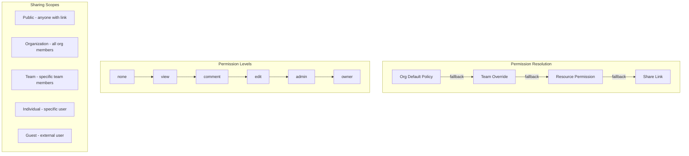
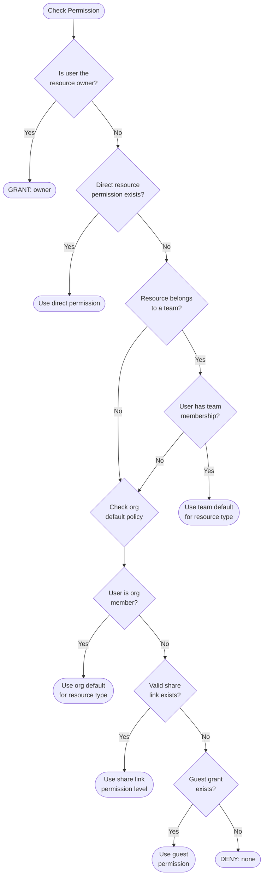
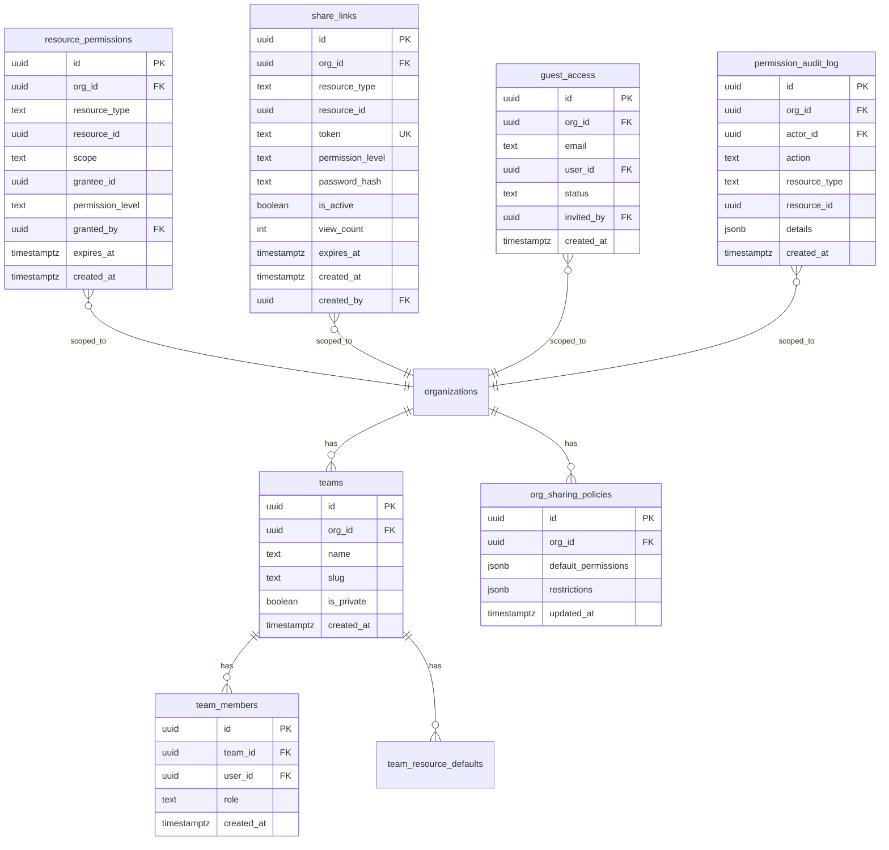
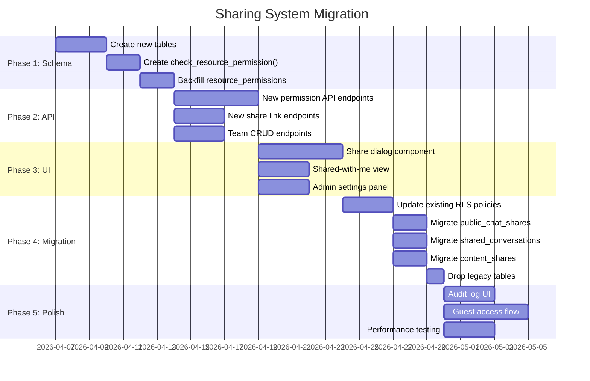

# Sharing & Per-Resource Permissions — Architecture Document

> Status: RFC (Request for Comments)
> Date: 2026-04-05
> Author: Architecture Team
> Supersedes: `sharing-system.md` (basic implementation)

---

## Table of Contents

1. [Executive Summary](#1-executive-summary)
2. [Research Findings](#2-research-findings)
3. [Comparison of Approaches](#3-comparison-of-approaches)
4. [Permission Model Design](#4-permission-model-design)
5. [Database Schema](#5-database-schema)
6. [Row Level Security Policies](#6-row-level-security-policies)
7. [API Endpoints](#7-api-endpoints)
8. [UI Flows](#8-ui-flows)
9. [Edge Cases & Security](#9-edge-cases--security)
10. [Migration Plan](#10-migration-plan)
11. [Performance Considerations](#11-performance-considerations)

---

## 1. Executive Summary

Layers currently has a flat sharing model: all org members see everything, with basic public link sharing for conversations. This document designs a comprehensive per-resource permission system that supports:

- **Six resource types**: conversations, artifacts, skills, connections (integrations), context items, MCP servers
- **Six permission levels**: none, view, comment, edit, admin, owner
- **Four sharing scopes**: public (anyone with link), organization-wide, team-level, individual user
- **Permission inheritance**: org defaults cascade to teams, which cascade to resources
- **Link sharing**: shareable URLs with optional password protection and expiry
- **Cross-org sharing**: invite external users to specific resources (guest access)
- **Admin controls**: org-level policies, audit logging, approval workflows

The system consolidates the existing `shared_conversations`, `public_chat_shares`, and `content_shares` tables into a unified `resource_permissions` and `share_links` schema, enforced at the database level via Supabase RLS.

---

## 2. Research Findings

### 2.1 Google Workspace

**Model**: Hierarchical (Organization > Shared Drive > Folder > File) with per-resource overrides.

Key patterns:
- **Link sharing scopes**: Restricted (only invited people), Organization (anyone in the org), Anyone with the link (public)
- **Permission levels**: Viewer, Commenter, Editor, Owner
- **Inheritance**: Files inside a shared folder inherit the folder's sharing settings. As of September 2025, Google removed the ability to restrict access on individual files within a shared folder — limited access is now managed at the folder level via a "limited access folder" setting.
- **Admin controls**: Admins set default link sharing scope (recommended: Restricted). External sharing can be disabled org-wide or allowed by exception.
- **Trust rules**: Fine-grained rules controlling which internal/external groups can share with which targets.
- **Expiry**: Shared access can be set to expire on a specific date.

**Takeaway for Layers**: The three-tier link sharing scope (restricted/org/anyone) is the industry standard. Google's shift away from per-file overrides inside shared folders shows that simpler inheritance models reduce confusion.

Sources:
- [Manage external sharing for your organization](https://support.google.com/a/answer/60781?hl=en)
- [Upcoming Change to Drive Sharing Permissions (Sept 2025)](https://workspaceupdates.googleblog.com/2025/09/upcoming-change-to-drive-sharing.html)
- [Mastering Google Drive Sharing Permissions](https://pipelinedigital.co.uk/blog/google-workspace-updates/mastering-google-drive-sharing-permissions/)
- [Create and manage trust rules for Drive sharing](https://knowledge.workspace.google.com/admin/security/create-and-manage-trust-rules-for-drive-sharing)

### 2.2 Notion

**Model**: Hierarchical (Workspace > Teamspace > Page > Sub-page) with per-page overrides.

Key patterns:
- **Workspace roles**: Owner, Membership Admin, Member, Guest
- **Page permission levels**: Full Access (edit + share), Can Edit, Can Edit Content (database content only, not structure), Can Comment, Can View
- **Teamspaces**: Dedicated spaces for teams within an org, each with their own members and permission levels. Teamspace owners control access.
- **Guest access**: External users invited to specific pages only. Guests need a Notion account. Limited to the pages shared with them.
- **Inheritance**: Adding someone to a page gives them automatic access to all sub-pages. Sub-page permissions can be restricted or expanded independently.
- **Publish to web**: Any page can be published as a read-only public URL, with optional settings for comments, editing, and search engine indexing.

**Takeaway for Layers**: The "Can Edit Content" level (edit data but not structure) is relevant for artifacts. Guest access scoped to individual resources is the right model for cross-org sharing. Notion's sub-page inheritance maps well to artifact file trees.

Sources:
- [Sharing & permissions – Notion Help Center](https://www.notion.com/help/sharing-and-permissions)
- [Manage members & guests](https://www.notion.com/help/add-members-admins-guests-and-groups)
- [Understanding Notion's sharing settings](https://www.notion.com/help/guides/understanding-notions-sharing-settings)
- [Notion Privacy Explained: Public vs Private (2025)](https://www.notionapps.com/blog/notion-privacy-2025)

### 2.3 Figma

**Model**: Hierarchical (Organization > Team > Project > File) with per-level overrides.

Key patterns:
- **Permission levels**: Can View, Can Edit (team/project/file), plus Admin and Owner at team level
- **Inheritance**: Higher-level access cascades down. A team member with "can view" inherits view access to all projects and files inside that team.
- **Sharing methods**: Link sharing (fastest), email invitations, team/project membership
- **Organization controls**: Admins can manage public link sharing and "open sessions" (temporary edit access for viewers)
- **Embed access**: Files can be embedded in external sites, controlled separately from edit/view permissions

**Takeaway for Layers**: Figma's clean hierarchy (Team > Project > File) with downward inheritance is the clearest model. The "open session" concept (temporary elevated permissions) could apply to collaborative artifact editing.

Sources:
- [Guide to sharing and permissions – Figma Learn](https://help.figma.com/hc/en-us/articles/1500007609322-Guide-to-sharing-and-permissions)
- [File and project permissions](https://help.figma.com/hc/en-us/articles/35361119554711-File-and-project-permissions)
- [Team permissions](https://help.figma.com/hc/en-us/articles/360039970673-Team-permissions)
- [Manage public link sharing and open sessions](https://help.figma.com/hc/en-us/articles/5726756336791-Manage-public-link-sharing-and-open-sessions)

### 2.4 GitHub

**Model**: Organization > Team > Repository, with five granular role levels.

Key patterns:
- **Visibility**: Public, Private, Internal (org-only, Enterprise plans)
- **Repository roles** (least to most access): Read, Triage, Write, Maintain, Admin
- **Team-based access**: Teams can be granted access to repositories at specific permission levels. Nested teams inherit parent team access.
- **Outside collaborators**: External users invited to specific repos, with individually assigned permission levels.
- **Fine-grained PATs**: Tokens scoped to specific repositories and specific operations (read contents, write issues, etc.)
- **Custom roles**: Enterprise accounts can create custom roles combining fine-grained permissions.

**Takeaway for Layers**: GitHub's five-tier role system (Read/Triage/Write/Maintain/Admin) is more granular than needed for Layers. The "Outside Collaborator" concept maps directly to our guest/cross-org sharing need. Fine-grained PATs inform how we should scope API keys for integrations.

Sources:
- [Repository roles for an organization – GitHub Docs](https://docs.github.com/en/organizations/managing-user-access-to-your-organizations-repositories/managing-repository-roles/repository-roles-for-an-organization)
- [Access permissions on GitHub](https://docs.github.com/en/get-started/learning-about-github/access-permissions-on-github)
- [Managing your personal access tokens](https://docs.github.com/en/authentication/keeping-your-account-and-data-secure/managing-your-personal-access-tokens)

### 2.5 Linear

**Model**: Workspace > Team > Project > Issue, with private teams as the isolation boundary.

Key patterns:
- **Workspace roles**: Admin, Member, Guest (Business/Enterprise only)
- **Private teams**: Issues, projects, and documents within a private team are only visible to that team's members. Non-members cannot see private team content even via search.
- **Guest access**: Guests are invited to specific teams. They can only see data within those teams. Guests in a shared project see only issues belonging to their team.
- **Public roadmaps**: Projects can be published publicly for external stakeholders to view progress.
- **Security caveat**: Workspace-level integrations are accessible to guests, which could leak data from teams the guest is not a member of.

**Takeaway for Layers**: Linear's team-scoped isolation is the right model for Layers teams. The security warning about integrations being workspace-wide applies to our MCP servers and connections — these need team-level scoping.

Sources:
- [Members and roles – Linear Docs](https://linear.app/docs/members-roles)
- [Private teams – Linear Docs](https://linear.app/docs/private-teams)
- [Security & Access – Linear Docs](https://linear.app/docs/security-and-access)
- [Master Guest User Management in Linear](https://www.steelsync.io/blog/master-guest-user-management-in-linear)

### 2.6 Slack

**Model**: Organization > Workspace > Channel (public/private), with Slack Connect for cross-org.

Key patterns:
- **Channel types**: Public (all workspace members can join), Private (invite-only), Shared (Slack Connect, cross-org)
- **Channel roles**: Owner/Admin set workspace-level permissions; Channel Managers handle per-channel moderation (posting permissions, archiving, canvas editing)
- **Posting permissions**: Channels can restrict who can post (everyone, admins only, specific people)
- **Slack Connect**: Channels shared with external organizations. Admins control who can receive invitations to external channels. Private channels cannot be converted to public if connected via Slack Connect.
- **Multi-workspace channels**: Channels spanning multiple workspaces within the same Enterprise Grid org.

**Takeaway for Layers**: Slack's distinction between "who can see" and "who can post" is relevant — we need separate "view" and "comment" levels. Slack Connect's admin-controlled external sharing is the right model for cross-org resource sharing.

Sources:
- [Manage permissions for channel management tools](https://slack.com/help/articles/360052445454-Manage-permissions-for-channel-management-tools)
- [Manage channel posting permissions](https://slack.com/help/articles/360004635551-Manage-channel-posting-permissions)
- [Manage who can join Slack Connect channels](https://slack.com/help/articles/360050528953-Manage-who-can-join-Slack-Connect-channels-owned-by-other-organizations)
- [Permissions by role in Slack](https://slack.com/help/articles/201314026-Permissions-by-role-in-Slack)

---

## 3. Comparison of Approaches

| Feature | Google Workspace | Notion | Figma | GitHub | Linear | Slack |
|---------|-----------------|--------|-------|--------|--------|-------|
| **Hierarchy depth** | 4 (Org > Drive > Folder > File) | 4 (Workspace > Teamspace > Page > Sub-page) | 4 (Org > Team > Project > File) | 3 (Org > Team > Repo) | 4 (Workspace > Team > Project > Issue) | 3 (Org > Workspace > Channel) |
| **Permission levels** | 4 (View, Comment, Edit, Owner) | 5 (View, Comment, Edit, Edit Content, Full Access) | 3 (View, Edit, Admin/Owner) | 5 (Read, Triage, Write, Maintain, Admin) | 3 (View, Edit, Admin) | 2 + moderation (View, Post) |
| **Link sharing** | Yes (3 scopes) | Yes (publish to web) | Yes (public links) | No (collaborator invites) | Yes (public roadmaps) | No |
| **Guest/external access** | Yes (visitor sharing) | Yes (page-level guests) | Yes (file-level invites) | Yes (outside collaborators) | Yes (team-level guests) | Yes (Slack Connect) |
| **Inheritance model** | Top-down, limited override | Top-down with per-page override | Top-down with per-file override | Team > Repo mapping | Team isolation boundary | Channel-level |
| **Expiry support** | Yes | No | No | No (PATs expire) | No | No |
| **Password protection** | No | No | No | No | No | No |
| **Admin override** | Yes (trust rules) | Yes (workspace settings) | Yes (org settings) | Yes (enterprise policies) | Yes (workspace settings) | Yes (admin dashboard) |
| **Audit log** | Yes | Yes (Enterprise) | Yes (Organization) | Yes | Yes | Yes |

### Design Decisions for Layers

Based on research, we adopt:

1. **Google's three-scope link sharing** (restricted / org / anyone) — the clearest mental model
2. **Notion's per-resource override** — resources can have permissions different from their parent scope
3. **GitHub's outside collaborator model** — guests invited to specific resources with specific roles
4. **Linear's team isolation** — teams as the primary sharing boundary within an org
5. **Figma's clean inheritance** — permissions flow down from org to team to resource
6. **Google's expiry support** — share links and grants can expire
7. **Password protection** — unique to Layers, useful for sensitive artifact sharing

---

## 4. Permission Model Design

### 4.1 Core Concepts



### 4.2 Permission Levels

| Level | Code | Can View | Can Comment | Can Edit | Can Share | Can Delete | Can Transfer |
|-------|------|----------|-------------|----------|-----------|------------|--------------|
| None | `none` | - | - | - | - | - | - |
| View | `view` | Yes | - | - | - | - | - |
| Comment | `comment` | Yes | Yes | - | - | - | - |
| Edit | `edit` | Yes | Yes | Yes | - | - | - |
| Admin | `admin` | Yes | Yes | Yes | Yes | Yes | - |
| Owner | `owner` | Yes | Yes | Yes | Yes | Yes | Yes |

Permission levels are strictly ordered: `none < view < comment < edit < admin < owner`. A higher level always includes all capabilities of lower levels.

### 4.3 Resource Types and Applicable Permissions

| Resource Type | DB Table | View | Comment | Edit | Admin | Owner | Notes |
|---------------|----------|------|---------|------|-------|-------|-------|
| `conversation` | `conversations` | Read messages | Add messages | Edit title, delete messages | Share, manage participants | Transfer, delete | Comment = participate in chat |
| `artifact` | `artifacts` | View code/doc | Add comments/annotations | Edit content, create versions | Share, manage collaborators | Transfer, delete | Edit = modify artifact files |
| `skill` | `skills` | Use the skill | - | Edit skill config/prompts | Share, enable/disable | Transfer, delete | Comment not applicable |
| `connection` | `integrations` | See connection status | - | Configure sync settings | Share, reconnect OAuth | Transfer, delete | Sensitive — limited sharing |
| `context_item` | `context_items` | Read content | Add annotations | Edit metadata, re-process | Share, manage access | Transfer, delete | Source content may be read-only |
| `mcp_server` | `mcp_servers` | See server info | - | Edit config, tools | Share, manage access | Transfer, delete | Security-critical — tools have side effects |

### 4.4 Permission Resolution Algorithm

When checking if User X can perform Action Y on Resource Z:



The resolution follows **most-specific-wins**: direct resource grants beat team defaults, which beat org defaults. Within the same specificity, the **highest permission wins** (if a user has both team-level `view` and direct `edit`, they get `edit`).

### 4.5 Org Default Policies

Each organization configures default permission levels per resource type:

```typescript
type OrgSharingPolicy = {
  defaults: {
    conversation: PermissionLevel;  // default: "view" (all org members can see chats)
    artifact: PermissionLevel;      // default: "view"
    skill: PermissionLevel;         // default: "view"
    connection: PermissionLevel;    // default: "none" (connections are private by default)
    context_item: PermissionLevel;  // default: "view"
    mcp_server: PermissionLevel;    // default: "none" (MCP servers are private by default)
  };
  restrictions: {
    allow_public_sharing: boolean;       // default: true
    allow_guest_access: boolean;         // default: false
    require_approval_for_external: boolean; // default: true
    max_share_link_expiry_days: number | null; // default: null (no max)
    allow_password_protected_links: boolean;   // default: true
  };
};
```

---

## 5. Database Schema

### 5.1 Overview



### 5.2 SQL Migrations

#### 5.2.1 Teams

```sql
-- ============================================================
-- TEAMS — sub-org grouping for permission isolation
-- ============================================================
CREATE TABLE teams (
  id uuid PRIMARY KEY DEFAULT gen_random_uuid(),
  org_id uuid NOT NULL REFERENCES organizations(id) ON DELETE CASCADE,
  name text NOT NULL,
  slug text NOT NULL,
  description text,
  is_private boolean NOT NULL DEFAULT false,
  created_by uuid NOT NULL REFERENCES auth.users(id),
  created_at timestamptz NOT NULL DEFAULT now(),
  updated_at timestamptz NOT NULL DEFAULT now(),
  UNIQUE(org_id, slug)
);

CREATE INDEX teams_org ON teams(org_id);

CREATE TABLE team_members (
  id uuid PRIMARY KEY DEFAULT gen_random_uuid(),
  team_id uuid NOT NULL REFERENCES teams(id) ON DELETE CASCADE,
  user_id uuid NOT NULL REFERENCES auth.users(id) ON DELETE CASCADE,
  role text NOT NULL DEFAULT 'member' CHECK (role IN ('owner', 'admin', 'member')),
  created_at timestamptz NOT NULL DEFAULT now(),
  UNIQUE(team_id, user_id)
);

CREATE INDEX team_members_user ON team_members(user_id);
CREATE INDEX team_members_team ON team_members(team_id);

-- Default permission level for each resource type within a team
CREATE TABLE team_resource_defaults (
  id uuid PRIMARY KEY DEFAULT gen_random_uuid(),
  team_id uuid NOT NULL REFERENCES teams(id) ON DELETE CASCADE,
  resource_type text NOT NULL CHECK (resource_type IN (
    'conversation', 'artifact', 'skill', 'connection', 'context_item', 'mcp_server'
  )),
  permission_level text NOT NULL DEFAULT 'view' CHECK (permission_level IN (
    'none', 'view', 'comment', 'edit', 'admin'
  )),
  UNIQUE(team_id, resource_type)
);
```

#### 5.2.2 Resource Permissions (unified)

```sql
-- ============================================================
-- RESOURCE_PERMISSIONS — unified per-resource access grants
-- Replaces: shared_conversations, content_shares
-- ============================================================
CREATE TABLE resource_permissions (
  id uuid PRIMARY KEY DEFAULT gen_random_uuid(),
  org_id uuid NOT NULL REFERENCES organizations(id) ON DELETE CASCADE,

  -- What resource
  resource_type text NOT NULL CHECK (resource_type IN (
    'conversation', 'artifact', 'skill', 'connection', 'context_item', 'mcp_server'
  )),
  resource_id uuid NOT NULL,

  -- Who gets access (one of these is set)
  scope text NOT NULL CHECK (scope IN ('org', 'team', 'user', 'guest')),
  grantee_id uuid, -- user_id for 'user'/'guest' scope, team_id for 'team' scope, NULL for 'org'

  -- What level of access
  permission_level text NOT NULL DEFAULT 'view' CHECK (permission_level IN (
    'none', 'view', 'comment', 'edit', 'admin', 'owner'
  )),

  -- Metadata
  granted_by uuid NOT NULL REFERENCES auth.users(id),
  expires_at timestamptz, -- NULL = never expires
  created_at timestamptz NOT NULL DEFAULT now(),
  updated_at timestamptz NOT NULL DEFAULT now(),

  -- Prevent duplicate grants for the same resource + scope + grantee
  UNIQUE(resource_type, resource_id, scope, grantee_id)
);

CREATE INDEX rp_resource ON resource_permissions(resource_type, resource_id);
CREATE INDEX rp_grantee ON resource_permissions(grantee_id) WHERE grantee_id IS NOT NULL;
CREATE INDEX rp_org ON resource_permissions(org_id);
CREATE INDEX rp_expires ON resource_permissions(expires_at) WHERE expires_at IS NOT NULL;

COMMENT ON TABLE resource_permissions IS
  'Unified permission grants for all resource types. Scope determines the audience: '
  'org = all org members, team = team members (grantee_id = team_id), '
  'user = specific user (grantee_id = user_id), guest = external user (grantee_id = guest user_id).';
```

#### 5.2.3 Share Links

```sql
-- ============================================================
-- SHARE_LINKS — public/protected shareable URLs
-- Replaces: public_chat_shares
-- ============================================================
CREATE TABLE share_links (
  id uuid PRIMARY KEY DEFAULT gen_random_uuid(),
  org_id uuid NOT NULL REFERENCES organizations(id) ON DELETE CASCADE,

  -- What resource
  resource_type text NOT NULL CHECK (resource_type IN (
    'conversation', 'artifact', 'skill', 'context_item'
  )),
  resource_id uuid NOT NULL,

  -- Link token (used in URL: /share/{token})
  token text NOT NULL UNIQUE DEFAULT encode(gen_random_bytes(16), 'hex'),

  -- Access level granted by this link
  permission_level text NOT NULL DEFAULT 'view' CHECK (permission_level IN (
    'view', 'comment', 'edit'
  )),

  -- Protection
  password_hash text, -- bcrypt hash, NULL = no password
  is_active boolean NOT NULL DEFAULT true,

  -- Tracking
  view_count integer NOT NULL DEFAULT 0,
  last_viewed_at timestamptz,

  -- Expiry
  expires_at timestamptz, -- NULL = never expires

  -- Metadata
  created_by uuid NOT NULL REFERENCES auth.users(id),
  created_at timestamptz NOT NULL DEFAULT now(),

  -- One active link per resource per creator (can create multiple if deactivated)
  UNIQUE(resource_type, resource_id, created_by) -- enforces one active link per user per resource
);

CREATE INDEX sl_token ON share_links(token) WHERE is_active = true;
CREATE INDEX sl_resource ON share_links(resource_type, resource_id);
CREATE INDEX sl_expires ON share_links(expires_at) WHERE expires_at IS NOT NULL AND is_active = true;

COMMENT ON TABLE share_links IS
  'Public or password-protected shareable URLs. Connections and MCP servers '
  'cannot have share links (security-sensitive). Only view/comment/edit levels allowed.';
```

#### 5.2.4 Guest Access

```sql
-- ============================================================
-- GUEST_ACCESS — external users invited to specific resources
-- ============================================================
CREATE TABLE guest_access (
  id uuid PRIMARY KEY DEFAULT gen_random_uuid(),
  org_id uuid NOT NULL REFERENCES organizations(id) ON DELETE CASCADE,

  -- Guest identity
  email text NOT NULL,
  user_id uuid REFERENCES auth.users(id), -- set once guest signs up / logs in

  -- Invitation
  status text NOT NULL DEFAULT 'pending' CHECK (status IN ('pending', 'accepted', 'revoked')),
  invited_by uuid NOT NULL REFERENCES auth.users(id),

  -- Timestamps
  created_at timestamptz NOT NULL DEFAULT now(),
  accepted_at timestamptz,
  revoked_at timestamptz,

  UNIQUE(org_id, email)
);

CREATE INDEX ga_email ON guest_access(email);
CREATE INDEX ga_user ON guest_access(user_id) WHERE user_id IS NOT NULL;
CREATE INDEX ga_org ON guest_access(org_id);

COMMENT ON TABLE guest_access IS
  'Tracks external users (guests) invited to access specific resources in an org. '
  'Actual resource-level permissions are stored in resource_permissions with scope=guest.';
```

#### 5.2.5 Org Sharing Policies

```sql
-- ============================================================
-- ORG_SHARING_POLICIES — org-level defaults and restrictions
-- ============================================================
CREATE TABLE org_sharing_policies (
  id uuid PRIMARY KEY DEFAULT gen_random_uuid(),
  org_id uuid NOT NULL REFERENCES organizations(id) ON DELETE CASCADE UNIQUE,

  -- Default permission levels for org members per resource type
  default_permissions jsonb NOT NULL DEFAULT '{
    "conversation": "view",
    "artifact": "view",
    "skill": "view",
    "connection": "none",
    "context_item": "view",
    "mcp_server": "none"
  }'::jsonb,

  -- Sharing restrictions
  restrictions jsonb NOT NULL DEFAULT '{
    "allow_public_sharing": true,
    "allow_guest_access": false,
    "require_approval_for_external": true,
    "max_share_link_expiry_days": null,
    "allow_password_protected_links": true
  }'::jsonb,

  updated_at timestamptz NOT NULL DEFAULT now(),
  updated_by uuid REFERENCES auth.users(id)
);
```

#### 5.2.6 Permission Audit Log

```sql
-- ============================================================
-- PERMISSION_AUDIT_LOG — tracks all sharing/permission changes
-- ============================================================
CREATE TABLE permission_audit_log (
  id uuid PRIMARY KEY DEFAULT gen_random_uuid(),
  org_id uuid NOT NULL REFERENCES organizations(id) ON DELETE CASCADE,
  actor_id uuid REFERENCES auth.users(id), -- NULL for system actions
  action text NOT NULL CHECK (action IN (
    'grant_permission', 'revoke_permission', 'update_permission',
    'create_share_link', 'deactivate_share_link', 'share_link_accessed',
    'invite_guest', 'accept_guest_invite', 'revoke_guest',
    'update_org_policy', 'update_team_defaults',
    'transfer_ownership'
  )),
  resource_type text,
  resource_id uuid,
  details jsonb NOT NULL DEFAULT '{}'::jsonb,
  -- details examples:
  -- grant: { "grantee_id": "...", "scope": "user", "level": "edit" }
  -- share_link: { "token": "abc...", "level": "view", "expires_at": "..." }
  -- guest: { "email": "...", "status": "pending" }
  ip_address inet,
  user_agent text,
  created_at timestamptz NOT NULL DEFAULT now()
);

CREATE INDEX pal_org_created ON permission_audit_log(org_id, created_at DESC);
CREATE INDEX pal_resource ON permission_audit_log(resource_type, resource_id, created_at DESC);
CREATE INDEX pal_actor ON permission_audit_log(actor_id, created_at DESC);

-- Partition by month for performance (optional, for high-volume orgs)
-- CREATE TABLE permission_audit_log (...) PARTITION BY RANGE (created_at);
```

### 5.3 Permission Resolution Function

```sql
-- ============================================================
-- check_resource_permission() — resolves effective permission
-- Returns the highest applicable permission level for a user on a resource
-- ============================================================
CREATE OR REPLACE FUNCTION check_resource_permission(
  p_user_id uuid,
  p_resource_type text,
  p_resource_id uuid
)
RETURNS text
LANGUAGE plpgsql
SECURITY DEFINER
STABLE
AS $$
DECLARE
  v_permission text := 'none';
  v_org_id uuid;
  v_owner_id uuid;
  v_perm_order jsonb := '{"none":0,"view":1,"comment":2,"edit":3,"admin":4,"owner":5}'::jsonb;
  v_current_level int := 0;
  v_candidate text;
  v_candidate_level int;
  rec record;
BEGIN
  -- 1. Check if user is the resource owner
  EXECUTE format(
    'SELECT org_id, COALESCE(user_id, created_by) FROM %I WHERE id = $1',
    CASE p_resource_type
      WHEN 'conversation' THEN 'conversations'
      WHEN 'artifact' THEN 'artifacts'
      WHEN 'skill' THEN 'skills'
      WHEN 'connection' THEN 'integrations'
      WHEN 'context_item' THEN 'context_items'
      WHEN 'mcp_server' THEN 'mcp_servers'
    END
  ) INTO v_org_id, v_owner_id USING p_resource_id;

  IF v_owner_id = p_user_id THEN
    RETURN 'owner';
  END IF;

  -- 2. Check direct user grants (scope = 'user')
  SELECT permission_level INTO v_candidate
  FROM resource_permissions
  WHERE resource_type = p_resource_type
    AND resource_id = p_resource_id
    AND scope = 'user'
    AND grantee_id = p_user_id
    AND (expires_at IS NULL OR expires_at > now());

  IF FOUND THEN
    v_candidate_level := (v_perm_order->>v_candidate)::int;
    IF v_candidate_level > v_current_level THEN
      v_current_level := v_candidate_level;
      v_permission := v_candidate;
    END IF;
  END IF;

  -- 3. Check team grants (scope = 'team')
  FOR rec IN
    SELECT rp.permission_level
    FROM resource_permissions rp
    JOIN team_members tm ON tm.team_id = rp.grantee_id AND tm.user_id = p_user_id
    WHERE rp.resource_type = p_resource_type
      AND rp.resource_id = p_resource_id
      AND rp.scope = 'team'
      AND (rp.expires_at IS NULL OR rp.expires_at > now())
  LOOP
    v_candidate_level := (v_perm_order->>rec.permission_level)::int;
    IF v_candidate_level > v_current_level THEN
      v_current_level := v_candidate_level;
      v_permission := rec.permission_level;
    END IF;
  END LOOP;

  -- 4. Check org-wide grant (scope = 'org')
  SELECT permission_level INTO v_candidate
  FROM resource_permissions
  WHERE resource_type = p_resource_type
    AND resource_id = p_resource_id
    AND scope = 'org'
    AND grantee_id IS NULL
    AND (expires_at IS NULL OR expires_at > now());

  IF FOUND THEN
    v_candidate_level := (v_perm_order->>v_candidate)::int;
    IF v_candidate_level > v_current_level THEN
      v_current_level := v_candidate_level;
      v_permission := v_candidate;
    END IF;
  END IF;

  -- 5. Fall back to org default policy
  IF v_current_level = 0 AND EXISTS (
    SELECT 1 FROM org_members WHERE org_id = v_org_id AND user_id = p_user_id
  ) THEN
    SELECT (default_permissions->>p_resource_type) INTO v_candidate
    FROM org_sharing_policies
    WHERE org_id = v_org_id;

    IF v_candidate IS NOT NULL THEN
      v_permission := v_candidate;
    END IF;
  END IF;

  -- 6. Check guest grants
  IF v_current_level = 0 THEN
    SELECT rp.permission_level INTO v_candidate
    FROM resource_permissions rp
    JOIN guest_access ga ON ga.user_id = p_user_id AND ga.org_id = rp.org_id
    WHERE rp.resource_type = p_resource_type
      AND rp.resource_id = p_resource_id
      AND rp.scope = 'guest'
      AND rp.grantee_id = p_user_id
      AND ga.status = 'accepted'
      AND (rp.expires_at IS NULL OR rp.expires_at > now());

    IF FOUND THEN
      v_permission := v_candidate;
    END IF;
  END IF;

  RETURN v_permission;
END;
$$;
```

---

## 6. Row Level Security Policies

### 6.1 RLS for `resource_permissions`

```sql
ALTER TABLE resource_permissions ENABLE ROW LEVEL SECURITY;

-- Org members can see permissions for resources in their org
CREATE POLICY "rp_select_org_members" ON resource_permissions
  FOR SELECT USING (
    org_id IN (SELECT get_user_org_ids())
  );

-- Users with admin+ on a resource can create grants
CREATE POLICY "rp_insert_admin" ON resource_permissions
  FOR INSERT WITH CHECK (
    granted_by = auth.uid()
    AND org_id IN (SELECT get_user_org_ids())
    AND check_resource_permission(auth.uid(), resource_type, resource_id) IN ('admin', 'owner')
  );

-- Granters can update their own grants; resource admins can update any
CREATE POLICY "rp_update" ON resource_permissions
  FOR UPDATE USING (
    granted_by = auth.uid()
    OR check_resource_permission(auth.uid(), resource_type, resource_id) IN ('admin', 'owner')
  );

-- Granters can delete their own grants; resource admins can delete any
CREATE POLICY "rp_delete" ON resource_permissions
  FOR DELETE USING (
    granted_by = auth.uid()
    OR check_resource_permission(auth.uid(), resource_type, resource_id) IN ('admin', 'owner')
  );
```

### 6.2 RLS for `share_links`

```sql
ALTER TABLE share_links ENABLE ROW LEVEL SECURITY;

-- Org members can see share links for their org's resources
CREATE POLICY "sl_select_org" ON share_links
  FOR SELECT USING (
    org_id IN (SELECT get_user_org_ids())
  );

-- Users with admin+ on a resource can create share links
CREATE POLICY "sl_insert" ON share_links
  FOR INSERT WITH CHECK (
    created_by = auth.uid()
    AND org_id IN (SELECT get_user_org_ids())
    AND check_resource_permission(auth.uid(), resource_type, resource_id) IN ('admin', 'owner')
  );

-- Link creators and resource admins can update (deactivate)
CREATE POLICY "sl_update" ON share_links
  FOR UPDATE USING (
    created_by = auth.uid()
    OR check_resource_permission(auth.uid(), resource_type, resource_id) IN ('admin', 'owner')
  );

-- Link creators and resource admins can delete
CREATE POLICY "sl_delete" ON share_links
  FOR DELETE USING (
    created_by = auth.uid()
    OR check_resource_permission(auth.uid(), resource_type, resource_id) IN ('admin', 'owner')
  );
```

### 6.3 RLS for `teams` and `team_members`

```sql
ALTER TABLE teams ENABLE ROW LEVEL SECURITY;
ALTER TABLE team_members ENABLE ROW LEVEL SECURITY;

-- Public teams visible to all org members; private teams visible to members only
CREATE POLICY "teams_select" ON teams
  FOR SELECT USING (
    org_id IN (SELECT get_user_org_ids())
    AND (
      NOT is_private
      OR EXISTS (
        SELECT 1 FROM team_members
        WHERE team_members.team_id = teams.id
          AND team_members.user_id = auth.uid()
      )
    )
  );

-- Org admins and team owners can manage teams
CREATE POLICY "teams_manage" ON teams
  FOR ALL USING (
    org_id IN (SELECT get_user_org_ids())
    AND (
      EXISTS (
        SELECT 1 FROM org_members
        WHERE org_members.org_id = teams.org_id
          AND org_members.user_id = auth.uid()
          AND org_members.role IN ('owner', 'admin')
      )
      OR EXISTS (
        SELECT 1 FROM team_members
        WHERE team_members.team_id = teams.id
          AND team_members.user_id = auth.uid()
          AND team_members.role = 'owner'
      )
    )
  );

-- Team members visible to team members (and org admins)
CREATE POLICY "team_members_select" ON team_members
  FOR SELECT USING (
    EXISTS (
      SELECT 1 FROM teams t
      WHERE t.id = team_members.team_id
        AND t.org_id IN (SELECT get_user_org_ids())
        AND (
          NOT t.is_private
          OR EXISTS (
            SELECT 1 FROM team_members tm2
            WHERE tm2.team_id = t.id AND tm2.user_id = auth.uid()
          )
        )
    )
  );
```

### 6.4 Updated RLS for Existing Tables

The key change: existing tables like `conversations` and `artifacts` need updated RLS policies that check `check_resource_permission()` instead of just `org_id IN (get_user_org_ids())`.

```sql
-- Example: Updated conversations RLS
-- Drop the existing overly permissive policy
DROP POLICY IF EXISTS "org members can read conversations" ON conversations;

-- New policy: check effective permission
CREATE POLICY "conversations_select" ON conversations
  FOR SELECT USING (
    -- Owner always has access
    user_id = auth.uid()
    -- Or check resolved permission
    OR check_resource_permission(auth.uid(), 'conversation', id) != 'none'
  );

-- Write access requires edit+
CREATE POLICY "conversations_update" ON conversations
  FOR UPDATE USING (
    user_id = auth.uid()
    OR check_resource_permission(auth.uid(), 'conversation', id) IN ('edit', 'admin', 'owner')
  );

-- Delete requires admin+
CREATE POLICY "conversations_delete" ON conversations
  FOR DELETE USING (
    user_id = auth.uid()
    OR check_resource_permission(auth.uid(), 'conversation', id) IN ('admin', 'owner')
  );
```

> **Important**: The same pattern applies to `artifacts`, `skills`, `integrations`, `context_items`, and `mcp_servers`. Each gets select/update/delete policies based on `check_resource_permission()`.

---

## 7. API Endpoints

### 7.1 Resource Permissions

| Method | Path | Description | Required Permission |
|--------|------|-------------|-------------------|
| GET | `/api/permissions?resource_type=X&resource_id=Y` | List all grants for a resource | view on resource |
| POST | `/api/permissions` | Create a permission grant | admin on resource |
| PATCH | `/api/permissions/[id]` | Update grant level or expiry | admin on resource |
| DELETE | `/api/permissions/[id]` | Revoke a grant | admin on resource (or own grant) |
| GET | `/api/permissions/effective?resource_type=X&resource_id=Y` | Get caller's effective permission | any (returns own level) |
| GET | `/api/permissions/shared-with-me` | List all resources shared with caller | any |

#### POST `/api/permissions` — Request Body

```typescript
type GrantPermissionRequest = {
  resource_type: 'conversation' | 'artifact' | 'skill' | 'connection' | 'context_item' | 'mcp_server';
  resource_id: string;     // UUID
  scope: 'org' | 'team' | 'user' | 'guest';
  grantee_id?: string;     // UUID — required for team/user/guest scope
  permission_level: 'none' | 'view' | 'comment' | 'edit' | 'admin';
  expires_at?: string;     // ISO date, optional
};
```

### 7.2 Share Links

| Method | Path | Description | Required Permission |
|--------|------|-------------|-------------------|
| POST | `/api/share-links` | Create a share link | admin on resource |
| GET | `/api/share-links?resource_type=X&resource_id=Y` | List share links for a resource | admin on resource |
| PATCH | `/api/share-links/[id]` | Update link (deactivate, change level) | link creator or admin |
| DELETE | `/api/share-links/[id]` | Delete a share link | link creator or admin |
| POST | `/api/share-links/[token]/verify` | Verify password and get access | any (public endpoint) |
| GET | `/api/share-links/[token]/resource` | Fetch shared resource data | valid token (public endpoint) |

#### POST `/api/share-links` — Request Body

```typescript
type CreateShareLinkRequest = {
  resource_type: 'conversation' | 'artifact' | 'skill' | 'context_item';
  resource_id: string;
  permission_level: 'view' | 'comment' | 'edit';
  password?: string;         // plain text, hashed server-side
  expires_at?: string;       // ISO date
};

// Response
type CreateShareLinkResponse = {
  id: string;
  token: string;
  url: string;               // e.g., "https://app.layers.run/share/abc123"
  permission_level: string;
  has_password: boolean;
  expires_at: string | null;
};
```

### 7.3 Guest Access

| Method | Path | Description | Required Permission |
|--------|------|-------------|-------------------|
| POST | `/api/guests/invite` | Invite external user | org admin |
| GET | `/api/guests` | List guests for org | org admin |
| DELETE | `/api/guests/[id]` | Revoke guest access | org admin |
| POST | `/api/guests/accept` | Accept invitation (called by guest) | invited guest |

### 7.4 Teams

| Method | Path | Description | Required Permission |
|--------|------|-------------|-------------------|
| GET | `/api/teams` | List teams in org | org member |
| POST | `/api/teams` | Create a team | org admin |
| PATCH | `/api/teams/[id]` | Update team settings | team owner/admin |
| DELETE | `/api/teams/[id]` | Delete a team | team owner or org admin |
| POST | `/api/teams/[id]/members` | Add member to team | team admin |
| DELETE | `/api/teams/[id]/members/[userId]` | Remove member | team admin |
| GET | `/api/teams/[id]/defaults` | Get team resource defaults | team member |
| PATCH | `/api/teams/[id]/defaults` | Update team resource defaults | team admin |

### 7.5 Org Sharing Policies

| Method | Path | Description | Required Permission |
|--------|------|-------------|-------------------|
| GET | `/api/org/sharing-policy` | Get org sharing policy | org member |
| PATCH | `/api/org/sharing-policy` | Update policy | org owner/admin |

---

## 8. UI Flows

### 8.1 Share Dialog

The share dialog is the primary UI for managing per-resource permissions. It appears when clicking "Share" on any resource.

```
┌─────────────────────────────────────────────────────────┐
│  Share "Q4 Strategy Analysis"                      [X]  │
│─────────────────────────────────────────────────────────│
│                                                         │
│  🔗 Link sharing                                        │
│  ┌─────────────────────────────────────────────────┐   │
│  │ https://app.layers.run/share/a1b2c3  [📋 Copy] │   │
│  └─────────────────────────────────────────────────┘   │
│  Anyone with link can [View ▾]  Expires: [Never ▾]     │
│  [ ] Require password  [Deactivate link]                │
│                                                         │
│─────────────────────────────────────────────────────────│
│                                                         │
│  👥 People with access                                  │
│                                                         │
│  [Search people or teams...]                            │
│                                                         │
│  Alfonso R. (you)           Owner                       │
│  Kyle M.                    [Edit ▾]     [X]            │
│  Engineering Team (5)       [View ▾]     [X]            │
│  bobby@external.co (guest)  [View ▾]     [X]            │
│                                                         │
│─────────────────────────────────────────────────────────│
│                                                         │
│  🏢 Organization access                                 │
│  All members of Acme Inc can [View ▾]                   │
│                                                         │
│─────────────────────────────────────────────────────────│
│  [Copy link]                           [Done]           │
└─────────────────────────────────────────────────────────┘
```

**Interaction flow:**
1. Dialog opens with current permissions loaded
2. Link sharing section shows existing link or "Create link" button
3. People section allows searching org members, teams, and adding email addresses (guest invites)
4. Permission level dropdowns show available levels for the resource type
5. Removing access triggers a confirmation if the user has edit+ access
6. "Done" closes the dialog; changes are saved immediately (optimistic UI)

### 8.2 "Shared with Me" View

Accessible from the sidebar navigation. Shows all resources the user has been explicitly granted access to (beyond org defaults).

```
┌──────────────────────────────────────────────────┐
│  Shared with Me                                  │
│──────────────────────────────────────────────────│
│  Filter: [All ▾] [Conversations] [Artifacts] ... │
│                                                   │
│  📝 Q4 Strategy Analysis (artifact)              │
│     Shared by Alfonso · Edit · 2 days ago         │
│                                                   │
│  💬 Product Roadmap Discussion (conversation)     │
│     Shared by Kyle · View · 1 week ago            │
│                                                   │
│  🔧 Code Review Assistant (skill)                │
│     Shared by Team: Engineering · View · 3d ago   │
│                                                   │
│  📄 API Documentation (context_item)             │
│     Shared by Bobby · Comment · 5d ago            │
└──────────────────────────────────────────────────┘
```

### 8.3 Admin Sharing Settings

Accessible from org settings. Controls org-wide sharing policies.

```
┌──────────────────────────────────────────────────────┐
│  Sharing & Permissions Settings                       │
│──────────────────────────────────────────────────────│
│                                                       │
│  Default Access for Org Members                       │
│  ┌──────────────────────────────────────────┐        │
│  │ Conversations    [View ▾]                │        │
│  │ Artifacts        [View ▾]                │        │
│  │ Skills           [View ▾]                │        │
│  │ Connections      [None ▾]                │        │
│  │ Context Items    [View ▾]                │        │
│  │ MCP Servers      [None ▾]                │        │
│  └──────────────────────────────────────────┘        │
│                                                       │
│  Sharing Restrictions                                 │
│  [x] Allow public link sharing                        │
│  [ ] Allow guest (external) access                    │
│  [x] Require approval for external sharing            │
│  [ ] Enforce maximum link expiry:  [30] days          │
│  [x] Allow password-protected links                   │
│                                                       │
│  Audit Log                                            │
│  [View sharing audit log →]                           │
│                                                       │
│                                      [Save Changes]   │
└──────────────────────────────────────────────────────┘
```

---

## 9. Edge Cases & Security

### 9.1 Security Threat Model

| Threat | Mitigation |
|--------|-----------|
| **Privilege escalation** — user grants themselves higher permissions | `check_resource_permission()` enforced in RLS `WITH CHECK`; only admin+ can create grants; cannot grant higher than own level |
| **Expired token reuse** — using a share link after expiry | `expires_at` checked in both RLS policies and API layer; cron job cleans up expired links |
| **Cross-org data leak** — guest sees resources outside their grants | Guest RLS requires explicit `resource_permissions` row with `scope='guest'`; no implicit org-wide access for guests |
| **Password brute force** — attacking password-protected share links | Rate limit `/api/share-links/[token]/verify` to 5 attempts per minute per IP; bcrypt with cost factor 12 |
| **IDOR via resource_id** — guessing UUIDs to access resources | All access goes through `check_resource_permission()`; UUIDs are v4 (122 bits of entropy) |
| **Stale permissions after org removal** — user removed from org keeps access | `ON DELETE CASCADE` on `org_members` triggers; background job cleans orphaned `resource_permissions` rows |
| **MCP server abuse** — shared MCP server used to execute dangerous tools | MCP servers default to `none` permission; sharing requires org admin approval; tool execution checks caller permission |
| **Connection credential leak** — sharing an integration exposes OAuth tokens | Connections never expose tokens in the API; sharing a connection only grants visibility into sync status and configuration, not the underlying credentials |

### 9.2 Edge Cases

| Scenario | Behavior |
|----------|----------|
| User is both a team member (view) and has direct grant (edit) | Highest permission wins: edit |
| Resource owner leaves the org | Ownership transfers to org owner; if no org owner, first admin |
| Team is deleted that has resource grants | `ON DELETE CASCADE` removes team grants; resources fall back to org defaults |
| Guest invite sent but user has no Layers account | Email stores the invite; on signup, `guest_access.user_id` is linked; permissions activate |
| Org disables public sharing after links exist | Existing links remain but are deactivated in bulk; API returns 403 for deactivated links |
| Resource deleted while share links exist | `share_links` and `resource_permissions` rows cascade-delete with the resource |
| Two share links for same resource with different levels | Each link grants its own level; the viewer gets whichever link they use |
| User has `none` explicit grant but org default is `view` | Explicit `none` overrides org default (explicit grants always win) |

### 9.3 Rate Limits

| Endpoint | Limit |
|----------|-------|
| POST `/api/permissions` | 60/min per user |
| POST `/api/share-links` | 20/min per user |
| POST `/api/share-links/[token]/verify` | 5/min per IP |
| GET `/api/share-links/[token]/resource` | 120/min per IP |
| POST `/api/guests/invite` | 10/min per user |

---

## 10. Migration Plan

### 10.1 Phased Rollout



### 10.2 Data Migration

#### Migrate `public_chat_shares` to `share_links`

```sql
INSERT INTO share_links (
  org_id, resource_type, resource_id, token,
  permission_level, is_active, created_by, created_at, expires_at
)
SELECT
  org_id,
  'conversation',
  conversation_id::uuid,
  share_token,
  CASE
    WHEN allow_public_view THEN 'view'
    ELSE 'view'  -- org-only shares become org-scoped resource_permissions instead
  END,
  is_active,
  shared_by,
  created_at,
  expires_at
FROM public_chat_shares
WHERE allow_public_view = true;

-- Org-only shares become resource_permissions
INSERT INTO resource_permissions (
  org_id, resource_type, resource_id, scope, grantee_id,
  permission_level, granted_by, created_at
)
SELECT
  org_id,
  'conversation',
  conversation_id::uuid,
  'org',
  NULL,
  'view',
  shared_by,
  created_at
FROM public_chat_shares
WHERE allow_public_view = false AND allow_org_view = true;
```

#### Migrate `shared_conversations` to `resource_permissions`

```sql
INSERT INTO resource_permissions (
  org_id, resource_type, resource_id, scope, grantee_id,
  permission_level, granted_by, created_at
)
SELECT
  c.org_id,
  'conversation',
  sc.conversation_id,
  'user',
  sc.shared_with,
  'view',
  sc.shared_by,
  sc.created_at
FROM shared_conversations sc
JOIN conversations c ON c.id = sc.conversation_id
ON CONFLICT (resource_type, resource_id, scope, grantee_id) DO NOTHING;
```

#### Migrate `content_shares` to `resource_permissions`

```sql
INSERT INTO resource_permissions (
  org_id, resource_type, resource_id, scope, grantee_id,
  permission_level, granted_by, created_at
)
SELECT
  COALESCE(
    (SELECT org_id FROM context_items WHERE id = cs.content_id),
    (SELECT org_id FROM artifacts WHERE id = cs.content_id)
  ),
  cs.content_type,
  cs.content_id,
  'user',
  cs.shared_with,
  CASE cs.permission
    WHEN 'viewer' THEN 'view'
    WHEN 'editor' THEN 'edit'
    WHEN 'owner' THEN 'admin'
  END,
  cs.shared_by,
  cs.created_at
FROM content_shares cs
ON CONFLICT (resource_type, resource_id, scope, grantee_id) DO NOTHING;
```

### 10.3 Backward Compatibility

During migration (Phase 4), both old and new APIs run in parallel:
- Old endpoints (`/api/chat/share`, `/api/chat/share-link`, `/api/sharing`) continue to work, proxying to the new tables
- New endpoints (`/api/permissions`, `/api/share-links`) are the canonical APIs
- The `/share/[token]` page reads from `share_links` with a fallback to `public_chat_shares`
- After all clients are updated, legacy tables are dropped (Phase 4e)

---

## 11. Performance Considerations

### 11.1 Permission Check Hot Path

`check_resource_permission()` is called on every resource access (via RLS). Performance is critical.

**Optimization strategies:**

1. **Indexes**: All columns used in `check_resource_permission()` lookups are indexed:
   - `resource_permissions(resource_type, resource_id)` — primary lookup
   - `resource_permissions(grantee_id)` — user grant lookup
   - `team_members(user_id)` — team membership check
   - `org_members(user_id, org_id)` — org membership check

2. **Materialized permission cache**: For high-traffic resources, precompute effective permissions:
   ```sql
   CREATE MATERIALIZED VIEW effective_permissions AS
   SELECT
     user_id,
     resource_type,
     resource_id,
     check_resource_permission(user_id, resource_type, resource_id) AS level
   FROM (
     -- All user-resource combinations with explicit grants
     SELECT DISTINCT grantee_id AS user_id, resource_type, resource_id
     FROM resource_permissions WHERE scope = 'user'
   ) sub;

   CREATE UNIQUE INDEX ON effective_permissions(user_id, resource_type, resource_id);
   ```
   Refresh on permission changes via trigger or background job.

3. **Short-circuit evaluation**: The function checks in order of specificity (owner > direct > team > org > guest), returning early on the first match.

4. **Avoid N+1**: When listing resources (e.g., all conversations), use a batch permission check rather than per-row RLS:
   ```sql
   -- Instead of RLS checking each row individually:
   SELECT c.*, check_resource_permission(auth.uid(), 'conversation', c.id) AS permission
   FROM conversations c
   WHERE c.org_id = $1
     AND check_resource_permission(auth.uid(), 'conversation', c.id) != 'none';

   -- Better: join against resource_permissions directly in the query
   SELECT c.*
   FROM conversations c
   WHERE c.org_id IN (SELECT get_user_org_ids())
     AND (
       c.user_id = auth.uid()
       OR EXISTS (
         SELECT 1 FROM resource_permissions rp
         WHERE rp.resource_type = 'conversation'
           AND rp.resource_id = c.id
           AND (
             (rp.scope = 'org' AND rp.grantee_id IS NULL)
             OR (rp.scope = 'user' AND rp.grantee_id = auth.uid())
             OR (rp.scope = 'team' AND rp.grantee_id IN (
               SELECT team_id FROM team_members WHERE user_id = auth.uid()
             ))
           )
           AND rp.permission_level != 'none'
           AND (rp.expires_at IS NULL OR rp.expires_at > now())
       )
       -- Fall back to org default
       OR EXISTS (
         SELECT 1 FROM org_sharing_policies osp
         JOIN org_members om ON om.org_id = osp.org_id AND om.user_id = auth.uid()
         WHERE osp.org_id = c.org_id
           AND (osp.default_permissions->>'conversation') IS DISTINCT FROM 'none'
       )
     );
   ```

5. **Connection pooling**: Permission checks use `SECURITY DEFINER` functions which run as the function owner, avoiding per-request role switches.

### 11.2 Expected Query Performance

| Operation | Expected Latency | Notes |
|-----------|-----------------|-------|
| Single resource permission check | < 2ms | Indexed lookups, early return |
| List conversations (50 items) | < 20ms | Batch join, not per-row function call |
| Create share link | < 5ms | Single insert |
| Share dialog load (all grants for 1 resource) | < 10ms | Indexed by resource_type + resource_id |
| "Shared with me" (paginated, 20 items) | < 15ms | Indexed by grantee_id |
| Audit log query (last 100 entries) | < 10ms | Indexed by org_id + created_at DESC |

### 11.3 Scaling Considerations

- **Row count projections**: For an org with 50 members, 1000 conversations, 500 artifacts, and active sharing, expect ~5,000-10,000 rows in `resource_permissions`. This is well within PostgreSQL's comfort zone.
- **Audit log growth**: At ~100 permission events/day, the audit log grows to ~36,500 rows/year. Consider partitioning by month at 1M+ rows, or archiving entries older than 1 year.
- **Share link lookups**: The `token` column has a unique index; lookups are O(log n) regardless of table size.
- **Materialized view refresh**: If used, refresh incrementally (not full) or via trigger on `resource_permissions` changes. Full refresh of the materialized view for an org with 10,000 permission rows takes ~500ms.

---

## Appendix A: Type Definitions

```typescript
// Permission levels, ordered
export const PERMISSION_LEVELS = ['none', 'view', 'comment', 'edit', 'admin', 'owner'] as const;
export type PermissionLevel = (typeof PERMISSION_LEVELS)[number];

// Resource types
export const RESOURCE_TYPES = [
  'conversation', 'artifact', 'skill', 'connection', 'context_item', 'mcp_server'
] as const;
export type ResourceType = (typeof RESOURCE_TYPES)[number];

// Sharing scopes
export const SHARING_SCOPES = ['org', 'team', 'user', 'guest'] as const;
export type SharingScope = (typeof SHARING_SCOPES)[number];

// Permission grant
export type ResourcePermission = {
  id: string;
  org_id: string;
  resource_type: ResourceType;
  resource_id: string;
  scope: SharingScope;
  grantee_id: string | null;
  permission_level: PermissionLevel;
  granted_by: string;
  expires_at: string | null;
  created_at: string;
  updated_at: string;
};

// Share link
export type ShareLink = {
  id: string;
  org_id: string;
  resource_type: ResourceType;
  resource_id: string;
  token: string;
  permission_level: Extract<PermissionLevel, 'view' | 'comment' | 'edit'>;
  has_password: boolean;
  is_active: boolean;
  view_count: number;
  expires_at: string | null;
  created_by: string;
  created_at: string;
};

// Org sharing policy
export type OrgSharingPolicy = {
  default_permissions: Record<ResourceType, PermissionLevel>;
  restrictions: {
    allow_public_sharing: boolean;
    allow_guest_access: boolean;
    require_approval_for_external: boolean;
    max_share_link_expiry_days: number | null;
    allow_password_protected_links: boolean;
  };
};

// Helper: compare permission levels
export function permissionAtLeast(
  current: PermissionLevel,
  required: PermissionLevel
): boolean {
  return PERMISSION_LEVELS.indexOf(current) >= PERMISSION_LEVELS.indexOf(required);
}
```

## Appendix B: Comparison with Current System

| Aspect | Current (v1) | New (v2) |
|--------|-------------|----------|
| Tables | `shared_conversations`, `public_chat_shares`, `content_shares` (3 tables) | `resource_permissions`, `share_links`, `guest_access`, `teams`, `team_members`, `org_sharing_policies` (6 tables) |
| Resource coverage | Conversations + context items + artifacts | All 6 resource types |
| Permission levels | viewer / editor / owner | none / view / comment / edit / admin / owner |
| Sharing scopes | User-to-user only | Org / Team / User / Guest |
| Link sharing | Conversations only, no password, no expiry enforcement | All shareable resources, password + expiry |
| Teams | None | Full team support with isolation |
| Guest access | None | Email invite, scoped to specific resources |
| Admin controls | None | Org-level defaults, restrictions, audit log |
| Permission inheritance | None (flat) | Org default > Team override > Resource-specific |
| RLS enforcement | Org-scoped only | Per-resource via `check_resource_permission()` |
| Audit trail | Basic `audit_log` table | Dedicated `permission_audit_log` with full details |

---

*This document is an RFC. Implementation should proceed in the phases outlined in Section 10. Security review is required before Phase 4 (RLS migration).*
