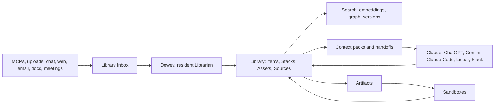

# Library Layer Plan

> Status: Canonical product and architecture plan
> Branch: `library-layer`
> Base: `main`
> Last updated: 2026-04-29

## 1. Executive Summary

Library Layer is the next architecture for Layers. It turns the product into the company context box: a central Library that can ingest content, understand it, expose it to humans and agents, and act on it through Dewey, MCPs, chat, artifacts, and sandboxes.

The product should be built around two core verbs:

1. Find and ingest content.
2. Act on that content.

Everything else in the application should support those two verbs. Chat, artifacts, sandboxes, skills, MCP connectors, schedules, sessions, portals, canvases, notifications, and analytics should stay, but they should no longer feel like separate product islands. They should become surfaces around the same Library.

The first implementation principle is conservative: use what already exists. The app already has chat, context items, collections, tags, inbox, MCP connectors, artifacts, sandbox execution, skills, schedules, sessions, sharing, portals, analytics, approvals, and notifications. Library Layer should rename, connect, harden, and extend those systems before replacing them.

## 2. Product Thesis

AI tools are only as good as the context they can use. Today, useful business context is scattered across documents, meetings, Slack threads, emails, CRMs, code repos, artifacts, and people's heads. Every AI tool starts from scratch. Every handoff leaks meaning.

Layers should become the authored context layer underneath the work:

- A Library where company context lives.
- A Librarian named Dewey who helps collect, curate, coordinate, and compound that context.
- MCP connectors that bring external systems into reach.
- Artifacts and sandboxes that turn context into work.
- Handoffs that package context for Claude, ChatGPT-compatible clients, Gemini-compatible agent surfaces, Claude Code, Linear, Slack, Gmail, and customer orchestrators.

The product philosophy is "tools for agents." Humans author, review, and steer. Agents use the Library to do work with context.

## 3. Current App Inventory

The full application on `main` already contains most of the pieces needed for Library Layer.

### Core surfaces

- Chat and conversation history.
- Context Library.
- Inbox.
- Collections and tags.
- MCP connectors and registry search.
- Skills marketplace/editor/chat.
- Artifacts and artifact versions.
- Sandbox execution.
- Sessions and scoped workspaces.
- Schedules and action execution.
- Approvals and edit proposals.
- Sharing, public links, and portals.
- Canvas.
- Notifications.
- Analytics and health dashboards.
- Settings, team, org, billing, and audit surfaces.

### Core backend capabilities

- `context_items` as the current knowledge item foundation.
- `collections` and `collection_items` for organization.
- `tags`, `item_tags`, and pins.
- `inbox_items` for intake.
- `context_chunks` and embeddings.
- Hybrid search and query expansion.
- Artifact tables and version history.
- MCP server records with OAuth metadata.
- Approval queue and scheduled actions.
- Priority documents and rules.
- Audit, usage, and interaction tracking.

### Starter kit baseline

The `library-layer` branch starts with `@mirror-factory/ai-dev-kit` adopted into the app. This gives the branch:

- Dev-kit dashboard routes under `/dev-kit`.
- Tool, page, API, hook, docs, skill, MCP, and test registries.
- Claude hooks, subagents, slash commands, and skills.
- Project index and audit log scaffolding.
- Brand/design/system gates.
- Doctor and compliance checks.

The starter kit is an enforcement layer. It should not dictate the product model, but it should enforce that Library Layer development stays tested, documented, observable, and reviewable.

## 4. Implementation Status

This branch now contains the first backend slice of Library Layer. It is intentionally additive over the existing app instead of a destructive rename pass.

Implemented:

- First-class `/library` dashboard that pulls together Library Items, Stacks, Inbox, assets, MCPs, sync rules, approvals, Dewey profile, context packs, and recent activity.
- Additive Supabase migration for Library metadata on `context_items`, Library sources/provenance, Library assets, item-asset links, item relationships, context packs, Dewey profiles, MCP import batches, MCP sync rules, and external MCP call audit logs.
- MCP server hardening fields for OAuth status, scopes, token metadata, tool snapshots, health status, retry state, and failure count.
- Library domain service over existing `context_items`, `collections`, tags, assets, context packs, Dewey profiles, MCP import batches, sync rules, approval proposals, and audit logs.
- Authenticated Library API routes for items, item detail, search, Stacks, assets, and context packs.
- Authenticated Inbox curation route for turning Inbox items into Library Items or assigning existing items to Stacks.
- Authenticated artifact save-back route and sandbox-run save-back behavior so generated work can return to the Library.
- Authenticated Dewey profile API route.
- MCP ingestion API route with explicit `live_lookup`, `save_selected`, and `sync_rule` modes.
- Initial Layers-as-MCP-server JSON-RPC route exposing Library, Dewey, context pack, artifact, sandbox, and approval tools.
- Chat assistant identity moved toward Dewey while leaving legacy Granger code names in place.
- AI tool additions for `save_to_library`, `list_library_stacks`, and `create_context_pack`.
- Focused unit and route coverage for Library mapping, MCP ingestion mode semantics, Inbox curation, artifact save-back, Dewey defaults, and Layers MCP registry risk classification.
- Temporary Library migration type shim while generated Supabase types are refreshed against an environment with the migration applied.
- Product-facing naming pass toward Layers as the product and Dewey as the assistant, while leaving native schemes, Discord internals, and legacy docs stable.

Still needed after this slice:

- User-facing Library/Dewey UI polish for inline curation, ingestion review, asset browsing, and context pack management.
- Real fake-MCP integration harnesses for OAuth, reconnect, tool discovery cache, and sync workers.
- Full MCP transport/auth hardening for external Claude/ChatGPT/Gemini-compatible clients.
- Sandbox provider abstraction and cost accounting around actual sandbox runs.
- Refresh generated Supabase types after applying the Library Layer migration in the target database.
- RLS/security tests against a real Supabase test database.
- End-to-end chat to Library to artifact to sandbox to save-back workflow.

## 5. Target Architecture

Library Layer has one central system and many surfaces.

The architecture should keep these boundaries clear:

- **Library** stores durable context.
- **Dewey** asks, curates, retrieves, proposes, and packages.
- **MCP connectors** access external systems.
- **Actions** execute writes through approval policy.
- **Artifacts** are durable work products.
- **Sandboxes** execute and preview generated work.
- **Handoffs** move scoped context to external execution surfaces.
- **Audit** records who accessed, changed, imported, exported, or executed what.

## 6. Library Domain Model

Use existing tables first, then add missing primitives.

### Existing concepts to preserve

- `context_items` becomes the first implementation backing for **Library Items**.
- `collections` becomes the first implementation backing for **Stacks**.
- `inbox_items` remains the **Library Inbox**.
- `context_chunks` remains the search/chunking layer.
- Artifact tables remain the generated work layer.
- Existing tags, pins, versions, sharing, and audit tables should remain.

### Product language

| Current implementation | Library Layer language | Meaning |
| --- | --- | --- |
| `context_items` | Library Items | Durable context records |
| `collections` | Stacks | Curated shelves or working sets |
| `inbox_items` | Inbox | Default landing zone for unsorted intake |
| `context_chunks` | Chunks | Searchable passages and embeddings |
| `artifacts` | Artifacts | Generated work products |
| `mcp_servers` | Sources / Connectors | External systems reachable through MCP |

### New concepts to add

- **Library Assets:** files, images, generated media, screenshots, thumbnails, diagrams, whiteboards, artifact previews.
- **Sources and Provenance:** where an item came from, when it was imported, who imported it, original URL or external ID, MCP server, prompt/model if generated.
- **Sync Rules:** recurring or event-based ingestion from an external MCP source.
- **Context Packs:** scoped bundles of Library content prepared for a handoff.
- **Relationships:** typed links between items, artifacts, people, projects, decisions, clients, meetings, and tasks.

### Library Item requirements

Every Library Item should eventually support:

- Title.
- Body or extracted text.
- Summary.
- Type.
- Source/provenance.
- Owner, org, and library scope.
- Permissions.
- Stack membership.
- Tags.
- Chunks and embeddings.
- Assets.
- Versions.
- Related items.
- Audit trail.

## 7. Dewey Model

Dewey is the resident Librarian. Dewey should appear inside chat as an assistant participant, but Dewey is not a normal human user. Dewey is a system-owned actor with a profile, tools, policy, memory behavior, and per-library instructions.

### Dewey surfaces

- Main chat assistant.
- Library onboarding.
- Inbox review.
- Stack creation and cleanup.
- MCP import review.
- Save-to-library prompts.
- Reference/framework conversations.
- Artifact and sandbox handoffs.
- Approval flow.

### Dewey responsibilities

- Ask structured questions.
- Run References and frameworks.
- Classify Inbox items.
- Suggest Stacks.
- Save useful chat content into the Library.
- Retrieve grounded context with citations.
- Explain what the Library knows and does not know.
- Package context for external tools.
- Propose actions.
- Ask for approval before risky writes.
- Bring outputs back into the Library.

### Dewey as chat participant

In chat, Dewey should feel like a user-visible assistant identity. Under the hood:

- Store Dewey as a system actor, not as a human team member.
- Keep a stable `actor_type = system_agent` or equivalent in future schema work.
- Give Dewey an agent profile that controls voice, allowed tools, retrieval scope, and approval policy.
- Render Dewey as a participant in chat UI, but prevent direct profile/team-management edits that apply only to humans.

### Dewey profile/config

Add a Dewey configuration layer with:

- Voice and tone.
- Allowed tools.
- Default retrieval scope.
- Save-to-library behavior.
- Approval policy.
- MCP lookup behavior.
- Per-library instructions.
- Reference/framework availability.

## 8. MCP Model

MCPs should not automatically dump everything into the Library. That creates noise, security risk, and unclear ownership.

Use three explicit modes:

### Live Lookup

Dewey queries an MCP server, answers the user, and does not save the result unless asked.

Example: "Look up the latest Linear issue status."

### Save Selected

Dewey queries an MCP server, presents candidate records, and the user chooses what enters the Library.

Example: "I found 84 Linear issues. Save all, save selected, or create a sync rule?"

### Sync Rule

The user creates a durable rule for ongoing ingestion.

Examples:

- Sync Linear issues from the Layers project.
- Save starred Slack threads.
- Import new meeting transcripts tagged Mirror Factory.
- Save GitHub PRs that mention Library Layer.

### MCP reliability requirements

The current MCP connection model should be hardened for production:

- Store MCP connection records durably.
- Store OAuth status, refresh token metadata, scopes, discovered tools, and health state.
- Do not rely on long-lived in-memory sockets in serverless production.
- Reconnect lazily per tool call.
- Refresh OAuth tokens before expiry.
- Cache discovered tools so the UI can render while disconnected.
- Add backoff, retries, and explicit reauth prompts.
- Add fake MCP servers for tests.
- Add connection health and tool-call logs to `/dev-kit` and product analytics.

## 9. Images And Assets

Images should enter the Library when they have future value.

Supported sources:

- Uploaded images.
- Generated images.
- Screenshots.
- External image pulls.
- Charts and diagrams.
- Whiteboards.
- Artifact previews.
- Portal and media assets.

Temporary chat uploads may remain ephemeral by default, but Dewey should offer to save useful assets into the Library.

Saved assets should store:

- Original file.
- Thumbnail or preview.
- MIME type and dimensions.
- OCR text when available.
- Caption or visual summary.
- Source URL and license if external.
- Prompt, model, and generation settings if generated.
- Related Library Item or Artifact.
- Creator and timestamp.

Images should become searchable through OCR, captions, summaries, metadata, and related item text.

## 10. Artifacts And Sandboxes

Artifacts and sandboxes should stay. They are the "act on content" half of Library Layer.

Artifacts are durable work products:

- Documents.
- Code.
- Briefs.
- Apps.
- Visualizations.
- Generated reports.
- Client deliverables.

Sandbox execution should:

- Run generated code safely.
- Preview work.
- Capture outputs.
- Track cost.
- Save useful outputs back into the Library.

Add a `SandboxProvider` abstraction before changing vendors. Keep Vercel Sandbox as the default until real usage proves cost or persistence problems.

Evaluate alternatives only behind that abstraction:

- Modal for compute-heavy or GPU workflows.
- Cloudflare Containers for lower-level infra control.
- Daytona for persistent workspace-style volumes.
- Fly Machines for controlled internal pools.

Track sandbox usage by run, user, org, artifact, duration, storage, and provider.

## 11. Layers As MCP Server

Layers should be both an MCP client and an MCP server.

As a client, Layers connects to external tools.

As a server, Layers exposes the Library and Dewey outward to other agent surfaces.

Initial MCP server tools:

- `search_library`
- `get_library_item`
- `add_library_item`
- `list_stacks`
- `create_stack`
- `save_asset`
- `ask_dewey`
- `create_context_pack`
- `list_context_packs`
- `create_artifact`
- `run_sandbox`
- `propose_action`
- `execute_approved_action`

Rules:

- Reads are permission-scoped.
- Writes require explicit user/org policy.
- Risky writes go through approvals.
- Every external MCP call is audited.
- Context packs should be preferred over unbounded export.

## 12. Action Layer

Library Layer should make action explicit and reviewable.

Action flow:

1. User asks Dewey to do something.
2. Dewey retrieves relevant Library context.
3. Dewey identifies required external tools.
4. Dewey drafts a proposed action.
5. Policy determines whether approval is required.
6. User approves, rejects, or edits.
7. System executes through MCP/direct API/tool.
8. Result is saved back to Library when useful.
9. Audit log records the full chain.

Risky writes include:

- Sending email.
- Posting to Slack or Discord.
- Creating/updating external issues.
- Editing documents.
- Running code with external side effects.
- Publishing portals.
- Sharing content outside the org.
- Changing billing, permissions, or credentials.

## 13. Testing And Production Readiness

The production target is not "test every possible AI response." The target is to make the system bounded, observable, and regression-resistant.

### Baseline gates

- `pnpm typecheck`
- `pnpm lint`
- `pnpm test`
- targeted integration tests
- critical E2E flows
- AI eval suites
- RLS/security tests
- dev-kit doctor

### Required test coverage

- Library item creation, update, versioning, search, and permissions.
- Inbox to Stack curation.
- Dewey retrieval with citations.
- Dewey save-to-library behavior.
- MCP OAuth lifecycle with fake MCP servers.
- MCP live lookup, save selected, and sync rule flows.
- Asset/image save and retrieval.
- Artifact creation, editing, and versioning.
- Sandbox execution and save-back.
- Approval workflow for risky writes.
- RLS isolation across users, orgs, libraries, items, and actions.
- E2E: chat to retrieval to artifact to sandbox to Library save.

### Observability

Every agent run should have a traceable run ID that connects:

- User request.
- Retrieved Library items.
- Tool calls.
- MCP server calls.
- Model calls.
- Artifact changes.
- Sandbox runs.
- Approvals.
- External writes.
- Saved outputs.

The starter kit's run ID, registries, audit log, and `/dev-kit` dashboard should be used as the enforcement layer for this.

## 14. Implementation Roadmap

### Phase 0: Foundation

- Use `library-layer` from `main`.
- Keep portal work separate.
- Adopt the AI starter kit.
- Repair dev-kit installation for the repo's `src/app` layout.
- Fix typecheck and test pollution blockers.
- Confirm migrations match generated Supabase types.
- Document current app inventory and architecture.

### Phase 1: Library domain

- Introduce Library terminology over existing context systems.
- Map `context_items` to Library Items.
- Map `collections` to Stacks.
- Make Inbox the default intake surface.
- Add asset/provenance records.
- Add save-to-library behavior from chat, uploads, MCP results, and artifacts.

### Phase 2: Dewey

- Define Dewey profile/config.
- Render Dewey as the assistant identity in chat.
- Add curation tools.
- Add Reference/framework flows.
- Add approval-aware action proposals.
- Add grounded retrieval and "what I know" explanations.

### Phase 3: MCP hardening

- Make MCP connection state durable and observable.
- Add live lookup, save selected, and sync rules.
- Add MCP health dashboard.
- Add fake MCP test harness.
- Add tool discovery cache and reconnection strategy.

### Phase 4: Action layer

- Connect Library context to artifacts, sandboxes, schedules, Linear/GitHub/Gmail/Slack-style actions.
- Require approvals for risky writes.
- Save outputs back to Library.
- Add context packs for external handoffs.

### Phase 5: Layers MCP server

- Expose Library, Dewey, artifact, sandbox, and action tools externally.
- Add OAuth/auth for external MCP clients.
- Add audit logs and permission checks.
- Test with Claude, local MCP clients, and internal orchestrator use cases.

## 15. Immediate Engineering Tasks

1. Finish starter kit adoption and make `/dev-kit` work under `src/app`.
2. Run dev-kit doctor and record remaining gaps.
3. Add Library Layer feature spec under `features/library-layer/SPEC.md`.
4. Fix current typecheck failures before large feature work.
5. Create a minimal Library domain adapter over existing context/collection/inbox APIs.
6. Define Dewey config and actor model.
7. Design MCP ingestion modes in UI and API.
8. Add tests for the first Library adapter and Dewey save-to-library path.

## 16. Open Decisions

These should be decided before schema implementation:

- Whether to introduce a separate `libraries` table immediately or keep org-level Library as the only v1 scope.
- Whether Dewey should be one global system actor or one actor per Library.
- Whether assets should be attached only to Library Items or also directly to Stacks, Artifacts, and Messages.
- Whether context packs should be persisted as first-class records in v1 or represented as generated artifacts first.
- Whether external MCP server exposure should start read-only.

Recommended defaults:

- One Library per org for v1.
- One Dewey profile per Library.
- Assets attach to Library Items and can reference Artifacts/Messages through relationships.
- Context packs are first-class records.
- External MCP server starts read-only plus `propose_action`.

## 17. Non-Goals

- Do not remove chat.
- Do not remove artifacts.
- Do not remove sandbox execution.
- Do not replace existing context tables before proving the adapter model.
- Do not auto-ingest entire MCP sources by default.
- Do not make Dewey a normal human user.
- Do not expose unbounded Library export through MCP.

## 18. Success Criteria

Library Layer is working when:

- Users can add content from chat, upload, MCP lookup, artifact output, and manual entry.
- New content lands in Inbox by default.
- Dewey can classify, summarize, and suggest Stacks.
- Search returns grounded, cited Library results.
- Dewey can explain what the Library knows and where it came from.
- Users can create an artifact from Library context.
- Sandbox output can be saved back to the Library.
- MCP lookups support live lookup, save selected, and sync rule modes.
- Risky writes require approval.
- External agents can query Layers through a permission-scoped MCP server.
- The dev-kit dashboard shows registries, runs, tests, and gaps for Library Layer work.
